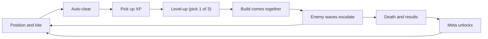

# Ludo Atlas · Genre Handbooks · Bullet Heaven

> **Genre Handbooks · Volume 1**. Positioning: the genre that flips bullet hell inside out. Bullets no longer belong to the enemies — they are yours: the player only handles positioning, attacks are fully automatic, and the thrill moves from hand speed to builds and growth; a run lasts 10–30 minutes, and on-screen enemies climb from single digits to over a thousand.
> Companions: Game Design Handbook (core loops and balance) · Programming Handbook (on-screen performance methodology) · Production Handbook (scope and cost) · Case Studies (breakdowns of real projects).
> This page carries no external links; cross-references use handbook names and volume numbers; every figure below is a reference value — defer to measurements and playtests in your own project.

---

## 1. Positioning and Core Loop

### 1.1 One-Sentence Definition

The player controls movement only (plus a level-up choice every few tens of seconds); attacking, aiming and clearing the screen are fully automatic. Over a 10–30 minute run you fight enemies that grow exponentially with time, and a build that keeps stacking turns the opening squirt gun into a late-game meat grinder; death ends the run, and meta unlocks convert every failure into a head start for the next one. Family placement: it hangs under the shooter family, but its skeleton is that of a lite roguelite — in-run random growth plus meta unlocks. Combat, the upgrade pool, spawning, number tables: seven or eight of its ten systems overlap with a roguelite, so migrating there after finishing this genre carries very low marginal cost; prototype difficulty is the lowest tier in this repository's genre matrix, hence its place in Volume 1.

### 1.2 Core Loop (Verb Loop)

The in-run loop (A to F) cycles every 30–90 seconds: almost every minute the player repeats "a little stronger, a little more pressure." The cross-run loop (G to H and back to A) cycles every 10–30 minutes and is what turns failure into progress. Build only the former and you have a demo; add the latter and you have a product.

### 1.3 Run Pacing Skeleton (based on a 20-minute run)

| Time | Screen state | Player state | Design intent |
| --- | --- | --- | --- |
| 0:00–0:30 | 1–2 basic enemy types, lowest density | Learning movement and auto-attack | A zero-barrier opening; dying is nearly impossible |
| 0:30–2:00 | Density rises slowly | First level-up (guaranteed within 60–90 seconds) | Without growth feedback in the first 2 minutes, players write the game off as boring |
| 2:00–6:00 | Enemy types start mixing | The first 3–4 choices settle this run's build | The build direction takes shape |
| 6:00–12:00 | First elites enter | Complete 1–2 weapon evolutions | Mid-run spike and a stage check |
| 12:00–16:00 | Peaks and troughs alternate | Cover weak spots, bank active items | A breathing stretch that leaves windows for pickups and menus |
| 16:00–20:00 | Mass spawns, encirclement closes in | Final burst | The endgame tide; the run's visual peak |
| Results | Screen clears and freezes | Review stats, claim unlocks | Must be able to start another run within 30 seconds |

Run-length arithmetic: a 20-minute run works out to roughly 30–40 level-up decisions; compressing it into a 10-minute version (common on mobile) means doubling the decision density to one every 20–30 seconds, or players will not feel the growth. Brotato chose a different solution: move the big decisions to the between-wave shop, where a single purchase means weighing 4–6 equipment items against each other. Run length is not the design goal; decision count is.

## 2. Player Experience Goals and Benchmark Titles

### 2.1 Three Experience Pillars

| Pillar | In the player's words | Design promise | Anti-goal (do not build) |
| --- | --- | --- | --- |
| Crushing growth | "From one poke, one kill to clearing the whole screen" | Late-game DPS grows 50–200× over the start (reference) | Enemy strength keeps pace with growth, so leveling feels like nothing |
| Build gambler | "This run I'm assembling the projectile build" | A meaningful choice every 30–60 seconds; evolutions deliver a qualitative shift | A single dominant solution, so choosing equals not choosing |
| Low-effort power fantasy | "Playable with one hand, podcast on" | Movement is the only input; pausable at any time | Adding aiming, combos, memorization |

Before you start, answer one question: do you want projectiles (bullets that require precise gap-threading)? In this genre the dodging pressure comes from the physical density of enemies, not from bullet patterns; hard bullet patterns punch straight through the low-load pillar. If you want them, make them an optional difficulty or a separate mode.

### 2.2 Benchmark Titles (mainstream market samples only)

| Title | Form | Key practices | What to borrow |
| --- | --- | --- | --- |
| Vampire Survivors (early access late 2021, breakout in 2022) | The originator and the most mainstream sample | Weapon-plus-passive evolution combining; 30-minute long runs; a low price that sold explosively | Evolution-table design, combination density, content update cadence |
| Brotato (early access 2022) | Wave-based variant with a between-wave shop | 6 weapon slots; decisions concentrate on "what to buy" | In-run economy, difficulty-tier design, short and snappy runs |
| Survivor.io (2022) | The mobile one-hand sample | Stage-based packaging plus a long-term progression framework | Mobile UI, run-length control, layering progression on core gameplay |
| 20 Minutes Till Dawn (early access 2022) | Auto-plus-manual hybrid variant | Manual aiming as an optional control layer | Turning spare control capacity into a player option, serving both audiences |

What they share: low price, frequent updates, streamer-friendly (screen density is naturally photogenic). Read the survivorship bias too: behind these four sit a huge number of similar products, and the genre's early-boom window is gone — latecomers compete on theme skin, polish and update discipline.

## 3. Design Essentials

### 3.1 Minimal Controls: One Input Verb

The full input list:

| Input | Purpose | Frequency |
| --- | --- | --- |
| Movement (left stick / WASD / touch drag) | Positioning, kiting, pickups | Throughout |
| Level-up choice (pick 1 of 3 / reroll) | Build | Every 30–60 seconds |
| Active item (optional, one button) | Screen clear, survival | 1–2 times per minute |
| Pause | Break and check the build | Any time |

Three red lines: no aiming required; no new buttons (new systems default to passive or automatic); no persistent states that require reading documentation to understand (status effects, resistance tables and the like wait).

For auto-attack, build three baseline forms first, and have new weapons vary parameters on those baselines rather than inventing entirely new behavior right away: orbiting (repeated damage at close range), projectile (auto-targeting or random-direction shots) and field (continuous damage in an area). Special behaviors can be added one per month; variety comes from sheer quantity.

Game feel (movement is this game's only hand): tune acceleration and deceleration separately; keep the collision radius slightly smaller than the visual radius, leaving tolerance; after taking a hit, 0.3–1 second of invincibility with flashing; taking a hit never interrupts movement input. With attacks fully automatic, the entire sense of impact falls to hit feedback: white flashes, knockback, damage numbers, sound effects (audio is half of game feel — see the Art & Audio Handbook).

### 3.2 Build Stacking: Laying Out Additive, Multiplicative and Trigger Chains

Three object pools: weapons (8–12, responsible for output forms), passives (8–12, responsible for numeric multipliers) and evolutions (a weapon combined with a specific maxed passive, responsible for qualitative shifts). The slot cap (commonly 6 weapons plus 6 passives) is the core constraint of the whole system: limited slots force trade-offs, and trade-offs create archetypes.

Four rules for the upgrade pool: a weight table controls the appearance rate; a pity rule (after several rolls in a row without anything new, force something new in); rerolls (a one-time resource); maxed-out items leave the pool. Do not underestimate these four — they are the engineering guarantee that no two runs feel alike.

The ordering of the "math explosion" is this genre's core craft:

| Stage | Stacking type | Typical effect | Psychological feel | Risk |
| --- | --- | --- | --- | --- |
| Early (0–5 min) | Additive (+) | +15–25% attack speed or +1 bounce per level (reference) | Every level is felt; low variance | Fades later |
| Mid (5–12 min) | Multiplicative (×) | Damage ×1.3, crits, shorter intervals | Builds diverge sharply; directed bursts | Exponential blowout |
| Late (12 min+) | Trigger chains | On-hit projectiles, death splits, kill healing | Chain reactions; the screen is on fire | Overpowered combinations |
| Mid-to-late (target) | Evolutions | Qualitative weapon changes plus visual upgrades | "This run is the one" | Conditions too demanding |

The layout logic: an all-additive endgame has no texture (gains stay constant while enemies grow exponentially); an all-multiplicative one has numbers out of control within ten minutes (exponents stacked on exponents). Target reference: late-game DPS grows 50–200× over the start, decomposing into three or four multiplicative segments each worth 3–6×. Use "enemies pressing in from multiple directions at once" (the barrel's shortest stave) to force players to cover both output and survival, avoiding single-stat dominance.

The evolution table must deliver 2–4 "it's real now" moments per run, each changing looks and effects. Players plan against the evolution table in their heads from the start of a run — that is the core motivation for repeated play; check the community's strongest builds once a week: strengthen what is weak, adjust the mechanics of what is strong — do not just cut numbers.

### 3.3 Pacing: Difficulty Tides and the Death Wall

Manage three curves at once: enemy count, enemy strength and player DPS. The technique is to let the two growth curves take the lead in alternation: when DPS falls behind, apply pressure; when level-ups pull ahead, release it. Leading the whole way is boring; trailing the whole way is frustrating.

Tide structure: a pulse every 60–90 seconds (mixed enemy types plus a few elites), with 20–30 second troughs between pulses, and the overall amplitude increasing with time. The trough is not a rest — it is the window for pickups, level-up choices and re-confirming your positioning; the level-up pause itself is the best breathing point.

| Parameter | Reference value | Notes |
| --- | --- | --- |
| Enemies on screen (normal waves) | 100–600 | Climbs with in-run progress |
| On-screen peak (endgame) | 800–2,000 | Depends on the target platform — stay within your means |
| Enemy HP growth | ×1.12–1.2 per 60 seconds (compounding) | Tune against the player DPS curve |
| Level-up frequency | One every 30–60 seconds in the first 10 minutes | Past 90 seconds without a level-up, it feels dull |
| First elite appearance | Minute 4–6 | The first "this wave is different" |
| Closing event | 60–120 seconds before the end | A boss or a full-screen tide |

The sudden death wall: at a scheduled point (commonly minute 8–10), step up enemy growth or density in a single jump (×2–3), as an acceptance check on whether the player's build has come together. It is deliberate design, not an accident. How to tune it:

- Position and size: place it half a step after "the average player should have finished their first evolution"; start the jump at ×1.5–2, add more if it is not enough, and never exceed ×3 in one step. Too early and it only kills beginners; too late and it has no presence.
- Telegraphing: sound, on-screen presentation, a new enemy appearing, a boss health bar — all four. A sudden death with no warning is prime territory for negative reviews.
- Safety margin: during the tide, provide healing drops or one screen-clear opportunity so players who are "almost there" survive.

Beyond telegraphing, gentle invisible adjustments are acceptable (drop bias, spawn-direction compensation), but keep to the Game Design Handbook's principle: transparent or optional — never let players feel the system is secretly rigging things.

Validation method: build a histogram of death times across runs. If deaths cluster around the death wall, the design is working; if a large share die at minute 3–5, the early game is too harsh; if everyone survives to the end, the endgame is too soft. This chart is more accurate than any survey.

### 3.4 Space: One Map, Reused in a Cycle

This genre has almost no level design: one map of 2–3 screens with a follow camera, and the sense of a level comes from the spawn table and the timeline. This is the lightest part of the content pipeline, and one reason the genre suits small teams.

- Map elements and guidance: a few obstacles (blocking movement blocks fun — place them sparingly), destructibles (XP pots), terrain effects (slow zones, speed strips) and boundary handling (soft walls or endless scrolling); the XP gem's magnet radius is de facto path guidance, so use drop placement to steer movement routes.
- Reuse strategy: build 1–3 maps and reskin them by theme to serve difficulty tiers; let diversity come from spawn patterns (encirclement, columns, charges, ranged lockdown) — the same batch of enemies can produce completely different pressure.
- Readability: favor a full-screen view (threats come from any direction); the player character is always drawn on the top layer with an outline; at high density, reduce per-enemy detail (see §4).

### 3.5 Meta: Turn Every Failure into Progress

- Unlock targets: weapons, characters, maps, difficulty tiers, achievements; currency is picked up in-run and spent in the meta layer, or just unlock through achievements and skip a whole economic layer. Difficulty tiers are the highest-value content expansion: the same content at higher pressure gives hardcore players a longer ramp.
- Numeric red line: meta progression does not crush with numbers (a global +50% damage buff destroys the in-run curve); grow the meta layer on "choices": new characters bring new mechanics, new weapons open new archetypes.
- Cadence goal: one unlock every 2–3 runs for the first 10 hours, then difficulty tiers and achievements carry it; derive the total unlock count backward from your target playtime.

## 4. Technical Essentials

### 4.1 Set the Budget Before You Start

- Target reference: PC at 60 FPS with 1,000–2,000 enemies on screen; mobile steady at 30–60 FPS with 300–800. Benchmark the target device before fixing content scale, and keep twenty percent of performance headroom.
- Frame budget thinking: cap enemy logic, collision and rendering each (for example, the enemy systems together stay under half of the 16.6 ms frame budget); when any one doubles, investigate it before talking optimization. No optimization without measurement — for tools and process see the Programming Handbook §3.

### 4.2 Five Engineering Pillars

1. Object pools: preallocate enemies, bullets, damage numbers, particles and drops; warm them up to peak counts; write the pool-overflow policy (reject / grow / degrade) explicitly into the design. No pooling, no more content.
2. Partitioned collision: no pairwise all-tests; a spatial hash tests only neighboring cells; keep player-vs-enemy and bullet-vs-enemy queries separate; accumulate damage and settle it in a batch at end of frame (damage buffer) to reduce state switching.
3. Batching and atlases: merge draw calls for sprites of the same kind (engine batching or GPU instancing), share materials and atlases, and never give each enemy its own material; at very high density, degrade peripheral enemies to a collision-free presentation layer.
4. Cheap assets: a pixel style is an engineering decision, not nostalgia. 4–8 frame loops; sell animation through scaling, offsets and white flashes; hit feedback does not rely on animation frames; death ends with particles and a sound effect, leaving no corpses. Produce enemy art in batches (see the Art & Audio Handbook).
5. Data-driven: put enemies, weapons, upgrades and the spawn timeline all into tables; change numbers without changing code, turning the tuning cost in §5 from programming work into spreadsheet work.

### 4.3 Input and Platforms

- Tune the three schemes — gamepad left stick, keyboard WASD, touch (virtual stick or full-screen drag) — separately; movement on a real device and on PC are two different games.
- Ranged, explosive and newly appearing dangerous enemies get dedicated colors and sounds; damage numbers are rate-limited and merged; the player's highlight layer is always on top.
- Saves store only meta progress (unlocks, currency, achievements); a run ends at death. Give the save structure a version number and migration function (see the save pitfalls in Pitfalls & Anti-patterns).

## 5. Content Volume and Workload Reference

### 5.1 Minimum Content Volume (launch scale, reference)

| Category | Minimum playable | Comfortable scale | Notes |
| --- | --- | --- | --- |
| Weapons | 8 | 12 | Including a 5-level upgrade line |
| Passives | 8 | 12 | Even pure-number items need personality (triggers, costs) |
| Evolutions | 8 | 16 | 1–2 combining routes per weapon |
| Enemies (including elites and bosses) | 10 + 3 | 15 + 5 | A new behavior every 3–4 minutes |
| Maps | 1 | 3 | Reskins serve difficulty tiers |
| Characters | 2 | 4–6 | Differences must change gameplay, not just numbers |
| Meta unlocks | 20 | 40–60 | One every 2–3 runs for the first 10 hours |

Combination math: choosing 6 slots from 12 weapons gives 924 raw combinations (C(12,6)); once passive combinations and evolution constraints stack on top, the nominal count reaches the 10^5 order — still far beyond the amount of authored content after pruning invalid builds. This is the mathematical basis of "low cost, high playtime."

### 5.2 Cost Structure: Compared with Platformers

| Stage | Bullet Heaven | Platformer | Notes |
| --- | --- | --- | --- |
| Combat system | Heavy | Medium | Weapon and enemy logic are the main battlefield |
| Level production | Very light | Heavy | No per-level production; one map reused in a cycle |
| Art assets | Light to medium | Medium to heavy | Small sizes, low frame counts, batchable |
| Audio | Medium | Medium | Looping music plus a large volume of one-shot SFX |
| Balance tuning | Heavy | Medium | Runs through the whole project; its share is often underestimated |
| Content reuse rate | Extremely high | Low | Platformer levels are used once; a Bullet Heaven reshuffles every run |

A cost-efficiency formula (for self-assessment): cost per hour of content ≈ cost of one content set ÷ (run length × reuse cycles). A platformer's reuse count is near 1; a Bullet Heaven's is near "number of runs" (dozens to hundreds). The same content is reshuffled every run here, pushing marginal cost toward zero — the root of how small teams win big with this genre; the price is that all system complexity bears down on combat and balance, and if either fails there is no fallback.

### 5.3 Workload Reference (solo development, reference values)

| Module | Reference hours |
| --- | --- |
| Combat and progression systems brought to shape | 4–8 weeks |
| One content piece (a 5-level weapon plus 1 evolution / enemy AI and feedback) | 0.5–3 days each |
| Elites and bosses, one map | 2–7 days |
| Performance optimization to target devices | 2–4 weeks (spread across the project) |
| Balance tuning to shippable | 1–2 months (throughout) |
| Meta systems and saves | 1–2 weeks |

Overall magnitude from zero to shippable: the minimum playable loop (§6 in full) 1–2 weeks; overall, 6–12 months solo, 3–6 months for a 2–3 person team (reference); cut half the content and you can halve it. For the priority of scope control and the order of feature cuts, see the Production Handbook.

## 6. How to Start the First Prototype

Goal: build a 15-minute loop in 1–2 weeks and validate the "one more run" feeling.

1. (Half a day) An empty arena plus a player who can move: speed, collision radius, hit invincibility, white flash. First tune movement until you are willing to run back and forth for its own sake.
2. (One day) One auto weapon (projectile type, targeting the nearest enemy) plus one enemy type (pooled, spawned in a ring outside the screen, walking straight at the player); hits need white flashes, knockback and numbers.
3. (Half a day) Magnetized XP gem pickup plus an XP bar, a level-up pause and a pick-1-of-3 (hand-code 6 upgrade options to start).
4. (One day) Move enemies, upgrades and the spawn timeline into tables, so from then on numbers change without code.
5. (One day) Write the spawn timeline for a 15-minute run: density ramp, two pulses, a death wall at minute 8.
6. (Half a day) Death results plus a fast restart within 30 seconds, and add 3 meta unlocks.
7. (One day) A performance health check: push on-screen enemies to 500 and use pooling and simple partitioning to reach a stable frame rate.
8. Playtest with 3 strangers and record only two numbers: at what second the first level-up lands, and how many minutes the first run lasts. If either is off, fix those two things first — do not add content.
9. If the urge for "one more run" does not appear, stop all content work. Core loop problems can only be solved in the core loop.

## 7. Common Pitfalls

1. No level-up feedback in the first 2 minutes. Guarantee the XP curve so the first level-up lands within 90 seconds.
2. Enemies only gain HP without changing behavior, and the late game becomes hitting sponges. Give them a new behavior every 3–4 minutes: speed up, encircle, ranged, split.
3. An upgrade pool without pity or rerolls; a run of bad picks makes players feel cheated by the system. Ship the trio: exclusion, pity, rerolls.
4. All-multiplicative stacking. Once DPS runs away exponentially the numbers lose meaning — follow the three-stage layout in §3.2.
5. A death wall with no telegraph. Sudden deaths are prime territory for negative reviews — deliver all four (sound / presentation / new enemy / health bar).
6. Hit feedback resting entirely on animation frames. With hundreds of enemies the frame cost explodes; let white flashes, displacement, numbers and sound carry it.
7. Adding content without object pools. GC stutter ruins game feel across the board — pool first, scale later.
8. Drops without magnetism. A screen full of gems you cannot pick up breeds anxiety; scale the magnet radius up as the run progresses.
9. The screen is too busy to see yourself or the danger. Player highlight, dedicated colors for hazards, merged and rate-limited damage numbers.
10. Runs too long (30+ minutes) drive away players with fragmented time. Build the 15-minute version first and make long runs optional.
11. Meta unlocks that hand out raw numbers. A +50% global damage buff destroys the in-run curve — the meta layer gives choices, not numbers.
12. Balancing by gut, locked in once. Keep the data tables and tune weekly; look at the death-time histogram, not your feelings.
13. Copying only the skin. Copying the pixel look is worth less than copying the combination tables: write down exactly which three seconds deliver your thrill before choosing theme and art.

## Further Reading

- How to read the companion handbooks: start with the core loop, balance and randomness sections of the Game Design Handbook; mid-development move into Programming Handbook §2.5 and §3; before scheduling, read the scope control in Production Handbook §2.
- Cases: the Vampire Survivors entry in Case Studies (subtraction and genre combination); for failures, compare against the two typical deaths: "scope out of control" and "balance out of control".
- Dev tools and free asset sources: Resources §1, §2 and §5; for sound design and impact feel see the Art & Audio Handbook.
- Homework: before you start, play 10 hours each of Vampire Survivors and Brotato and record "which three seconds were the best, and at what minute you wanted to quit"; then build the 15-minute loop from §6, iterate three versions of the spawn table, and compare their death-time histograms.

This genre has exactly one make-or-break test: whether the player is hooked at second 30, and whether at minute 30 they still want another run. Every system serves those two things.
