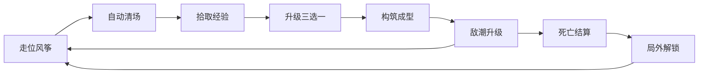

# Ludo Atlas · 类型手册 · 幸存者类（Bullet Heaven）

> **类型手册 P0 批次**（第 ㉛ 轮扩展）。定位：把弹幕地狱（Bullet Hell）反转过来的类型。弹幕不再属于敌人，而是你的：玩家只负责走位，攻击全自动，爽感从手速转移到构筑与成长；单局 10-30 分钟，同屏敌人从个位数涨到上千。
> 配套：《游戏设计手册》（⑨，核心循环与数值）·《技术实现手册》（⑩，同屏性能方法论）·《制作管理手册》（⑫，范围与成本）·《案例研究集》（⑳，真实项目的拆解）。
> 本文不放外链，交叉引用用手册名与轮次编号；文中数字均为参考值，以你自己项目的实测与试玩为准。

---

## 1. 定位与核心循环

### 1.1 一句话定义

玩家只控制移动（外加每隔几十秒的升级选择），攻击、瞄准、清场全自动；在 10-30 分钟的单局里对抗随时间指数增长的敌人，靠不断叠加的构筑把开场的小水枪变成终盘的绞肉机；死亡即结算，局外解锁把每一次失败兑换成下一局的起跑线。家族位置：挂在射击（shooter）家族，骨架却是肉鸽 Lite，局内随机成长加局外解锁。战斗、升级池、刷怪、数值表，七八成系统与 roguelite 重叠，做完这个类型再迁移过去边际成本很低；原型难度在本仓库的类型矩阵里是最低一档，因此进入 P0 批次。

### 1.2 核心循环（动词环）

局内循环（A 到 F）以 30-90 秒为一圈，玩家几乎每分钟都在重复"变强一点、压力大一点"。跨局循环（G 到 H 再回 A）以 10-30 分钟为一圈，负责把失败变成进度。只做前者是 demo，补上后者才算产品。

### 1.3 单局节奏骨架（以 20 分钟一局为基准）

| 时间 | 屏幕状态 | 玩家状态 | 设计意图 |
| --- | --- | --- | --- |
| 0:00-0:30 | 1-2 种杂兵，密度最低 | 熟悉移动与自动攻击 | 零门槛开场，几乎不可能死 |
| 0:30-2:00 | 密度缓升 | 第一次升级（保底 60-90 秒内触发） | 前 2 分钟没有变强反馈，玩家就判定无聊 |
| 2:00-6:00 | 兵种开始混合 | 前 3-4 次选择定下本局流派 | 构筑方向成型 |
| 6:00-12:00 | 精英首次入场 | 完成 1-2 条武器进化 | 中期爆发与阶段验收 |
| 12:00-16:00 | 波峰波谷交替 | 补短板，攒主动道具 | 呼吸段，给拾取与看界面留窗口 |
| 16:00-20:00 | 批量刷新，包围收拢 | 收尾爆发 | 终盘潮汐，全场视觉峰值 |
| 结算 | 清场定格 | 查看数据，领取解锁 | 30 秒内必须能再开一局 |

局长换算：一局 20 分钟约对应 30-40 次升级决策；压成 10 分钟版本（手机端常见）要把决策密度翻倍，每 20-30 秒一次，否则玩家感觉不到成长。土豆兄弟选择了另一种解法：把大决策挪到波间商店，一次购买要做 4-6 件装备的取舍。时长不是设计目标，决策次数才是。

## 2. 玩家体验目标与标杆作品

### 2.1 体验三支柱

| 支柱 | 玩家原话 | 设计承诺 | 反目标（别做） |
| --- | --- | --- | --- |
| 碾压成长 | "从戳一下死一个到一屏全清" | 终局 DPS 相对开局成长 50-200 倍（参考） | 敌人强度追平成长，练了像没练 |
| 构筑赌徒 | "这局我要凑齐弹幕流" | 每 30-60 秒一次有效选择，进化给质变 | 唯一解，选了等于没选 |
| 低负荷爽玩 | "一只手能玩，能边听播客" | 输入只留移动，随时可暂停 | 加瞄准、连招、背板 |

动手前先回答一个问题：要不要做弹幕（需要精确穿缝的子弹）？本类型的躲避压力来自敌人的身体密度，不是子弹图案；硬弹幕会把低负荷支柱打穿。要做就做成可选难度或单独模式。

### 2.2 标杆作品（只取大众市场样本）

| 作品 | 形态 | 关键做法 | 可抄的点 |
| --- | --- | --- | --- |
| 吸血鬼幸存者（2021 年末早期访问，2022 年爆发） | 开山与最大众化样本 | 武器加被动进化合成；30 分钟长局；低价卖爆 | 进化表设计、组合密度、内容更新节奏 |
| 土豆兄弟（2022 年早期访问） | 波次制加波间商店变体 | 6 个武器槽，决策集中在"买什么" | 局内经济、难度档设计、短平快单局 |
| 弹壳特攻队（2022） | 移动端单手化样本 | 关卡制包装加长线养成框架 | 移动端 UI、单局时长控制、养成与核心玩法叠层 |
| 黎明前 20 分钟（2022 年早期访问） | 自动加手动混合变体 | 手动瞄准作为可选操作层 | 把操作余量做成玩家自选，兼顾两类人 |

共同点：定价低、更新勤、直播友好（画面密度天然上镜）。也要读幸存者偏差：这四款背后是海量同类产品，品类草创期的红利窗口已经过去，后来者拼的是题材皮、完成度与更新纪律。

## 3. 设计要点

### 3.1 操作极简：输入只留一个动词

全量输入清单：

| 输入 | 用途 | 使用频率 |
| --- | --- | --- |
| 移动（左摇杆 / WASD / 触屏拖拽） | 走位、风筝、拾取 | 全程 |
| 升级选择（三选一 / 重抽） | 构筑 | 每 30-60 秒 |
| 主动道具（可选，一个键） | 清场、保命 | 每分钟 1-2 次 |
| 暂停 | 中断与查看构筑 | 随时 |

三条红线：不要求瞄准；不新增按键（新系统默认做成被动或自动）；不引入需要读说明才能懂的持续状态（异常状态、抗性表这类先不做）。

自动攻击先做三种基线形态，新武器优先在基线上换参数，别一上来就做全新行为：环绕型（近身周期性伤害）、发射型（自动索敌或随机方向弹道）、领域型（范围内持续伤害）。特殊行为可以每月加一件，丰富度靠数量堆。

手感（移动是这个游戏唯一的手）：加减速分开调；碰撞半径略小于视觉半径，留宽容度；受击后 0.3-1 秒无敌加闪烁；受击不打断移动输入。攻击全自动之后，打击感全部由命中反馈承担：闪白、击退、伤害数字、音效（音频是手感的一半，见⑪）。

### 3.2 构筑叠加：加算、乘算与触发链的排布

三个对象池：武器（8-12 件，负责输出形态）、被动（8-12 件，负责数值乘区）、进化（武器加特定被动满级后合成，负责质变）。槽位上限（常见 6 武器加 6 被动）是整个系统的核心约束：有限槽位制造取舍，取舍产生流派。

升级池四条规则：权重表控制出场率；保底（连续多次不出新东西就强制补新）；重抽（一次性资源）；已满级项移出池子。别小看这四条，它是"每局都不像上一局"的工程保障。

"数学爆炸感"的排布顺序是本类型的核心工艺：

| 阶段 | 叠加类型 | 典型效果 | 心理感受 | 风险 |
| --- | --- | --- | --- | --- |
| 前段（0-5 分钟） | 加算（+） | 每级 +15-25% 攻速或 +1 弹射（参考） | 每级都有感觉，波动小 | 后期无感 |
| 中段（5-12 分钟） | 乘算（×） | 伤害 ×1.3、暴击、间隔缩短 | 流派撕裂，定向爆发 | 指数失控 |
| 后段（12 分钟以后） | 触发链 | 击中触发弹幕、死亡分裂、击杀回血 | 链式反应，屏幕在燃烧 | 组合超模 |
| 中后段（目标） | 进化 | 武器质变加视觉升级 | "这局成了" | 条件太苛刻 |

排布逻辑：全加算的终局没有质感（增幅恒定，敌人却在指数成长）；全乘算十分钟后数字失控（指数叠指数）。目标参照：终局 DPS 相对开局成长 50-200 倍，拆开是三四个乘段各贡献 3-6 倍。用"敌人从多方向同时压迫"（木桶短边）逼玩家兼顾输出与生存，避免单属性无敌。

进化表要在一局里给出 2-4 次"成真时刻"，每次换外观和特效。玩家开局就按进化表在脑内做计划，这是重复游玩的核心动机；每周看一次社区最强流派，弱了补强，强了调机制，别只砍数值。

### 3.3 节奏：难度潮汐与死亡墙

三条曲线同时管：敌人数量、敌人强度、玩家 DPS。手法是让两条成长曲线交替领先：DPS 落后时压迫，升级反超时释放。全程领先无聊，全程落后挫败。

潮汐结构：每 60-90 秒一个脉冲（混合兵种加少量精英），脉冲之间留 20-30 秒低谷，整体振幅随时间递增。低谷不是休息，是拾取、升级选择、重新确认走位的窗口；升级暂停游戏本身，就是最好的呼吸点。

| 参数 | 参考值 | 说明 |
| --- | --- | --- |
| 同屏敌人数（普通波） | 100-600 | 随局内进度爬升 |
| 同屏峰值（终盘） | 800-2000 | 看目标平台，量力而行 |
| 敌人 HP 成长 | 每 60 秒 ×1.12-1.2（复利） | 与玩家 DPS 曲线对照调 |
| 升级频率 | 前 10 分钟每 30-60 秒一级 | 超过 90 秒不出升级就会闷 |
| 精英首次出现 | 第 4-6 分钟 | 第一次"这波不一样" |
| 收尾事件 | 终局前 60-120 秒 | Boss 或全屏潮汐 |

突然死亡墙：在预定时间点（常见第 8-10 分钟）把敌人成长或密度一次性跳档（×2-3），用来验收玩家构筑是否成型。它是有意设计，不是意外。调节方法：

- 位置与跳幅：放在"平均玩家应完成第一次进化"之后半步；跳幅先 ×1.5-2，不够再加，单次不超过 ×3。早了专杀新手，晚了没有存在感。
- 预告：音效、画面表现、新敌人出场、Boss 血条，四件套上齐。无预告的暴死是差评重灾区。
- 保底：潮汐期间给回复掉落或一次清屏机会，让"差一点成型"的玩家活过去。

预告之外可以做隐形温和调节（掉落偏向、刷新方向补偿），但守住《游戏设计手册》（⑨）的原则：透明或可关，别让玩家感到系统在暗改。

验收方法：把每局死亡时间做成直方图。死亡集中在死亡墙附近，说明设计生效；大量死在 3-5 分钟，前期太狠；人人活到结局，终盘太软。这张图比任何问卷都准。

### 3.4 空间：一张地图的循环复用

这个类型几乎没有关卡设计：一张 2-3 屏的地图加跟随相机，关卡感由刷怪表和时间轴扮演。这是内容管线最轻的一块，也是它适合小团队的原因之一。

- 地图要素与引导：少量障碍物（挡移动就是挡乐趣，谨慎放）、可破坏物（经验罐）、地形效果（减速区、加速带）、边界处理（软墙或无尽滚动）；经验宝石的磁吸半径是事实上的路径引导，用掉落布点控制走位路线。
- 复用策略：做 1-3 张图，主题换皮服务难度档；多样性交给刷怪模式（包围、纵列、冲锋、远程封锁），同一批敌人能排出完全不同的压力。
- 可读性：全屏视野优先（威胁来自任意方向）；玩家角色永远画在最上层并带描边；高密度时降低敌人单体细节（见 §4）。

### 3.5 局外：把每次失败换成进度

- 解锁对象：武器、角色、地图、难度档、成就；货币在局内拾取、局外消费，或者干脆用成就解锁，少做一层经济。难度档是性价比最高的内容扩容：同一批内容更高压力，给硬核玩家更长的坡道。
- 数值红线：局外成长不做数值碾压（全局伤害 +50% 会毁掉局内曲线）；把局外做大在"选择"上：新角色带新机制、新武器开新流派。
- 节奏目标：前 10 小时每 2-3 局解锁一件东西，之后靠难度档与成就；解锁总数按目标时长反推。

## 4. 技术要点

### 4.1 先定预算再开工

- 目标参考：PC 同屏 1000-2000 敌人 60 FPS；移动端 300-800 敌人稳 30-60 FPS。先测目标机再定内容规模，性能余量留两成。
- 帧预算思路：给敌人逻辑、碰撞、渲染各划上限（例如敌人系统合计不超过 16.6ms 帧预算的一半），任何一项翻倍先查它再谈优化。没有测量不做优化，工具与流程见《技术实现手册》（⑩）§3。

### 4.2 五个工程支柱

1. 对象池：敌人、子弹、伤害数字、粒子、掉落全部预分配，预热到峰值数量，池溢出策略（拒绝 / 扩容 / 降级）明确写进设计。不做池化就先别加内容。
2. 分区碰撞：不做两两全测；空间网格（spatial hash）只测邻格；玩家对敌人、子弹对敌人两类查询分开；伤害累积到帧末批量结算（damage buffer），减少状态切换。
3. 批处理与图集：同类精灵合并绘制调用（引擎批处理或 GPU 实例化），共享材质与图集，杜绝每个敌人独立材质；密度过高时把外围敌人降级为无碰撞的表现层。
4. 廉价资产：像素风是工程决策，不是情怀。4-8 帧循环，缩放、位移、闪白凑出动画感；受击反馈不靠动画帧；死亡用粒子加音效收尾，不留尸体。敌人美术按"批"生产（见⑪）。
5. 数据驱动：敌人、武器、升级、刷怪时间轴全部进表；改数值不改代码，让 §5 的调参成本从程序工作变成表格工作。

### 4.3 输入与平台

- 手柄左摇杆、键盘 WASD、触屏（虚拟摇杆或全屏拖拽）三套分别调手感，真机与 PC 的走位体验是两种游戏。
- 远程、爆炸、新出现的危险敌人用专属颜色和音效；伤害数字限频与合并；玩家高亮层级永远最上。
- 存档只存局外进度（解锁、货币、成就），单局死亡即结束；存档结构留版本号与迁移函数（见⑥存档坑）。

## 5. 内容量与工作量参考

### 5.1 最小内容量（首发规模，参考）

| 类别 | 最小可玩 | 舒适规模 | 备注 |
| --- | --- | --- | --- |
| 武器 | 8 | 12 | 含 5 级升级线 |
| 被动 | 8 | 12 | 纯数值件也要有个性（触发、代价） |
| 进化 | 8 | 16 | 每武器 1-2 条合成路线 |
| 敌人（含精英与 Boss） | 10 + 3 | 15 + 5 | 每 3-4 分钟一种新行为 |
| 地图 | 1 | 3 | 换皮服务难度档 |
| 角色 | 2 | 4-6 | 差异要改玩法，不只是数值 |
| 局外解锁 | 20 | 40-60 | 前 10 小时每 2-3 局一件 |

组合数推算：12 件武器选 6 个槽位，原始组合数为 924（C(12,6)）；叠加被动组合与进化约束后，名义组合进入 10^5 量级，砍掉无效构筑后仍远超制作内容量。这是"低成本高时长"的数学基础。

### 5.2 成本结构：与平台跳跃对照

| 环节 | 幸存者类 | 平台跳跃 | 说明 |
| --- | --- | --- | --- |
| 战斗系统 | 重 | 中 | 武器与敌人逻辑是主战场 |
| 关卡制作 | 极轻 | 重 | 无逐关制作，一张图循环复用 |
| 美术资产 | 轻到中 | 中到重 | 小尺寸、低帧数、可批量 |
| 音频 | 中 | 中 | 循环音乐加大量一次性音效 |
| 数值调参 | 重 | 中 | 贯穿全程，占比常被低估 |
| 内容复用率 | 极高 | 低 | 平台跳跃每关一次性，幸存者类每局重组 |

性价比公式（自评用）：单位小时内容的成本 ≈ 单套内容制作成本 ÷（单局时长 × 内容复用轮次）。平台跳跃的复用轮次接近 1，幸存者类的复用轮次接近"局数"（几十上百）。同一批内容在这里被每局重组，边际成本趋近于零，这是小团队用这个类型以小博大的根源；代价是系统复杂度全压在战斗与数值两处，这两处做砸就没有退路。

### 5.3 工时参考（单人开发，参考值）

| 模块 | 参考工时 |
| --- | --- |
| 战斗与成长系统成型 | 4-8 周 |
| 单件内容（武器 5 级加 1 条进化 / 敌人 AI 与反馈） | 0.5-3 天/件 |
| 精英与 Boss、一张地图 | 2-7 天 |
| 性能优化到目标机型 | 2-4 周（分散在全程） |
| 数值调参到可发布 | 1-2 个月（贯穿） |
| 局外系统与存档 | 1-2 周 |

从零到可发布的整体量级：最小可玩循环（§6 全部）1-2 周，整体单人 6-12 个月，2-3 人小队 3-6 个月（参考）；砍掉一半内容可以减半。范围控制的优先级与砍功能顺序见《制作管理手册》（⑫）。

## 6. 第一个原型怎么起步

目标：1-2 周做出一个 15 分钟循环，验证"想再来一局"。

1. （半天）一张空白场地加会走位的玩家：速度、碰撞半径、受击无敌、闪白。先把移动调到"愿意来回跑"。
2. （一天）一把自动武器（发射型，索敌最近目标）加一种敌人（池化、屏幕外环带刷新、朝玩家直走）；命中要有闪白、击退、数字。
3. （半天）经验宝石磁吸拾取加经验条，升级暂停加三选一（先手写 6 个升级选项）。
4. （一天）把敌人、升级、刷怪时间轴表化，从此改数值不改代码。
5. （一天）写 15 分钟局的刷怪时间轴：密度爬坡、两个脉冲、第 8 分钟死亡墙。
6. （半天）死亡结算加 30 秒内快速重开，再加 3 项局外解锁。
7. （一天）性能体检：同屏拉到 500 敌人，用池化与简单分区修到稳帧。
8. 试玩 3 个陌生人，只记录两个数字：第一次升级在第几秒，第一局撑到第几分钟。不对就先改这两处，别加内容。
9. 如果"再来一局"的欲望没有出现，停下所有内容工作。核心循环的问题只能用核心循环解决。

## 7. 常见坑

1. 前 2 分钟没有升级反馈。保底经验曲线，确保 90 秒内第一次升级。
2. 敌人只涨血量不换行为，后期变成打海绵。每 3-4 分钟给一种新行为：加速、包围、远程、分裂。
3. 升级池没有保底与重抽，连续烂选让玩家觉得被系统坑。把排除、保底、重抽三件套做掉。
4. 全乘算堆叠。DPS 指数失控后数字失去意义，按 §3.2 的三段式排布。
5. 死亡墙没有预告。突然暴死是差评重灾区，四件套（音效 / 演出 / 新敌人 / 血条）上齐。
6. 打击反馈全靠动画帧。几百个敌人时帧开销爆炸，用闪白、位移、数字、音效承担。
7. 不做对象池就加内容。GC 抖动毁掉的是全盘手感，先池化再扩量。
8. 掉落不磁吸。满屏宝石捡不完，玩家会焦虑；磁吸范围随游戏进程放大。
9. 屏幕太花，看不清自己和危险。玩家高亮、危险物专用色、伤害数字合并限频。
10. 单局太长（30 分钟以上）劝退碎片时间玩家。先做 15 分钟版本，长局做成可选。
11. 局外解锁直接给数值。+50% 全局伤害毁掉局内曲线，局外给选择不给数值。
12. 平衡拍脑袋一次定死。数据表加每周调参，看死亡时间直方图不看感觉。
13. 只抄到皮。抄像素风不如抄组合表：先写清自己的爽点落在哪三秒，再定题材与美术。

## 延伸阅读

- 配套手册的读法：先《游戏设计手册》（⑨）的核心循环、数值与随机性三节；开发中段进《技术实现手册》（⑩）§2.5 与 §3；排期前看《制作管理手册》（⑫）§2 范围控制。
- 案例：《案例研究集》（⑳）的吸血鬼幸存者条目（做减法与品类组合）；失败案例重点对照"范围失控"与"数值失控"两种典型死法。
- 开发工具、免费素材源见《资源大全》§1、§2、§5；音效与打击感的设计方法见《美术与音频手册》（⑪）。
- 作业：动手前把吸血鬼幸存者与土豆兄弟各玩 10 小时，记录"哪三秒最爽、第几分钟想关掉"；再做 §6 的 15 分钟循环，改三版刷怪表，对比各自的死亡时间直方图。

这类游戏的胜负手只有一个：玩家在第 30 秒是否被勾住，在第 30 分钟是否还想要下一局。所有系统都在服务这两件事。
