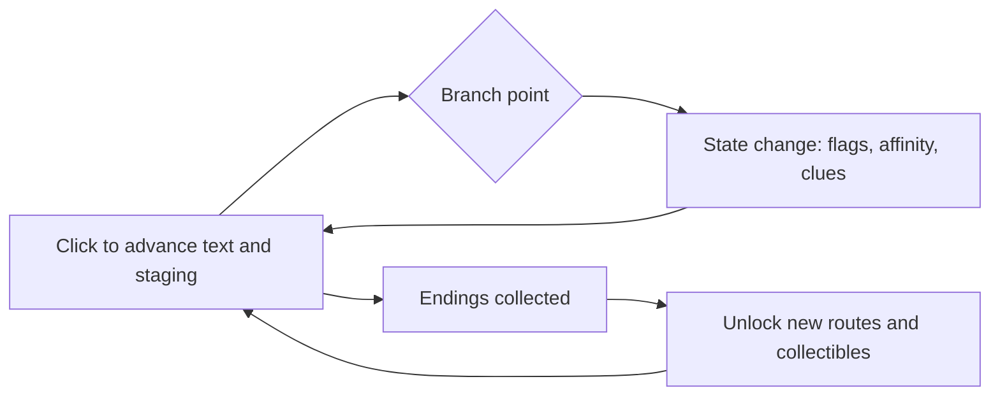

# Ludo Atlas · Genre Handbooks · Visual Novel

> **Genre Handbooks · Volume 1**. Positioning: the full development flow of the visual novel, covering branch structure, text engineering, asset specs, staging rhythm, the save experience and localization.
> Companions: Game Design Handbook (narrative and branching costs) · Art & Audio Handbook (sprite and audio specs) · Pitfalls & Anti-patterns · Case Studies.
> This page carries no links. The feel for writing comes from reading and writing itself; here we only get the engineering accounts straight.

---

## 1. Positioning and Core Loop

The visual novel (VN) takes text as its primary medium, with images and sound as its staging layer. The player has exactly two actions: read, and occasionally choose. Everything else rests on text quality, staging rhythm and branch structure.

For individuals and small teams this is the most realistic entry into narrative: the mainstream toolchain is free, and the standard features — saves, backlog, skip, multiple languages — come out of the box, so a project's success or failure rests almost entirely on one thing: text and structure. The price must be stated plainly as well: the text volume runs into the hundred-thousand-character range, and no gameplay system will backstop you. If you cannot produce the writing, the project stops right there.

The core loop has three layers:

| Layer | Loop | Source of stickiness |
| --- | --- | --- |
| Second level | Click → read a passage → emotional response | Prose density, staging beat, the placement of laughs and suspense |
| Chapter level | Finish a chapter → small climax or cliffhanger → stop | The chapter-end hook: leaving players wanting to know what happens next |
| Playthrough level | Clear the game → unlock new information → reread some passages | Multiple endings, hidden routes, collectibles |

The reverse judgment matters just as much: if no one on the team genuinely loves writing long text, or the product is expected to be "gameplay-driven", do not touch this genre.

## 2. Player Experience Goals and Benchmark Titles

The experience goals directly decide what you write and how you stage it:

| Experience goal | The player's inner voice | Where design pushes |
| --- | --- | --- |
| Immersion | "This is my choice" | Choices have real costs; the narrative calls back to what the player did before |
| Emotional impact | Laugh out loud, cry, get goosebumps | Setup and payoff, character arcs, overspending on staging at key scenes |
| Suspense | "And then?" | Chapter-end hooks, information control, unreliable narration |
| Collecting | "Two endings to go" | Multiple endings, hidden routes, the CG gallery and achievements |
| Comfort | "Read as long as I like" | Text speed, auto-play, save whenever, backlog |

Benchmark works (a widely known list, organized by what can be borrowed):

| Work | One-line selling point | What to borrow |
| --- | --- | --- |
| Steins;Gate | Timeline jumping and narrative trickery | Choices and payoffs: every divergence has consequences, and a second playthrough is all foreshadowing |
| Fate/stay night | Three routes progressively reveal the setting | Route structure: the common route converges and then expands, going deeper the further you go |
| CLANNAD | An emotional burst built from everyday accumulation | Pacing: a long setup earns the climax, and one strike lands it |
| White Album 2 | A love triangle and the accumulation of state values | Flag design: choices accumulate relationship values, and routes are routed in the late game |
| Ace Attorney | Courtroom deduction staged through clicking | Staging density: evidence, sound effects and the drawn-out catchphrase |
| Danganronpa | Deduction mixed with trial gameplay | Genre mixing: staging turned into playable stretches |
| The Invisible Guardian | Live-action footage and multiple endings | Structural design for live-action VNs and the realities of publishing in mainland China |
| Love Is All Around | Live-action dating interaction | A low-barrier entry and topic-driven virality |

Players expect a VN to be "a book you can close at any time": saving, backlog and skip are baseline features, and missing any one of them shows up directly in the reviews.

## 3. Design Essentials

### 3.1 Branch Structure: Trees, Accumulated State and Hybrid

Three models; choose by project scale:

| Model | Approach | Cost | Suits |
| --- | --- | --- | --- |
| Tree branching | Options point directly to their own subsequent text | Grows roughly exponentially with depth | Short works, a few key divergences |
| State accumulation | Options only change values; text varies by threshold | Roughly linear, high text reuse | Long works with many routes |
| Hybrid | The main line runs on state values; key decisions use explicit branches | Controllable, the mainstream approach | The default recommendation |

Governance rules for branch explosion:

1. Convergence points: before opening any branch, write down where it rejoins. Only when a branch comes back is the cost addition.
2. Variations first: if "same scene, changed lines and expressions" solves it, do not open a whole new route.
3. Depth cap: key branches go three layers at most. In a deeper tree, players cannot remember what they chose and writers cannot maintain it.
4. Register before writing: log every branch in the branch table first (ID, entry, convergence point, affected state values, assigned writer), then write the prose.
5. Close-out audit: reconcile variable references against the branch table and clear out passages that are "written but will never trigger" and "referenced but never defined" — in a long work this step can save weeks.

Diagrams and tooling:

- The single source of truth is the branch table; the flowchart is for display only. Structure and data both live in the table — the diagram is just for people to look at.
- draw.io or Twine's flowchart view is enough for drawing; do not adopt a dedicated tool just for visualization.
- One hard rule: a branch that is not registered in the branch table may not appear in the prose.

### 3.2 Script: Character Voice Tables and Option Design

- One voice table per character: catchphrases, sentence-length habits, how they address others, topics they cannot bring themselves to speak about. When several writers share the work, this table is the only insurance against the characters blending together.
- Option text is part of the script: short, concrete, showing a difference in stance. "Follow them / stay put" carries more information than "agree / refuse".
- Only real choices: do not offer options with no variation. It takes players only once to see through a fake choice; after that, no choice gets taken seriously again.
- Cut at least a tenth from the first draft: deleting 10–20% of the content before finalizing is standard practice. Text density is experience density.

### 3.3 Staging Design: The Rhythm of Click-to-Advance

Staging is "all the information beyond the text": sprite changes, BGM entrances and exits, screen effects, the length of pauses.

- The rhythm formula: calm passages run fast (short pauses, zero effects), climactic passages run slow (long pauses, effects at the key moment). Do it the other way around, and the faster players click, the deader the emotion.
- Click-to-advance: one click advances one unit of information (one line of dialogue or one staging change). No cheap "one click dumps a whole screen of text" staging.
- BGM switching: one or two rises and falls per scene is enough; switching is always a crossfade, with hard cuts reserved for jump scares.
- Effects budget: screen shake, white flashes, filters and full-screen staging are the whole work's scarce resources — spend them only at climaxes. Shaking on every line is the same as never shaking.
- Text speed and auto-play: defaults target slow readers, and fast players tune it themselves; compute the auto-play interval from the current text length rather than a fixed value.
- Writing pauses: write "two seconds of silence before speaking" as an explicit command in the script. Part of staging design is controlling when the reader gets to breathe.

### 3.4 Saves, Backlog and Multiple Playthroughs

The standard-feature checklist of the modern VN; miss one item and the reviews punish you:

- Rollback: step back several passages and choose again — the divide between a VN and an ordinary reader, and the first line of insurance after a misclick.
- Backlog: a complete dialogue history, supporting voice replay and jumping from a backlog point back into the main line.
- Chapter select: freely skip through chapters already read; after clearing the game, every chapter opens up for selection.
- Saves: multiple slots, autosave (one before and one after each divergence point) and quick save/load hotkeys; the save screen shows a thumbnail, timestamp and chapter name.
- Multiple playthroughs: a second playthrough unlocks a new perspective or added passages; hidden routes and the true ending come after all endings are collected, and the ending list shows how many remain uncollected — leaving no room for guessing games.
- Collection: a CG gallery, music room and ending list give players who "want something to keep after reading" somewhere to go.

## 4. Technical Essentials

### 4.1 Engine Routes

- Ren'Py: the de facto standard for VNs, free and open source. Saves, rollback, backlog, skip, preferences, multiple languages and achievement integration are all standard; the scripting language is close to a screenplay format, so writers can edit the text directly. With no special requirements, start here — do not build your own.
- Unity plus a VN plugin (NaniNovel and the like): take this route when you need 3D scenes, deep Live2D integration or complex mini-games; development effort steps up a level, and the expressive range you get back steps up with it.
- Godot plus a dialogue plugin (Dialogic and the like): the open-source route, suited to projects already on Godot or works planning to mix a VN with 2D gameplay.
- Web and plain-text routes: Ink and Twine suit interactive fiction and narrative prototypes; web VN solutions suit release scenarios where "the browser is click-to-play".
- A custom engine: worth considering only when your staging form exceeds every off-the-shelf tool; do not do it for a first work.

### 4.2 Text Engineering: The Script as Data

- Dialogue, character names, expressions, music and effect markers in one place is the normal shape of a VN script, but variables and conditions must be managed centrally: build a variable table (name, type, initial value, affected passages), and allow conditions to reference only registered variables.
- Scene numbering runs all the way through: one stable ID per scene (example: 3-02 classroom, lunch break), shared by the script, the branch table, the asset list and the voice list, so accounts can be reconciled at any time.
- A good habit is to organize the text so that "you can change a line without touching the logic", with no literal strings scattered through condition checks.

### 4.3 Text Management and Localization

- Organize the text around "this will be translated" from day one: all dialogue goes through the engine's string system; build a glossary for proper nouns (names, places, move names) before talking about translation.
- The export flow: export the script to a translation table (spreadsheet or CSV) → translators translate → import back → glossary check → play the whole flow once to check line breaking, fonts and punctuation. Mainstream engines ship with translation export built in.
- Fonts are the number-one pitfall for Chinese-language projects: confirm the commercial license for every CJK font one by one; every language added to a multilingual release needs missing-glyph and fallback-font checks; reserve UI width for the longest language, starting from an estimated 30% margin.
- Line breaking and punctuation: leave it to the engine's line-breaking rules first, then spot-check by hand; CJK punctuation rules (no closing punctuation at the start of a line, and so on) need a pass in the staging render as well.

### 4.4 Staging Systems and Release

- Export sprites in layers: body, expression variants and pose variants exported separately and composited by tag in the engine — do not make one full image per combination.
- Audio details: BGM crossfades; an explicit voice-interruption rule (new voice lines interrupt old ones); throttle the click sound effect so rapid clicking doesn't become noise.
- Use video staging sparingly: bitrate and build size are hidden costs; where a static image plus effects and audio can do the job, prefer not to make a cutscene video.
- Platform realities: Steam is the VN main battlefield, with achievements and cloud saves as common standard features; mobile versions need touch and battery adaptations; web versions trim build size to the platform.

## 5. Content Volume and Workload Reference

### 5.1 Text Volume and Writing Hours

Magnitude relations (solo developer, targeting releasable quality; the numbers are a ruler, not a promise):

| Scale | Text volume | Playtime | Writing timeline | Positioning |
| --- | --- | --- | --- | --- |
| Short | Around 20k characters | 1–2 hours | 2–6 weeks | Jam entries, proof of concept |
| Mid-length | 80k–150k characters | 4–8 hours | 3–6 months | A commercially sellable complete work |
| Long | 250k–500k characters | 12–25 hours | 1–2 years | Multi-route works, approaching full-time commitment |
| Very long | The million-character class | 40+ hours | Years, or a team | Commercial blockbusters and series foundations |

Conversion rates (the three numbers to write into the schedule):

- Writing speed: a practiced writer drafts 2,000–4,000 characters a day, counted on 6–8 hours of effective work.
- Revision multiplier: revision and integration take about 0.5–1× the first draft.
- Reading speed: estimate the player's net pace at 200–300 characters per minute, including staging pauses and interaction, and use it to compute playtime.

By these rates, writing and revising 100,000 characters of text costs roughly 40–90 effective working days. That is the real investment of a "mid-length" work, and it belongs in the greenlight document.

The proofreading flow (four passes — do not skip any):

1. Self-proof: wait at least a day after drafting, then read the whole thing through, cutting filler and unifying speech tics.
2. Cross-proof: have someone else read and edit, hunting for logic holes and characters slipping out of voice (A saying B's lines).
3. Integration proof: run the text in the engine and check that expressions, music and pauses land where they were written.
4. Final proof: read the whole work straight through, ideally out loud; go item by item against the checklist for glossary terms, forms of address, variable references and typos.

Final-proof checklist: character names and forms of address consistent; glossary coverage complete; numbers, dates and places consistent throughout; every branch variable defined and triggered; homophone typos; CJK punctuation.

### 5.2 Asset Specs and List Management

| Asset | Suggested spec | Mid-length magnitude | Notes |
| --- | --- | --- | --- |
| Sprite | Half-body or full-body, canvas about 1200–2000 px tall, transparent background | 5–8 characters, 3–6 poses each | Unified anchor (foot baseline or waist line), for easy positioning and swapping |
| Expression variants | 6–12 per character, base emotions plus special expressions | Scales with character count | Head area only, composited with the body in the engine |
| Background | 1920×1080 and up, produce a clean base image in one pass | 15–30 images | Time and weather variants made later as the story needs them |
| CG | 1920×1080 and up | 3–8 per route | Each CG anchors one emotional peak — be stingy when choosing subjects |
| BGM | 1–3 minutes, seamlessly loopable | 10–30 tracks | Allocate by emotion and scene; do not pile up tracks for the count |
| Sound effects | Clicks, transitions, daily, special | 30–80 | The click sound is a high-frequency asset — get it right first |
| Voice | Counted by character and line | Varies enormously | Full voice is the biggest cost variable; the common compromise: full voice on the main line, none on branches |
| UI | Dialogue box, options, backlog, saves, settings, gallery, title | One set | The most underrated engineering workload — give it its own schedule line |

Three things about list management:

- One master asset table runs through the project: scene IDs map to text passages, then to the sprites, expressions, backgrounds, CGs, music, sound effects and voice required. Register as you write the script, and produce art against the table.
- One freeze point per chapter: detailed art starts only after that chapter's text is finalized; before that, placeholders only, to avoid rework.
- Naming conventions run from day one: `bg_location_time`, `ch_character_expression`, `cg_chapter_number`, `bgm_emotion_number`. Once files run into the hundreds, bad naming starts charging interest.

## 6. How to Start the First Prototype

Goal: within two weeks, build the minimum playable version that "reads a whole chapter, saves and loads, and gets real feedback". Not one finished illustration required.

1. Day 1: install Ren'Py, finish the bundled tutorial, and walk through "new project, edit text, build" once end to end.
2. Days 2–3: write a 3,000–5,000-character first chapter: two characters, one scene, one choice point, two endings. Writing it in a phone notes app is fine — do not get stuck on tools.
3. Days 4–5: use solid color blocks plus free assets as placeholders (a block labeled "classroom - daytime" is enough), paste the text into the engine, and make the first chapter clickable from start to finish.
4. Days 6–7: configure and actually test five standard features: save, load, backlog, skip already-read, and settings (text speed and auto-play).
5. Days 8–10: tune the staging: BGM entrance and exit timing, pause lengths, click rhythm; record "what pauses where, and for how long" as comments, to serve as the staging convention for later chapters.
6. Days 11–14: have 3–5 people read it. Watch only three things: where they hit fast-forward, where they laugh or gasp, and where they quit. After they finish, ask one question: "Do you want to read chapter two?"

Acceptance criteria: someone who has not read the design doc finishes the first chapter in 10 minutes, can retell the plot, and wants to know what happens next. If it fails, revise the text — do not add features.

## 7. Common Pitfalls

1. **Branch explosion**: tree branching with no convergence points doubles the writing and proofreading load with time. Avoidance: mark convergence points first, then write the prose.
2. **Fake choices**: options produce no variation, or variation too small for players to perceive. Avoidance: either deliver real variation or cut the option.
3. **No skip or already-read management**: long text that cannot be skipped drives players straight away. Avoidance: turn on all the standard features; every replay passage is skippable, and new content is highlighted.
4. **Text decoupled from assets**: writing as you go, with art needs left until the close-out stage, is a budget that inevitably runs away. Avoidance: produce the master asset table first and build against it in parallel.
5. **Staging overload**: every line shakes the screen, flashes white and switches music, and the reader goes numb from the third paragraph on. Avoidance: budget the effects and overspend only at climaxes.
6. **Defaults left untuned**: text speed and auto-play interval left at engine defaults suit nobody. Avoidance: before release, have at least 5 readers tune them to their own comfort and take the median.
7. **Glossary drift**: one noun with three names, and forms of address that change from chapter to chapter. Avoidance: a glossary plus cross-proofing, with a full-text search before close-out.
8. **Font and asset licensing**: unclear commercial licensing for CJK fonts and unclear sources for music and assets invite claims after launch. Avoidance: keep license documentation for every font and asset.
9. **Save compatibility**: updating the script after release breaks old saves. Avoidance: decouple the save structure from story content and test with old saves before any update.
10. **Testing the text but not the staging**: everything is fine in the text editor, then expressions land in the wrong place and music cues miss in the engine. Avoidance: run a full-flow test after integration, with staging acceptance after the test list is frozen.
11. **Hidden routes buried too deep**: hidden so well that most players never see them. Avoidance: the ending list shows the number uncollected, and the hidden route's entrance gives perceptible hints.
12. **Forced rereading**: repeated passages in later playthroughs that cannot be skipped, and players will vote with bad reviews. Avoidance: repeated passages skippable, and new content unmistakable at a glance.

## Further Reading

- [Game Design Handbook](../../fundamentals/game-design/README.md) §8, narrative design: branching cost management, dialogue design and the layers of worldbuilding presentation.
- [Art & Audio Handbook](../../fundamentals/art-audio/README.md): delivery specs for sprites and CGs, audio design and loudness standards.
- [Production Handbook](../../fundamentals/production/README.md): estimation, scheduling and scope control; use together with §5 of this page.
- [Pitfalls & Anti-patterns](../../pitfalls/README.md): pitfalls around kickoff and content production; read against §7 of this page.
- [Case Studies](../../postmortems/README.md): four-part breakdowns of complete cases; a reference for selection and approach.
- [AI Workflows](../../ai/README.md): the semi-automated generation and human verification flow for the narrative pipeline.
- Engine and tool entries: [Resources](../../../resources/README.md); the Ren'Py volume of the Engine Tracks is under construction in [docs/engines/](../../engines/README.md).
