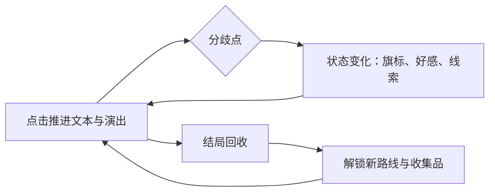

# Ludo Atlas · 类型手册 · 视觉小说（Visual Novel）

> **类型手册 · 第一辑**。定位：视觉小说的开发全流程，覆盖分支结构、文本工程、资产规格、演出节奏、存档体验与本地化。
> 配套：《游戏设计手册》（叙事与分支成本）·《美术与音频手册》（立绘与音频规格）·《避坑大全》·《案例研究集》。
> 本文不放链接。写作手感来自阅读与写作本身，这里只把工程上的账算清楚。

---

## 1. 定位与核心循环

视觉小说（Visual Novel，VN）以文字为第一载体，图像与声音是它的演出层。玩家的动作只有两个：读，以及偶尔选择。其余体验全部由文本质量、演出节奏与分支结构承担。

对个人与小团队来说，这是最现实的叙事入口：主流工具链免费，存档、回看、跳过、多语言这些标配功能开箱即有，项目成败几乎全部落在文本与结构这一件事上。代价也要说明白：文本量按十万字计，没有任何玩法系统能替你兜底。写不出来，项目就停在那里。

核心循环分三层：

| 层级 | 循环 | 黏性来源 |
| --- | --- | --- |
| 秒级 | 点击 → 读一段 → 情绪反应 | 文笔密度、演出节拍、笑点与悬念的投放 |
| 章节级 | 一章读完 → 小高潮或悬念 → 停下 | 章末钩子：让玩家带着"想知道下文"离开 |
| 周目级 | 通关 → 解锁新信息 → 重读部分段落 | 多结局、隐藏线、收集品 |

反过来的判断同样重要：如果团队里没有人真正爱写长文本，或者产品预期是"玩法驱动"，这个类型不要碰。

## 2. 玩家体验目标与标杆作品

体验目标直接决定写什么、怎么演：

| 体验目标 | 玩家内心的声音 | 设计着力点 |
| --- | --- | --- |
| 代入 | "这是我的选择" | 选项有真实代价；叙事回指玩家之前的行为 |
| 情感冲击 | 笑出来、哭出来、起鸡皮疙瘩 | 铺垫与回收、角色弧线、关键场次的演出超支 |
| 悬念 | "然后呢？" | 章末钩子、信息控制、不可靠叙述 |
| 收集欲 | "还差两个结局" | 多结局、隐藏线、CG 回廊与成就 |
| 舒适 | "想读多久读多久" | 字幕速度、自动播放、随时存档、回看 |

标杆作品（大众熟知名单，按可借鉴点列）：

| 作品 | 一句话卖点 | 可借鉴点 |
| --- | --- | --- |
| 命运石之门 | 时间线跳跃与叙述诡计 | 选择与回收：每个分歧都有后果，二周目重看全是伏笔 |
| Fate/stay night | 三条线递进揭示世界观 | 路线结构：共同线收敛后再展开，越走越深 |
| CLANNAD | 日常积累后的情感爆发 | 节奏：长铺垫换高潮，一击成立 |
| 白色相簿 2 | 三角关系与状态量积累 | 旗标设计：选项累积关系值，路线在后期路由 |
| 逆转裁判 | 法庭推理的点击演出 | 演出密度：证物、音效与拖长音的口号 |
| 弹丸论破 | 推理与裁判玩法混合 | 类型混合：把演出做成可玩的段落 |
| 隐形守护者 | 真人影像与多结局 | 影像 VN 的结构设计与国内发行现实 |
| 完蛋！我被美女包围了 | 真人恋爱互动 | 低门槛入局与话题传播 |

玩家对 VN 的预期是一本"可以随时合上的书"：存档、回看、跳过是底线功能，任何一条缺失都会直接反映在评价里。

## 3. 设计要点

### 3.1 分支结构：树状、状态量与混合式

三种模型，按项目规模选择：

| 模型 | 做法 | 成本 | 适用 |
| --- | --- | --- | --- |
| 树状分支 | 选项直接指向各自的后续文本 | 随深度近似指数增长 | 短篇、少量关键分歧 |
| 状态量累积 | 选项只改数值，文本按阈值给差分 | 近似线性，文本复用率高 | 长篇多线 |
| 混合式 | 主线走状态量，关键抉择走显式分支 | 可控，主流做法 | 默认推荐 |

分支爆炸的治理规则：

1. 收敛点：每开一个分支，先把回汇位置写清楚。分支只有会回来，成本才是加法。
2. 差分优先：能用"同一场景改台词与表情"解决的，不要新开整条线。
3. 深度上限：关键分支最多三层。更深的树，玩家记不住自己选过什么，写手也维护不了。
4. 先登记再动笔：所有分支先记进分支表（编号、入口、收敛点、影响的状态量、负责写手），再写正文。
5. 结项审计：用分支表对账变量引用，清掉"写了却永远不会触发"与"引用了却没定义"的段落，长篇里这一步能救回数周。

流程图与工具：

- 单一事实来源是分支表，流程图只做展示。结构与数据都放在表里，图只是给人看的。
- 画图用 draw.io 或 Twine 的流程图视图足够，不用为可视化专门上工具。
- 一条硬规则：分支表里没登记过的分支，不允许出现在正文里。

### 3.2 剧本：角色声音表与选项设计

- 每个角色一张声音表：口头禅、句子长度习惯、称呼他人的方式、说不出口的话题。多人合写时，这张表是角色不串味的唯一保险。
- 选项文案是剧本的一部分：短、具体、能看出立场差异。"跟上去 / 留在原地"比"同意 / 拒绝"有信息量。
- 只做真选择：没有差分的选项不要给。玩家识破假选择只需要一次，之后所有选择都不再认真。
- 初稿砍一成起步：定稿前删掉 10-20% 的内容是常规操作。文本密度就是体验密度。

### 3.3 演出设计：点击推进的节奏学

演出是"文本之外的全部信息"：立绘变化、BGM 进出、屏幕特效、停顿长短。

- 节奏公式：平静段落快（短停顿、零特效），高潮段落慢（长停顿、关键处加特效）。反着来，点得越快情绪越死。
- 点击推进：一次点击推进一个信息单位（一句台词或一个演出变化）。不做"点一下刷出整屏文字"的廉价演出。
- BGM 切换：一场戏一到两次起落就够；切换一律淡入淡出，硬切只留给惊吓。
- 特效预算：震屏、闪白、滤镜、全屏演出是全篇的稀缺资源，只在高潮处花。每句都震等于不震。
- 字幕速度与自动播放：默认值面向慢速读者，快的玩家自己调；自动播放间隔按当前文本长度计算，不用固定值。
- 停顿写作：把"沉默两秒再开口"写成脚本里的显式指令。演出设计的一部分，就是控制读者什么时候喘气。

### 3.4 存档、回看与多周目

现代 VN 的标配清单，少一项就会被评价惩罚：

- 剧情回退：能往回翻若干段并重新选择，这是 VN 与普通阅读器的分水岭，也是点错选项后的第一道保险。
- 回看：完整对话历史，支持重听语音、从回看点跳回主线。
- 章节跳转：已读章节自由跳；通关后开放全章节选择。
- 存档：多槽位、自动存档（分歧点前后各存一次）、快速存读快捷键；存档界面带缩略图、时间与章节名。
- 多周目：二周目解锁新视角或增补段落；隐藏线与真结局放在全结局回收之后，结局列表显示未回收数量，不给玩家猜谜的机会。
- 收集：CG 回廊、音乐鉴赏、结局列表，给"读完还想留下点什么"的玩家一个去处。

## 4. 技术要点

### 4.1 引擎路线

- Ren'Py：VN 的事实标准，免费开源。存档、回退、回看、跳过、偏好设置、多语言、成就对接都是标配；脚本语言接近剧本格式，写手可以直接改文本。没有特殊需求，从它开始，别自制。
- Unity 加 VN 插件（NaniNovel 等）：需要 3D 场景、Live2D 深度整合或复杂小游戏时走这条路线，开发量上一个台阶，换来的表现力也上一个台阶。
- Godot 加对话插件（Dialogic 等）：开源阵营路线，适合已用 Godot 的项目，或计划让 VN 与 2D 玩法混合的作品。
- Web 与纯文本路线：Ink、Twine 适合交互小说与叙事原型；网页 VN 方案适合"浏览器即点即玩"的发布场景。
- 自制引擎：只有演出方式超出所有现成工具时才值得考虑，第一作不要这么做。

### 4.2 文本工程：脚本即数据

- 对白、角色名、表情、音乐、特效标记写在同一处是 VN 脚本的正常形态，但变量与条件必须集中管理：建一张变量表（名字、类型、初值、影响的段落），条件只允许引用登记过的变量。
- 场景编号贯穿到底：每场戏一个稳定编号（示例：3-02 教室午休），剧本、分支表、资产清单、语音表共用同一套编号，方便随时对账。
- 好习惯是把文本做到"能改台词不动逻辑"，字面量字符串不散落在条件判断里。

### 4.3 文本管理与本地化

- 从第一天就按"要翻译"组织文本：对白全部走引擎的字符串系统；专有名词（人名、地名、招式名）先立术语表，再谈翻译。
- 导出流程：脚本导出为翻译表（表格或 CSV）→ 译员翻译 → 回填 → 术语校验 → 全流程跑一遍看断行、字体与标点。翻译导出功能主流引擎都自带。
- 字体是中文项目的第一坑：商用 CJK 字体授权逐款确认；多语言版每加一门语言都要验证缺字与回退字体；UI 宽度按最长语言预留，起步按 30% 余量估算。
- 断行与标点：先交给引擎的换行规则，再人工抽查；中文标点禁则（行首不出现闭标点等）在演出渲染里也要过目一遍。

### 4.4 演出系统与发布

- 立绘做分层：身体、表情差分、姿态差分分开导出，引擎按标签组合，不要把每种组合做成整张图。
- 音频细节：BGM 交叉淡入淡出；语音打断规则明确（新语音打断旧语音）；点击音效加节流，防止狂点变成噪音。
- 视频演出慎用：码率与包体是隐藏成本，能用静态图加特效与音频实现的，优先不做过场视频。
- 平台现实：Steam 是 VN 的主战场，成就与云存档是常见标配；移动版做触屏与省电适配；网页版按平台裁剪包体。

## 5. 内容量与工作量参考

### 5.1 文本量与写作工时

量级关系（按单人、面向可发布质量；数字是标尺，不是承诺）：

| 规模 | 正文篇幅 | 通关时长 | 写作工期量级 | 定位 |
| --- | --- | --- | --- | --- |
| 短篇 | 2 万字上下 | 1-2 小时 | 2-6 周 | Jam 作品、概念验证 |
| 中篇 | 8-15 万字 | 4-8 小时 | 3-6 个月 | 商业可售的完整作品 |
| 长篇 | 25-50 万字 | 12-25 小时 | 1-2 年 | 多线作品，接近全职投入 |
| 超长篇 | 100 万字级 | 40 小时以上 | 数年或团队 | 商业大作与系列基底 |

换算口径（写进进度表的三个数）：

- 写作速度：熟练写手每天 2000-4000 字初稿，按 6 到 8 小时有效工作计。
- 修订倍率：修订与集成耗时约等于初稿的 0.5 到 1 倍。
- 阅读速度：玩家净通过速度按每分钟 200-300 字估算，含演出停顿与互动，用它算通关时长。

按这个口径，10 万字正文的写作加修订约 40 到 90 个有效工作日。这是"中篇"的真实投入，立项文件里要写明。

校对流程（四道，别省）：

1. 自校：初稿隔一天以上再通读，删废话、统一口癖。
2. 交叉校：换一个人读改，专抓逻辑漏洞与角色串音（A 说出了 B 的话）。
3. 集成校对：文本进引擎跑一遍，核对表情、音乐、停顿是否出现在写的位置。
4. 终校：全篇连读，出声读效果最好；对照清单过术语、称呼、变量引用与错别字。

终校检查清单：角色名与称呼一致；术语表全覆盖；数字、日期、地点前后一致；分支变量全部有定义且有触发；同音字错别字；中文标点。

### 5.2 资产规格与清单管理

| 资产 | 规格建议 | 中篇量级 | 备注 |
| --- | --- | --- | --- |
| 立绘 | 半身或全身，画布约 1200-2000 像素高，透明底 | 5-8 人，每人 3-6 种姿态 | 锚点统一（脚底或腰线），方便站位与换位 |
| 表情差分 | 每人 6-12 种，基础情绪加特殊表情 | 随角色数等比增加 | 只画头部区域，引擎里与身体组合 |
| 背景 | 1920×1080 起，一次性出干净底图 | 15-30 张 | 时间与天气差分按剧情需要再做 |
| CG | 1920×1080 以上 | 每条线 3-8 张 | 每张 CG 对应一个情感高点，选题要吝啬 |
| BGM | 1-3 分钟可无缝循环 | 10-30 首 | 按情绪与场景配置，不为数量堆曲子 |
| 音效 | 点击、转场、日常、特殊 | 30-80 个 | 点击音是高频资产，优先做好 |
| 语音 | 按角色与台词统计 | 差异极大 | 全语音是最大成本变量；常见折中：主线全语音、分支无语音 |
| UI | 对话框、选项、回看、存档、设置、画廊、标题 | 一套 | 最容易被低估的工程量，排期要单列 |

清单管理三件事：

- 一张资产总表贯穿项目：场景编号对到文本段，再对到需要的立绘、表情、背景、CG、音乐、音效、语音。写剧本时同步登记，美术按表生产。
- 每章一个冻结节点：该章文本定稿后才进入细节美术，定稿前只做占位，避免返工。
- 命名规范从第一天执行：`bg_地点_时间`、`ch_角色_表情`、`cg_章节_序号`、`bgm_情绪_序号`。文件上几百个之后，乱命名会开始收利息。

## 6. 第一个原型怎么起步

目标：两周内做一个"能完整读一章、能存读档、能收到真实反馈"的最小可玩版。一张成品图都不需要。

1. 第 1 天：装 Ren'Py，跑完自带教程，把"新建项目、改文本、打包"走通一遍。
2. 第 2-3 天：写 3000-5000 字的第一章：两个角色、一个场景、一个选择点、两个结局。在手机备忘录里写也行，别卡在工具上。
3. 第 4-5 天：用纯色块加免费素材占位（色块标上"教室-白天"就够），把文本贴进引擎，让第一章能从头点到尾。
4. 第 6-7 天：配置并实测五个标配功能：存档、读档、回看、跳过已读、设置（字幕速度与自动播放）。
5. 第 8-10 天：调演出：BGM 进出时机、停顿长度、点击节奏；把"哪里停多久"记成注释，作为后续章节的演出规范。
6. 第 11-14 天：找 3-5 个人读。只看三件事：哪里点了快进、哪里笑或惊呼、哪里退出。读完只问一句："你想不想看第二章？"

验收标准：一个没读过设定的人，10 分钟内读完第一章，能复述剧情，并且想知道后面发生了什么。达不到，就改文本，不要加功能。

## 7. 常见坑

1. **分支爆炸**：没有收敛点的树状分支，写作与校对量随时间翻倍。规避：先画收敛点，再写正文。
2. **假选择**：选项不产生差分，或差分小到玩家感知不到。规避：要么给真差分，要么收掉选项。
3. **跳过与已读管理缺失**：长文本加不能跳过，等于直接劝退。规避：标配功能全开；多周目段落全部可跳，新内容高亮标记。
4. **文本与资产脱钩**：写到哪算到哪，美术需求拖到收尾阶段才整理，预算必然失控。规避：先出资产总表，按表并行生产。
5. **演出过载**：每句话都震屏、闪白、切音乐，读者从第三段开始麻木。规避：给特效编预算，只在高潮超支。
6. **默认值不调**：字幕速度、自动播放间隔用引擎默认，谁也读不舒服。规避：发布前请至少 5 个读者调到各自舒服的值，取中位数。
7. **术语漂移**：同一名词三种叫法，角色称呼随章节变化。规避：术语表加交叉校对，结项前全篇检索。
8. **字体与素材版权**：CJK 字体商用授权、音乐与素材来源不清，上架后被追责。规避：每一款字体与素材都留授权凭证。
9. **存档兼容**：发布后更新剧本，旧存档报错。规避：存档结构与剧情内容解耦，更新前用旧档实测。
10. **只测文本不测演出**：文本编辑器里一切正常，进引擎后表情错位、音乐踩点失误。规避：集成后跑全流程测试，演出验收放在测试名单冻结之后。
11. **隐藏线过深**：藏得太好，多数玩家永远看不到。规避：结局列表提示未回收数量，隐藏线入口给可感知的暗示。
12. **强制重读**：多周目的重复段落不可跳过，玩家会用差评投票。规避：重复段落可跳，新增内容必须一眼可辨。

## 延伸阅读

- [《游戏设计手册》](../../fundamentals/game-design/README.md)§8 叙事设计：分支成本管理、对话设计与世界观呈现层次。
- [《美术与音频手册》](../../fundamentals/art-audio/README.md)：立绘与 CG 的交付规格、音频设计与响度规范。
- [《制作管理手册》](../../fundamentals/production/README.md)：估算、排期与范围控制，配合本页 §5 使用。
- [《避坑大全》](../../pitfalls/README.md)：立项与内容生产相关坑位，与本页 §7 对照阅读。
- [《案例研究集》](../../postmortems/README.md)：完整案例的四段拆解，选型与打法参考。
- [《AI 工作流手册》](../../ai/README.md)：叙事管线的半自动生成与人工核对流程。
- 引擎与工具条目：[《资源大全》](../../../resources/README.md)；引擎轨道 Ren'Py 篇在 [docs/engines/](../../engines/README.md) 建设中。
