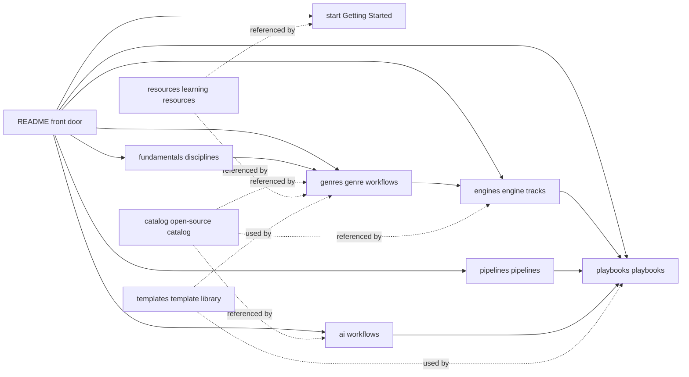

# Ludo Atlas · Game Development Panorama Handbook — Repository Skeleton Design Doc

> Current status: v2.5 · Genre Handbooks: 81 genres · Reading site: Material for MkDocs (book edition; Simplified Chinese / English / Japanese)
> Goal: build a long-term-maintainable open-source game development knowledge repository, integrating "genre-based development workflows" × "open-source project catalog" × "courses and learning resources" × "AI development workflows".

---

## Contents

1. Project Positioning
2. Design Principles (10)
3. Information Architecture (dual axes + cross-referencing)
4. Full Directory Tree (repository skeleton)
5. `docs/` in Detail (eight areas)
6. `catalog/` in Detail (machine-readable open-source project catalog)
7. `resources/` in Detail (courses and learning resources)
8. `playbooks/` in Detail (end-to-end playbooks)
9. `templates/` in Detail (unified template library)
10. `examples/` `scripts/` `.github/` `assets/` in Detail
11. Game Genre Matrix (18 families × 112 genres × volumes)
12. Content and Writing Standards
13. Governance and Maintenance (contributing, review, lifecycle, licensing, translation)
14. AI Development Workflows (dedicated section design, with 8 end-to-end cases)
15. Current State and Next Steps
16. Repository Metadata and Naming Recommendations
17. Appendix: Companion Handbooks and Where They Live
18. Change Log

---

## 0. About This Document

- This document defines the repository's information architecture and maintenance standards: positioning, directory responsibilities, templates, writing standards and collaboration workflow.
- The directory tree and templates can be copied and used directly (§4–§10); content standards and governance are in §12–§13; the AI section design is in §14.
- This document lives at `docs/meta/design.md` and is updated as the repository evolves; for version history see `CHANGELOG.md` at the repository root.

---

## 1. Project Positioning

### 1.1 One-line Definition

A **Chinese-first, structurally sound, link-verifiable** open-source game development knowledge base: it breaks "making games" into four main lines — genre workflows (how to do it) × open-source toolchain (what to build it with) × learning resources (where to learn) × AI workflows (how to go faster) — and integrates them into a structured handbook that is searchable, contributable and maintainable over the long term.

### 1.2 Goals (the 6 Problems the Repository Solves)

1. **Beginners do not know where to start** → `docs/start/` provides an engine selection decision tree + your first game in 7 days + learning paths.
2. **How each genre is made is scattered everywhere** → `docs/genres/` builds a uniformly structured development playbook for every genre (design / tech / content pipeline / production / cases / starter kit).
3. **No trustworthy list of "which open-source project should I use"** → `catalog/` provides a machine-readable (YAML + schema), CI-validated tool catalog with licences and maintenance status.
4. **Courses and resources are hit-or-miss** → `resources/` filters by difficulty, cost, language and genre, and marks each entry with a review date.
5. **Nobody has systematically organized AI-era workflows** → `docs/ai/` is a standalone section: coding agents, engine MCP, AI art/audio/narrative/QA, compliance and ethics + 8 end-to-end workflow cases.
6. **There is no bridge between learning and doing** → `playbooks/` provides copyable end-to-end processes (30-day demo, 48-hour game jam, vertical slice, Steam launch, portfolio to job).

### 1.3 Non-goals (Explicitly Out of Scope, to Keep the Range Under Control)

- No reposting, no cloning other people's tutorials in full; only "indexing + recommendation + our own processes and experience".
- No forum and no Q&A (GitHub Discussions serves that role).
- No news site and no market-data service (we only link to existing authoritative sources).
- No unlabelled sponsored content; paid resources are included, but price tier and licence terms are mandatory labels.

### 1.4 Target Audience (Four Personas)

| Persona | Needs | Main entry point |
| --- | --- | --- |
| A. Complete beginners | Understand how games are actually made; ship a first project | `start/` → `playbooks/zero-to-demo-30d` |
| B. Career changers / job seekers | Fill in gaps systematically, build a portfolio, prepare for interviews | `fundamentals/` → `playbooks/portfolio-to-job` |
| C. Indie developers | Tool selection, fewer wrong turns, launch and live-ops | `catalog/` → `genres/` → `playbooks/steam-launch` |
| D. Educators / teams | A unified course skeleton and engineering standards | the whole `docs/` site + `templates/` |

### 1.5 How It Differs from Existing Repositories (Differentiated Positioning)

Excellent lists that already exist: `ellisonleao/magictools` (tool compendium), `dawdle-deer/awesome-learn-gamedev` (learning resources), `FronkonGames/Awesome-Gamedev` (categorized resources), `BUas/programming-awesome-list` (course-oriented).

Where this repository differs (and the reasoning behind its design trade-offs):

1. **Development workflows organized by genre**: existing lists almost all classify by tool; nobody has systematically laid out "what it takes to make a platformer".
2. **A machine-readable catalog** (YAML + JSON Schema + CI validation) that supports auto-generated tables and site pages and keeps dead links from piling up.
3. **AI workflows as a standalone section**: the biggest variable in game development workflows since 2024, and broadly missing from existing lists.
4. **Template-driven**: content of the same kind (genres, entries, postmortems) is structurally identical, so contributors just fill in the blanks.
5. **Chinese-first**, with terms given in both Chinese and English, aimed at the Chinese-speaking community; the multilingual reading site is live (English/Japanese), and the English edition is translated batch by batch.

> Relationship: we **cross-link and complement** the lists above rather than reinventing the wheel; `catalog/` seed data can be bulk-imported from existing lists (including the already forked magictools-SI) and then verified entry by entry.

---

## 2. Design Principles (10, Each with How It Is Applied)

| # | Principle | Description | How it is applied |
| --- | --- | --- | --- |
| P1 | **Dual-axis navigation** | Content is organized along two axes: the discipline axis (design/programming/art/audio/production) and the genre axis (112 game genres, 81 covered so far) | `fundamentals/` owns disciplines, `genres/` owns genres; where they cross, they link to each other instead of duplicating |
| P2 | **Single source of truth (SSOT)** | Every tool, course and resource is defined exactly once, in `catalog/` or `resources/` | Other pages reference the entry id / link only; copying description text is forbidden |
| P3 | **Machine-readable first** | Catalog data is data, not prose | `catalog/*.yml` + `schema.json`; tables and site pages are generated by scripts |
| P4 | **Template-driven** | Content of the same kind must be isomorphic, lowering writing and maintenance costs | `templates/` provides templates for genre playbooks, entries, GDDs, postmortems and more; all new content is initialized from a template |
| P5 | **Progressive disclosure** | README → section index → chapter home → deep-dive page, unfolding layer by layer | Every level's first screen gives a "one-line summary + navigation"; details sink deeper |
| P6 | **Verifiability** | Links must open; entries must carry a review date | CI: markdownlint + lychee link checking + catalog schema validation; entries record `added/reviewed` |
| P7 | **Stable URLs** | Directory and file names use English kebab-case, titles are written in Chinese; titles change, paths do not | Once published, the taxonomy and paths count as a compatibility promise; migrations must leave redirects |
| P8 | **Controllable scope** | The 112 genres are not filled in all at once; they advance by volume, tier by tier | The genre matrix marks each genre's volume; Volume 1 in full, the rest expanded as needed |
| P9 | **Built for the AI era** | The repository itself must be "LLM-friendly", and AI workflows are a first-class citizen | A dedicated `docs/ai/` section; content clearly structured for retrieval and citation |
| P10 | **Open governance** | Anyone can contribute through a defined process; review has rules and staleness has a handling path | CONTRIBUTING + CODEOWNERS + the lifecycle state machine (§13) |

---

## 3. Information Architecture

### 3.1 Four Main Lines + Three Cross-Cutting Layers

- Main line 1 — **Learning line**: `start/` → `fundamentals/` → `resources/`
- Main line 2 — **Production line**: `genres/` → `engines/` → `pipelines/` → `playbooks/`
- Main line 3 — **Tooling line**: `catalog/` (referenced by every page)
- Main line 4 — **AI line**: `docs/ai/` (a standalone section spanning learning and production)
- Cross-cutting layer 1: **templates** (`templates/`, reused by content and projects)
- Cross-cutting layer 2: **examples** (`examples/`, minimal runnable code)
- Cross-cutting layer 3: **automation** (`scripts/` + `.github/`, verifying and generating everything)

### 3.2 Cross-Reference Rules (Hard Rules When Writing Content)

1. `genres/*` references: `catalog/` (tools), `resources/` (courses), `engines/` (implementation differences), `templates/` (document templates).
2. `engines/*` references: `catalog/` (open-source plugins in that engine's ecosystem), `pipelines/` (general pipelines).
3. `ai/*` references: `catalog/ai-tools.yml`, `pipelines/`, `templates/`.
4. No page **may** copy a tool entry's description; only "entry name + relative link + one line on why it is recommended" is allowed.
5. Bidirectional linking: the referenced party lists the referencing page in its `related` field (the site generates a "backlinks" block).

### 3.3 Navigation Diagram (mermaid, to Be Embedded in the README)



---

## 4. Full Directory Tree (Repository Skeleton)

> Note: text after `#` is a comment; `…/` means the directory uses a uniform file template (see §5.3, §5.4). The repository has 9 top-level areas in total.

```text
ludo-atlas/
├── .github/                          # engineering: CI, templates, named owners
│   ├── workflows/
│   │   ├── lint-md.yml               # markdownlint + format checks (every PR)
│   │   ├── link-check.yml            # lychee link checking (PR + weekly schedule)
│   │   ├── validate-catalog.yml      # validate catalog/*.yml against schema.json
│   │   ├── build-site.yml            # build MkDocs Material and deploy to GitHub Pages
│   │   ├── gen-tables.yml            # regenerate index-page tables from the yml weekly
│   │   └── stats.yml                 # weekly stats (entry counts / coverage)
│   ├── ISSUE_TEMPLATE/
│   │   ├── new-resource.yml          # recommend a new resource (form: type/link/reason/no-duplicate declaration)
│   │   ├── content-fix.yml           # corrections (dead links, outdated, mistakes)
│   │   ├── playbook-request.yml      # request a playbook for a new genre
│   │   ├── translation.yml           # claim a translation
│   │   └── config.yml                # routing to Discussions
│   ├── PULL_REQUEST_TEMPLATE.md      # submission checklist (§13.2)
│   ├── CODEOWNERS                    # assign reviewers by area
│   └── dependabot.yml                # dependency and Actions updates
│
├── docs/                             # 1. Main documentation site (body content; the reading-site build lives in site/ at the repo root)
│   ├── (site engineering lives in site/: prepare.py aggregation + hooks-generated navigation + Material for MkDocs build)
│   ├── index.md                      # home: one-line positioning + entries to the four main lines + stats
│   ├── meta/                         # about the repository itself
│   │   ├── design.md                 # this design document (evolves with the repository)
│   │   ├── taxonomy.md               # taxonomy notes: family/genre/tag vocabulary (controlled vocabulary)
│   │   ├── writing-style.md          # writing standards (§12)
│   │   └── link-policy.md            # link policy: verification, archiving, handling failures
│   ├── start/                        # 0 · Getting Started (4 steps)
│   │   ├── README.md                 # getting-started overview and recommended routes
│   │   ├── what-is-gamedev.md        # the game development landscape and role map (programming/design/art/TA/audio/production/QA/publishing)
│   │   ├── engine-choice.md          # engine selection decision tree (by goal/language/platform/team)
│   │   ├── first-game-7days.md       # make your first game in 7 days (a task list per day)
│   │   └── learning-path.md          # learning paths: three tracks — hobbyist / indie / job-seeking
│   ├── fundamentals/                 # 1 · Fundamentals (6 subjects)
│   │   ├── game-design/              #   core loops, systems design, level design, numeric balancing, narrative, economy, UX
│   │   ├── programming/              #   languages, architecture, design patterns, algorithms, networking, performance, version control and tooling
│   │   ├── math-physics/             #   vectors and matrices, quaternions, probability, collision, game math in practice
│   │   ├── art/                      #   pipeline overview, 2D, 3D, animation, UI, technical art, shaders
│   │   ├── audio/                    #   sound design, music, middleware, mixing
│   │   └── production/               #   planning, scope control, version control, testing
│   ├── genres/                       # 2 · Genre development workflows (★ core; 18 families, 112 genres)
│   │   ├── README.md                 # genre selection matrix (complexity/team size/market/learning value)
│   │   ├── _template/                # blank genre playbook template (7 files, see §5.3)
│   │   ├── action/                   #   Action (12): platformer / precision-platformer / metroidvania /
│   │   │                             #     beat-em-up / fighting / character-action / hack-and-slash / stealth /
│   │   │                             #     soulslike / run-and-gun / endless-runner / immersive-sim
│   │   ├── shooter/                  #   Shooter (9): fps / tps / shmup / twin-stick / bullet-heaven /
│   │   │                             #     battle-royale / extraction-shooter / hero-shooter / looter-shooter
│   │   ├── rpg/                      #   Role-playing (7): jrpg / arpg / crpg / tactics-srpg /
│   │   │                             #     dungeon-crawler / mmorpg / monster-taming
│   │   ├── strategy/                 #   Strategy (8): rts / tower-defense / 4x / grand-strategy /
│   │   │                             #     auto-battler / moba / wargame / artillery
│   │   ├── simulation/               #   Simulation (11): management / city-builder / colony-sim / farming-life /
│   │   │                             #     survival-craft / vehicle-sim / flight-sim / god-game / life-sim /
│   │   │                             #     pet-sim / raising-sim
│   │   ├── puzzle/                   #   Puzzle (11): logic / sokoban / physics / escape-room / puzzle-platformer /
│   │   │                             #     match-3 / merge / word / hidden-object / grid-logic / jigsaw
│   │   ├── narrative/                #   Narrative (7): visual-novel / otome / point-and-click / interactive-fiction /
│   │   │                             #     mud / interactive-movie / walking-sim
│   │   ├── social/                   #   Social and multiplayer (7): party / co-op / couch-multiplayer / mmo /
│   │   │                             #     social-deduction / asymmetric / io-games
│   │   ├── procedural/               #   Procedural generation and in-run progression (4): roguelike / roguelite / deckbuilder / idle-incremental
│   │   ├── rhythm-music/             #   Rhythm and music (4): rhythm / music-sandbox / karaoke / dance
│   │   ├── sports-racing/            #   Racing and sports (8): racing / kart-racing / team-sports / extreme-sports /
│   │   │                             #     golf / fishing / billiards / fitness
│   │   ├── sandbox/                  #   Sandbox creation (3): sandbox-building / creative-workshop / physics-sandbox
│   │   ├── automation/               #   Automation and logic (3): factory-automation / programming-puzzle / logic-automation
│   │   ├── horror/                   #   Horror (3): survival-horror / psychological-horror / co-op-horror
│   │   ├── card-board/               #   Card and board (5): tcg / board-game / mahjong / solitaire / casino
│   │   ├── education/                #   Educational and functional (4): edutainment / serious-game / quiz / training-sim
│   │   ├── casual/                   #   Casual and lightweight (4): hyper-casual / minigame-collection / anti-stress / arcade-classic
│   │   └── xr/                       #   XR (2): vr-game / ar-game
│   ├── engines/                      # 3 · Engine tracks (12; 7 files each, see §5.4)
│   │   ├── README.md                 # engine selection matrix and comparison table
│   │   ├── godot/…  unity/…  unreal/…  bevy/…  web/…  microframework/…
│   │   ├── monogame-fna/…  defold/…  gamemaker/…  renpy/…  rpgmaker/…  custom-inhouse/…
│   ├── pipelines/                    # 4 · Pipelines (12 general pipelines)
│   │   ├── README.md                 # pipeline panorama: from code commit to live operations
│   │   ├── version-control/          #   Git workflows, Git LFS, branching strategies (what makes game repositories special)
│   │   ├── environment/              #   dev environments, toolchains, proxies and intranets, team mirrors
│   │   ├── coordination/             #   task management, document collaboration, meetings and decision records (ADRs)
│   │   ├── asset-pipeline/           #   art assets: naming, export, import, atlases, LOD
│   │   ├── audio-pipeline/           #   audio assets: formats, loudness, budgets, middleware
│   │   ├── level-content/            #   levels and content: data tables, editors, iteration cadence
│   │   ├── localization/             #   localization: string extraction, glossaries, translation, fonts
│   │   ├── playtesting/              #   playtesting: recruitment, scripts, notes, metrics
│   │   ├── build-release/            #   build and release: signing, stores, version numbers
│   │   ├── cicd/                     #   game CI/CD: build farms, automated packaging, Steam pipelines
│   │   ├── analytics/                #   telemetry and analytics: event design, privacy, dashboards
│   │   └── live-ops/                 #   live-ops: update cadence, hotfixes, community, incident response
│   ├── ai/                           # 5 · AI workflows (★ dedicated section, see §14)
│   ├── teams/                        # 6 · Teams & Scale
│   │   ├── README.md
│   │   ├── solo.md  small-team.md  studio.md
│   │   ├── hiring.md                 #   hiring and job-seeking: roles, interviews, portfolios
│   │   └── jams.md                   #   the complete Game Jam guide
│   ├── publishing/                   # 7 · Publishing & Monetization
│   │   ├── README.md
│   │   ├── marketing.md              #   marketing: wishlists, devlogs, social media, events
│   │   ├── steam-launch.md           #   the full Steam launch process
│   │   ├── store-page.md             #   store page and capsule art specs
│   │   ├── pricing.md                #   pricing and discounts
│   │   └── publishers-funding.md     #   publishers, investment, funding (including domestic support programmes)
│   └── postmortems/                  # 8 · Postmortem library
│       ├── README.md                 # postmortem index (filterable by genre/scale/outcome)
│       └── _template.md              # uniform postmortem template
│
├── catalog/                          # 2. Open-source project catalog (machine-readable, single source of truth)
│   ├── README.md                     # usage guide: field meanings, how to search, how to contribute
│   ├── schema.json                   # entry JSON Schema (§6.1)
│   ├── engines.yml                   # engines and frameworks
│   ├── libraries.yml                 # libraries (ECS/physics/rendering/networking/audio/PCG/pathfinding/UI)
│   ├── editor-tools.yml              # editors and tools (Tiled/LDtk/Blender/Krita/pixel-art tools…)
│   ├── narrative-tools.yml           # narrative tools (Ink/Twine/Yarn/Ren'Py/Dialogic)
│   ├── build-ci.yml                  # build and CI tools (GameCI/butler/gdUnit4…)
│   ├── backend-services.yml          # backend and multiplayer services (Nakama/Colyseus/Agones…)
│   ├── free-assets.yml               # free asset sources (Kenney/Poly Haven/Freesound…)
│   ├── starter-kits.yml              # template and starter projects
│   └── ai-tools.yml                  # AI tools (referenced by §14)
│
├── resources/                        # 3. Courses and learning resources
│   ├── README.md                     # master resource index and filtering guide
│   ├── courses/                      # courses (split by difficulty, including university open courses and engine-specific courses)
│   │   ├── README.md  beginner.md  intermediate.md  advanced.md
│   │   ├── university.md             # university open courses and course materials
│   │   └── engine-specific.md        # official and community courses per engine
│   ├── books.md                      # books (design/programming/art/production/industry accounts)
│   ├── video-channels.md             # video channels and series (including Bilibili/YouTube)
│   ├── blogs-newsletters.md          # blogs and newsletters
│   ├── gdc-talks.md                  # list of classic GDC talks (grouped by theme)
│   ├── papers.md                     # papers and technical reports
│   ├── communities.md                # communities (forums/Discord/Reddit/Chinese-language communities)
│   ├── jams-competitions.md          # competitions and game jams
│   ├── open-source-games.md          # games with source code worth studying (tagged by language/genre)
│   └── practice-projects.md          # practice-project list (remaking classics, increasing difficulty)
│
├── playbooks/                        # 4. End-to-end playbooks (copyable processes)
│   ├── README.md
│   ├── zero-to-demo-30d/             # 30 days from zero to a playable demo (weekly plan + daily checklist)
│   ├── game-jam-48h/                 # 48-hour game jam guide (including an AI-assisted version)
│   ├── vertical-slice/               # the vertical slice method
│   ├── steam-launch/                 # full Steam launch process (build packages/store page/review/launch day)
│   ├── mobile-launch/                # mobile release (Android/iOS, including privacy compliance)
│   ├── web-deploy/                   # web game deployment (itch/self-hosting/SEO)
│   ├── early-access/                 # early access and long-term update planning
│   ├── live-ops-6months/             # live-ops handbook for the first 6 months after launch
│   ├── portfolio-to-job/             # portfolio to job (resume/interview/test tasks)
│   └── studio-pitch/                 # pitching to publishers (proposal structure/budget/demo requirements)
│
├── templates/                        # 5. Template library (for both content and projects)
│   ├── README.md                     # how to use the templates, plus a selection tree
│   ├── gdd/                          # game design documents (three tiers: mini / standard / full)
│   ├── one-pager.md                  # one-page pitch
│   ├── tech-design.md                # technical design document
│   ├── adr.md                        # architecture decision record
│   ├── postmortem.md                 # postmortem template
│   ├── playtest-plan.md              # playtest plan
│   ├── milestone-plan.md             # milestones and schedule
│   ├── art-bible.md                  # art bible (style/specs/naming)
│   ├── audio-plan.md                 # audio plan
│   ├── genre-playbook/               # genre playbook template (7 files, §5.3)
│   ├── catalog-entry/entry.yml       # catalog entry template
│   └── repo-starter/                 # game repository starter (.gitignore/.gitattributes/CI/README/LICENCE)
│
├── examples/                         # 6. Minimal runnable examples (organized by engine)
│   ├── README.md                     # example index (for each example: what problem it solves, where to start reading)
│   ├── godot/                        #   platformer-2d/  topdown/  roguelike-tiles/ …
│   ├── unity/                        #   2d-controller/  state-machine/ …
│   ├── web/                          #   canvas-basics/  phaser-platformer/ …
│   ├── micro/                        #   raylib-starter/  love-starter/ …
│   └── shaders/                      #   reusable shader collection (Godot/Unity/GLSL versions)
│
├── scripts/                          # 7. Automation scripts
│   ├── validate_catalog.py           # schema validation (invoked by CI)
│   ├── gen_catalog_tables.py         # yml → index-page tables (generated; do not edit by hand)
│   ├── new_genre.py                  # generate a new genre directory from the template
│   ├── new_playbook.py               # generate a new playbook from the template
│   ├── check_links.py                # local link-check entry point (CI uses lychee)
│   └── stats.py                      # stats: entry count/genre coverage/overdue reviews
│
├── assets/                           # 9. Brand and image assets
│   ├── logo.svg  banner.png  social-preview.png   # branding (light/dark versions)
│   └── reading/                      # illustrations used across documents (webp, <300KB)
│
└── (root files)
    README.md                  # front door (Chinese): one line + four-main-line navigation + stats + quick start
    README.en.md  README.ja.md # English / Japanese editions
    LICENSE                    # content: CC BY-SA 4.0
    LICENSE-CODE               # code (examples/scripts): MIT
    CONTRIBUTING.md            # contributing guide (two workflows: writing + data)
    CODE_OF_CONDUCT.md         # code of conduct (Contributor Covenant)
    GOVERNANCE.md              # governance: roles, review, arbitration, part-time maintainer system
    ROADMAP.md                 # roadmap (status and next steps)
    CHANGELOG.md               # changelog (Keep a Changelog format)
    GLOSSARY.md                # glossary (Chinese–English, mounted as a site page)
    CITATION.cff               # citation information
    .editorconfig  .gitattributes  .gitignore
    .markdownlint.json  .lycheeignore
```

---

## 5. `docs/` in Detail (Eight Areas)

### 5.1 `start/` and `fundamentals/`

`start/`: five pages (plus the index):

| File | Content highlights |
| --- | --- |
| `what-is-gamedev` | the full process from concept to release + the role map |
| `role-map` | roles and skills map: programming / design / art / TA / audio / production |
| `engine-choice` | engine selection: target platform × programming background × 2D/3D × team |
| `first-game` | first game: a 30-day plan and acceptance criteria |
| `learning-path` | learning path: what to learn → what to build → acceptance criteria |

`fundamentals/`: 7 volumes on fundamental subjects, each with one `README.md`: a subject map + learning order + core content organized into thematic sections.

### 5.2 Where the `fundamentals/` Volumes Live

| Volume | Directory |
| --- | --- |
| Game Design Handbook | `game-design/` |
| Programming Handbook | `programming/` |
| Art & Audio Handbook | `art-audio/` |
| Production Handbook | `production/` |
| Level Design Handbook | `level-design/` |
| Engine Internals Path | `engine-internals/` |
| Renderer from Scratch | `graphics/` |

### 5.3 `genres/` ★ Core Area

**Organization**: one directory per genre, grouped under 18 families, with one `README.md` per genre, all sharing a seven-section structure:

| Section | Content |
| --- | --- |
| 1. Positioning and core loop | one-line definition, core-loop breakdown, genre boundaries |
| 2. Player experience goals and benchmark titles | experience goals, benchmark titles and what to take from them |
| 3. Design essentials | system list, numbers and curves, content pacing, design pitfalls |
| 4. Technical essentials | key technical points, architecture suggestions, engine implementation differences, performance budgets |
| 5. Content volume and workload reference | scale tiers (solo / small team / commercial) and milestone references |
| 6. How to start the first prototype | minimal prototype route and day-one checklist |
| 7. Common pitfalls | high-frequency pitfalls and countermeasures |

Each page opens with a positioning block (`> **Genre Handbooks · Volume X**. Positioning: …`) and companion-reading pointers, and closes with further reading. **Volumes**: Volumes 1–4 (10 / 15 / 26 / 30 genres), 81 genres in total; long-tail and hybrid genres are added as needed (see the matrix in §11).

### 5.4 `engines/` Engine Tracks (12)

One `README.md` per track, all with the same seven-section structure:

| Section | Content |
| --- | --- |
| 1. Positioning and selection | version status, applicable scenarios and trade-offs, matching genres |
| 2. Ecosystem and project structure | directory layout, asset naming, plugin ecosystem and toolchain |
| 3. Core workflows | editing, debugging, building and the daily loop |
| 4. Key system idioms | signals/events, state machines, componentization, data-driven design |
| 5. Performance and optimization essentials | draw calls, memory, loading and platform differences |
| 6. Learning route | official docs and tutorial paths (→ resources) |
| 7. Common pitfalls | high-frequency pitfalls and countermeasures |

**The 12 tracks**: `godot` (GDScript/C#; the open-source first choice), `unity`, `unreal`, `bevy` (Rust/ECS), `web` (Three.js/Babylon.js/PixiJS/Phaser), `micro` (raylib/LÖVE/SDL/SFML), `monogame`, `defold`, `gamemaker`, `renpy`, `rpgmaker`, `cocos`.

### 5.5 `pipelines/` Work Pipelines (6 + 2 In-depth Handbooks)

One `README.md` per pipeline: the first screen answers "what problem does this pipeline solve, and when do you need it", then gives the process and a checklist. **This is the section of the repository with the strongest hands-on experience.**

| Pipeline | In one line |
| --- | --- |
| `version-control` | Git strategy for game repositories, LFS and scene-conflict management |
| `asset-pipeline` | the five-stage pipeline from creation to check-in, and its standards |
| `localization` | the complete process of extraction, translation, backfill and testing |
| `build-release` | build matrices, automation and channel-package management |
| `playtesting` | a hypothesis-first, strangers-first playtesting method |
| `telemetry-analytics` | a data pipeline that defines questions before adding instrumentation |

In-depth handbooks: [Modding & UGC](../pipelines/modding/README.md), [Multiplayer & Backend](../pipelines/multiplayer-backend/README.md).

### 5.6 `teams/`, `publishing/`, `postmortems/`

- `teams/`: `solo-dev` (solo development strategy and keeping projects from being abandoned), `small-team` (division of labour and collaboration for 3–10 people), `studio` (departments and processes).
- `publishing/`: six volumes — Live-Ops & Growth, Mini-Game Development, Console, VR/AR, Esports and Legal — plus an index, covering publishing, compliance and monetization.
- `postmortems/`: one file per postmortem; the README maintains a filterable index (by genre / scale / success or failure). Submissions are preferred, and permission is required.


---

## 6. `catalog/` in Detail (Open-Source Project Catalog)

### 6.1 Entry Schema (field definitions in `catalog/schema.json`)

```yaml
- id: godot                          # unique id (kebab-case; referenced repository-wide)
  name: Godot Engine
  homepage: https://godotengine.org
  repo: https://github.com/godotengine/godot
  category: engine                   # engine|library|editor|narrative|build|backend|assets|starter|ai
  description: Open-source cross-platform 2D/3D game engine, scripting in GDScript / C#…
  # Hard rules for descriptions: ≤80 characters, one sentence, state "what it is + what stands out"; no marketing tone
  tags: [2d, 3d, gdscript, csharp, gpl-exception]   # controlled vocabulary, see docs/meta/taxonomy.md
  license: MIT                       # SPDX identifier; for non-standard licences, put details in notes
  platforms: [windows, macos, linux, android, ios, web]
  languages: [GDScript, C#, C++]
  maturity: production               # experimental | beta | production | legacy
  pricing: free                      # free | freemium | paid | source-available
  status: active                     # active | stale | archived (maintenance status)
  added: 2026-10-04
  reviewed: 2026-10-04               # review date (auto-flagged past 12 months)
  notes: ""                          # honest notes: licence traps, commercial caveats, etc.
```

### 6.2 Inclusion and Review Criteria (a Rigorous Checklist, to Keep the Catalog from Bloating and Losing Focus)

**Inclusion conditions (all must hold)**:

1. Solves a clear game development problem and is a reasonable choice among its peers (not "yet another small tool").
2. Has an accessible homepage or repository; open-source projects need a clear licence.
3. Shows activity within the last 24 months (commits/releases/community), or is a "retired classic still worth studying" and is labelled honestly.
4. No malicious history, no licensing disputes of unclear origin.

**Not included**: licence-free "source-available" software (unless the risk is explicitly noted), pure advertising projects, AI-generated spam repositories, dead projects (moving one to `legacy` requires a human note explaining why).

**Classification rule**: a project goes into exactly one primary category (SSOT); cross-cutting topics are expressed with `tags`, not duplicate entries.

### 6.3 Workflow (data → display)

1. A contributor edits `catalog/*.yml` (or submits via an issue form, and a maintainer fills it in).
2. CI: `validate_catalog.py` validates the schema (required fields/enum values/date formats).
3. `gen_catalog_tables.py` turns the yml into per-category index-page tables (inserted between the marker regions in `docs/catalog/*.md`) and site data.
4. Link checking (lychee) tests homepage/repo reachability; results are merged into the CI report.
5. The stats shown in the README and the site home are computed and injected by the build scripts, so hand edits cannot drift out of sync.

> Generated regions are wrapped in comment markers: `<!-- gen:begin category=engine -->` … `<!-- gen:end -->`; humans only maintain the yml.

### 6.4 Content Outline for Each yml File (seed list in §17)

- `engines.yml`: engines and "framework-style" options (Godot/Bevy/raylib/LÖVE/libGDX/MonoGame/Defold/O3DE…), with a `kind: engine|framework|engine-like` field to tell them apart.
- `libraries.yml`: libraries broken down by `subcategory`: `ecs` `physics` `rendering` `networking` `audio` `pcg` `pathfinding` `ui` `scripting` `serialization`.
- `editor-tools.yml`: general-purpose editors and creation tools (Tiled/LDtk/Blender/Krita/pixel-art tools/voxel tools…).
- `narrative-tools.yml`: Ink/Twine/Yarn Spinner/Ren'Py/Dialogic and the like.
- `build-ci.yml`: GameCI, butler, gdUnit4, GUT, AltTester, fastlane and the like.
- `backend-services.yml`: Nakama, Colyseus, Agones, Supabase/Appwrite (the parts commonly used in games) and the like.
- `free-assets.yml`: asset sources (licence required: CC0/CC-BY/mixed, noted per entry).
- `starter-kits.yml`: open-source starter projects (tagged by engine/genre).
- `ai-tools.yml`: AI tools (referenced by §14.2; with extra fields `ai_scope: coding|art|audio|narrative|qa|l10n|all`, `local: true|false`, `pricing`).

---

## 7. `resources/` in Detail (Courses and Learning Resources)

### 7.1 Entry Format (table rows, a uniform six columns)

```text
| Name (link) | Language | Cost | Difficulty | Audience | Notes and review date |
```

**Filtering principles**: prefer "complete courses / structured curricula" over single-tip articles; mark the language (Chinese/English) and cost (free/subscription/one-time purchase); entries not reviewed for over 12 months are tagged `⏳ stale` for cleanup.

### 7.2 File-by-File Responsibilities

| File | Inclusion criteria |
| --- | --- |
| `courses/beginner.md` | absolute beginners: intro to programming + intro to an engine + a first game |
| `courses/intermediate.md` | some background: systems design, architecture, specialist techniques |
| `courses/advanced.md` | advanced: engine internals, graphics, network synchronization, performance engineering |
| `courses/university.md` | university open courses (CS50G, CMU, Utah graphics, etc.) |
| `courses/engine-specific.md` | official courses and documentation-style tutorials per engine (including Chinese-language resources) |
| `books.md` | five categories: design, programming, art, production management, industry accounts (each book gets one line on "which chapter to read first") |
| `video-channels.md` | channel tracks: tutorial-oriented / design-analysis-oriented / technical-breakdown-oriented; Chinese-language channels get their own section |
| `blogs-newsletters.md` | long-form blogs (technical + design) and weekly newsletters |
| `gdc-talks.md` | a talk list grouped by theme (design/programming/art/production/indie), with suggested viewing order |
| `papers.md` | entry points to graphics/procedural generation/game AI papers |
| `communities.md` | communities: general forums, engine communities, Chinese-language communities, Discord servers (with a "read the pinned posts/FAQ first" note) |
| `jams-competitions.md` | competitions: Ludum Dare, GGJ, GMTK Jam, 7DRL, js13k… (difficulty/duration/stage they suit) |
| `open-source-games.md` | games with source code worth studying: tagged by language, each with one line on "which subsystem to read first" |
| `practice-projects.md` | a practice-project ladder: remaking classics (Snake → Tetris → platformer → roguelike → small RPG), each with acceptance criteria |

---

## 8. `playbooks/` in Detail (End-to-End Playbooks)

Every playbook shares a four-part structure:

1. **Fit and output**: when to use it, and what you get when it is done (a verifiable artifact).
2. **Overview chart**: stage breakdown + timeboxes (a table).
3. **Stage-by-stage checklist**: each stage = tasks (checkable) + tools (→ catalog) + checkpoints ("stop here and verify X").
4. **Failure points**: the five most common reasons this process fails, and how to avoid them.

Key content skeleton for the ten playbooks:

| Playbook | Core stages | Signature content |
| --- | --- | --- |
| `zero-to-demo-30d` | tool selection (2d) → prototype (7d) → core loop (10d) → content fill (7d) → release (4d) | two schedules: 2 hours a day / full-time |
| `game-jam-48h` | team up → cut scope → execute → submit | a scope formula ("one sentence of playable"); an AI-assisted process (→ §14.8) |
| `vertical-slice` | goal definition → slice scope → polish → review | slice acceptance criterion: can an outsider say within 10 minutes what the game's selling point is |
| `steam-launch` | store page first → wishlist building → builds → review → launch | a timeline table (from 6 months before to 30 days after launch, week by week) |
| `mobile-launch` | porting → privacy compliance → testing → submission | iOS/Android privacy checklists, age ratings, user-acquisition basics |
| `web-deploy` | build → deploy → share | a comparison of three options: itch.io / GitHub Pages / self-hosted CDN |
| `early-access` | EA positioning → roadmap → update cadence | managing EA expectations (what goes into EA, what not to promise) |
| `live-ops-6months` | updates → community → data → retrospective | a monthly cadence template; incident response process |
| `portfolio-to-job` | portfolio → resume → interview → test task | a three-piece portfolio structure (1 complete + 1 technical showcase + 1 quick piece) |
| `studio-pitch` | proposal → demo → negotiation | pitch deck structure (10-page template); demo requirements checklist |

---

## 9. `templates/` in Detail (Template Library)

### 9.1 Three Tiers of Game Design Documents (`gdd/`)

| Tier | Length | Suits |
| --- | --- | --- |
| `mini.md` | 1–2 pages | jam / prototype: one line, core loop, controls, scope |
| `standard.md` | 8–15 pages | indie projects: + systems, content, art direction, technical constraints, schedule |
| `full.md` | 20+ pages | full greenlight: + market positioning, competitors, business model, risks, acceptance |

### 9.2 Genre Playbook Template (`genre-playbook/`)

The blank version of the seven files from §5.3, plus a **writing-guide comment** at the top of each file (what to write, what not to write, length caps). `new_genre.py` uses it to generate a new genre directory in one command.

### 9.3 Entry Template (`catalog-entry/entry.yml`)

A blank entry matching the schema in §6.1, with commented examples.

### 9.4 Repository Starter (`repo-starter/`)

A ready-to-use kit for future game repositories:

```text
repo-starter/
├── README.md                 # game repository README template (name/screenshots/GIF/gameplay/how to build/licence)
├── .gitignore                # per engine: godot.gitignore / unity.gitignore / unreal.gitignore
├── .gitattributes            # Git LFS rules: png/psd/wav/fbx/blend etc.
├── LICENSE                   # placeholder note (game code and asset licences kept separate)
├── docs/                     # GDD.md  TECH.md  ART_BIBLE.md  CHANGELOG.md
├── .github/workflows/ci.yml  # build + test skeleton (switch per engine via comments)
└── CONTRIBUTING.md           # if open source
```

---

## 10. `examples/`, `scripts/`, `.github/` in Detail

### 10.1 `examples/` Standards

- Each example = the minimum runnable code + a `README.md` (what problem it solves / a guide to the key files / the run command) + no unrelated dependencies.
- Principle: "delete everything you can": examples are teaching material, not production engineering.
- Engine examples may join their own CI (optional).

### 10.2 `scripts/` Responsibilities and CI Mapping

| Script | Called by | Purpose |
| --- | --- | --- |
| `validate_catalog.py` | `validate-catalog.yml` (PR) | validates yml against schema.json and outputs error line numbers |
| `gen_catalog_tables.py` | `gen-tables.yml` (weekly + manual) | regenerates index-page tables and the merged json |
| `new_genre.py` / `new_playbook.py` | contributors, locally | generates a directory skeleton from the template |
| `check_links.py` | locally; CI uses lychee | link checking (403/429 count as "reachable in a browser"; other failures must be fixed) |
| `stats.py` | locally / CI (weekly) | entry counts, genre coverage, stale counts, overdue-review list |

### 10.3 `.github/` Engineering Details

- **workflows**: `lint-md` (markdownlint-cli2), `link-check` (lychee; accepts 200/206/403/429; cron every Monday), `validate-catalog`, `build-site` (Pages deployment; note that the repository Settings must use the Actions source), `gen-tables`, `stats`.
- **PR template checklist**: correct classification / machine fields complete / links reachable / no copyright risk / Chinese typography linted / local validation run.
- **Issue forms**: resource recommendation (with a duplicate-check step), corrections (attach the broken link), playbook requests, translation claims.
- **CODEOWNERS**: reviewer assignment by area — `catalog/`, `docs/genres/`, `docs/ai/`, etc.

---

## 11. Game Genre Matrix (18 Families × 112 Genres)

> Priority (by volume): **Volume 1** = written in full in the first batch (10 genres); **Volume 2** and **Volume 3** = the remaining genres, advanced batch by batch. Prototype difficulty: ★ = low … ★★★★ = high (the relative difficulty of "getting a playable prototype").
> Every genre directory uses the same single-page, seven-section structure (see §5.3); this matrix is for topic selection and scheduling, not the full definition of the genre catalog.

### 11.1 Action (12)

| Genre directory | Positioning | Prototype difficulty | Benchmark titles | Priority |
| --- | --- | --- | --- | --- |
| platformer | Platformer: movement feel and level rhythm | ★ | Celeste / Super Mario | **Volume 1** |
| precision-platformer | Hardcore platformer: extreme execution and speedrunning | ★★ | Getting Over It / Super Meat Boy | Volume 2 |
| metroidvania | Metroidvania: ability gates + a connected map | ★★★ | Hollow Knight | **Volume 1** |
| beat-em-up | Beat 'em up: combos and crowd control | ★★ | Streets of Rage 4 | Volume 2 |
| fighting | Fighting: frame data and versus balance | ★★★★ | Street Fighter | Volume 3 |
| character-action | Character action: combo systems and camera choreography | ★★★★ | Devil May Cry 5 | Volume 3 |
| hack-and-slash | Hack and slash: the thrill of mowing down armies | ★★★ | Dynasty Warriors | Volume 3 |
| stealth | Stealth: information and route planning | ★★★ | Dishonored | Volume 3 |
| soulslike | Soulslike: punishing combat and level loops | ★★★★ | Elden Ring | Volume 2 |
| run-and-gun | Run and gun: the rhythm of running and shooting | ★★ | Metal Slug | Volume 3 |
| endless-runner | Endless runner: one mistake and you restart | ★ | Temple Run | Volume 3 |
| immersive-sim | Immersive sim: freedom in how systems interact | ★★★★ | Prey / Deus Ex | Volume 3 |

### 11.2 Shooter (9)

| Genre directory | Positioning | Prototype difficulty | Benchmark titles | Priority |
| --- | --- | --- | --- | --- |
| fps | First-person shooter: gun feel and level sightlines | ★★★ | DOOM | Volume 2 |
| tps | Third-person shooter: cover and camera | ★★★ | Resident Evil 4 remake | Volume 3 |
| shmup | Bullet-hell shooter (STG): bullet patterns and hit detection | ★★ | Ikaruga | Volume 2 |
| twin-stick | Twin-stick shooter: movement and aiming kept apart | ★★ | Enter the Gungeon | Volume 2 |
| bullet-heaven | Bullet heaven: auto-attack + swarms of enemies | ★ | Vampire Survivors | **Volume 1** |
| battle-royale | Battle royale: 100 players per match and long-term live-ops | ★★★★ | Game for Peace | Volume 3 |
| extraction-shooter | Extraction shooter: a high-risk loot loop | ★★★★ | Escape from Tarkov | Volume 3 |
| hero-shooter | Hero shooter: character ability combinations | ★★★★ | Overwatch | Volume 3 |
| looter-shooter | Looter shooter: drops and stats driving the loop | ★★★★ | Borderlands | Volume 3 |

### 11.3 Role-Playing (7)

| Genre directory | Positioning | Prototype difficulty | Benchmark titles | Priority |
| --- | --- | --- | --- | --- |
| jrpg | JRPG: story-driven + turn-based/active-time battles | ★★★ | Octopath Traveler | Volume 2 |
| arpg | Action RPG: gear-farming loop + hit feel | ★★★ | Hades / Diablo | Volume 2 |
| crpg | Western RPG: rules systems + branching narrative | ★★★★ | Baldur's Gate 3 | Volume 3 |
| tactics-srpg | Tactics/SRPG: grid combat and class progression | ★★★ | Fire Emblem | Volume 3 |
| dungeon-crawler | Dungeon crawler: grid exploration and resource management | ★★★ | Etrian Odyssey | Volume 3 |
| mmorpg | Massively multiplayer online RPG | ★★★★ | World of Warcraft | Volume 3 |
| monster-taming | Monster collecting and raising for battle | ★★★ | Pokémon | Volume 3 |

### 11.4 Strategy (8)

| Genre directory | Positioning | Prototype difficulty | Benchmark titles | Priority |
| --- | --- | --- | --- | --- |
| rts | RTS: unit economy and a high mechanical ceiling | ★★★★ | StarCraft | Volume 2 |
| tower-defense | Tower defense: wave numbers and build progression | ★★ | Kingdom Rush | **Volume 1** |
| 4x | 4X: explore, expand, exploit, exterminate | ★★★★ | Civilization VI | Volume 3 |
| grand-strategy | Grand strategy: macro simulation and diplomacy | ★★★★ | Crusader Kings III | Volume 3 |
| auto-battler | Auto battler: lineup composition and automatic resolution | ★★ | Teamfight Tactics | Volume 2 |
| moba | MOBA: hero and map balance | ★★★★ | Honor of Kings / DOTA 2 | Volume 3 |
| wargame | Wargame: military simulation | ★★★★ | Hearts of Iron | Volume 3 |
| artillery | Artillery: ballistics and turn-based play | ★★ | Worms | Volume 3 |

### 11.5 Simulation (11)

| Genre directory | Positioning | Prototype difficulty | Benchmark titles | Priority |
| --- | --- | --- | --- | --- |
| management | Management sim: resource loops and scaling curves | ★★ | Two Point Hospital | Volume 2 |
| city-builder | City builder: layout and coupled systems | ★★★ | Cities: Skylines | Volume 2 |
| colony-sim | Colony sim: AI agents and story generation | ★★★★ | RimWorld | Volume 2 |
| farming-life | Farming life: a daily loop and emotional companionship | ★★ | Stardew Valley / My Time at Portia | **Volume 1** |
| survival-craft | Survival crafting: survival pressure and crafting chains | ★★ | Minecraft / Don't Starve | **Volume 1** |
| vehicle-sim | Vehicle sim: vehicle physics and road conditions | ★★★ | Euro Truck Simulator | Volume 3 |
| flight-sim | Flight sim: instruments and aerodynamics | ★★★★ | Microsoft Flight Simulator | Volume 3 |
| god-game | God game: overseeing everything from above | ★★★ | Black & White | Volume 3 |
| life-sim | Life sim: weaving daily life and social ties | ★★★ | The Sims | Volume 3 |
| pet-sim | Digital pet: companionship and light raising | ★★ | Travel Frog | Volume 3 |
| raising-sim | Raising sim: stat-based nurturing and emotional investment | ★★ | Chinese Parents / Princess Maker | Volume 3 |

### 11.6 Puzzle (11)

| Genre directory | Positioning | Prototype difficulty | Benchmark titles | Priority |
| --- | --- | --- | --- | --- |
| logic | Logic puzzle: the beauty of rules and deduction | ★ | Portal / Baba Is You | **Volume 1** |
| sokoban | Sokoban: the classic of spatial reasoning | ★ | Sokoban | Volume 3 |
| physics | Physics puzzle: designing around simulation's unpredictability | ★★ | Human: Fall Flat | Volume 2 |
| escape-room | Escape room: clue networks and narrative wrapping | ★★ | Rusty Lake series / Paper Bride | Volume 3 |
| puzzle-platformer | Puzzle-platformer: level design that teaches its mechanics | ★★ | FEZ / Seesaw | Volume 3 |
| match-3 | Match-3: satisfying feedback and level curves | ★ | Anipop | Volume 2 |
| merge | Merge: combining to grow and de-stress | ★ | Synthetic Big Watermelon | Volume 2 |
| word | Word puzzle: vocabulary and language logic | ★ | Wordle | Volume 3 |
| hidden-object | Hidden object: observation and environmental storytelling | ★★ | Hidden Folks | Volume 3 |
| grid-logic | Grid logic: sudoku/nonograms/minesweeper | ★ | Sudoku | Volume 3 |
| jigsaw | Jigsaw: sorting pieces and patterns | ★ | jigsaw game collections | Volume 3 |

### 11.7 Narrative (7)

| Genre directory | Positioning | Prototype difficulty | Benchmark titles | Priority |
| --- | --- | --- | --- | --- |
| visual-novel | Visual novel: branching narrative and presentation | ★ | Ace Attorney | **Volume 1** |
| otome | Otome/romance: character relationships and affinity systems | ★ | Mr Love: Queen's Choice | Volume 2 |
| point-and-click | Point-and-click adventure: item puzzles and dialogue | ★★ | Monkey Island | Volume 2 |
| interactive-fiction | Interactive fiction: narrative experiments in pure text | ★ | 80 Days | Volume 2 |
| mud | Text adventure/MUD: narrative worlds on a command line | ★★ | various online text worlds | Volume 3 |
| interactive-movie | Interactive movie/FMV: branching live-action video | ★★ | Love Is All Around / The Invisible Guardian | Volume 3 |
| walking-sim | Walking sim: environmental storytelling | ★★ | Firewatch | Volume 3 |

### 11.8 Social & Multiplayer (7)

| Genre directory | Positioning | Prototype difficulty | Benchmark titles | Priority |
| --- | --- | --- | --- | --- |
| party | Party: chaotic fun for a crowd | ★★ | Eggy Party | Volume 3 |
| co-op | Co-op: designing cooperative mechanics | ★★★ | It Takes Two | Volume 2 |
| couch-multiplayer | Couch multiplayer: shared-screen fun | ★★ | Overcooked | Volume 3 |
| mmo | MMO: a social world | ★★★★ | Sky: Children of the Light | Volume 3 |
| social-deduction | Social deduction: asymmetric information | ★★ | Goose Goose Duck | Volume 3 |
| asymmetric | Asymmetric versus: designing unequal roles | ★★★ | Identity V | Volume 3 |
| io-games | .io web battles: click and play | ★★ | agar.io | Volume 3 |

### 11.9 Procedural Generation & In-Run Progression (4)

| Genre directory | Positioning | Prototype difficulty | Benchmark titles | Priority |
| --- | --- | --- | --- | --- |
| roguelike | Traditional roguelike: turn-based + procedural generation | ★★★ | DCSS | Volume 2 |
| roguelite | Roguelite: in-run randomness + meta progression | ★★ | Hades / Risk of Rain 2 | **Volume 1** |
| deckbuilder | Deckbuilder: card pools and combinatorial explosion | ★★ | Slay the Spire | Volume 2 |
| idle-incremental | Idle/incremental: exponential numbers and a sense of time | ★ | Cookie Clicker / The King of Salted Fish | **Volume 1** |

### 11.10 Rhythm & Music (4)

| Genre directory | Positioning | Prototype difficulty | Benchmark titles | Priority |
| --- | --- | --- | --- | --- |
| rhythm | Rhythm: timing windows and chart design | ★★ | Rhythm Doctor | Volume 3 |
| music-sandbox | Music sandbox: turning improvisation into gameplay | ★★ | Trombone Champ | Volume 3 |
| karaoke | Karaoke/singing gameplay | ★ | WeSing (gamified) | Volume 3 |
| dance | Dance/motion rhythm games | ★★ | Just Dance | Volume 3 |

### 11.11 Racing & Sports (8)

| Genre directory | Positioning | Prototype difficulty | Benchmark titles | Priority |
| --- | --- | --- | --- | --- |
| racing | Racing: vehicle physics and tracks | ★★★ | Forza Motorsport | Volume 3 |
| kart-racing | Kart racing: items and fun | ★★ | KartRider | Volume 3 |
| team-sports | Team ball sports | ★★★ | FIFA series | Volume 3 |
| extreme-sports | Extreme sports: skateboarding/snowboarding | ★★★ | Steep | Volume 3 |
| golf | Golf/casual ball games | ★★ | Golf With Your Friends | Volume 3 |
| fishing | Fishing: slow-paced rhythm and collecting | ★★ | Russian Fishing 4 | Volume 3 |
| billiards | Billiards: physics magic | ★★ | billiards game collections | Volume 3 |
| fitness | Motion fitness: exercise as gameplay | ★★★ | Ring Fit Adventure | Volume 3 |

### 11.12 Sandbox & Creation (3)

| Genre directory | Positioning | Prototype difficulty | Benchmark titles | Priority |
| --- | --- | --- | --- | --- |
| sandbox-building | Sandbox building: free construction and physics | ★★★ | Minecraft | Volume 2 |
| creative-workshop | Creative workshop: in-game creation and sharing | ★★★★ | Super Mario Maker | Volume 3 |
| physics-sandbox | Physics sandbox: toybox-style interaction | ★★★ | Garry's Mod | Volume 3 |

### 11.13 Automation & Logic (3)

| Genre directory | Positioning | Prototype difficulty | Benchmark titles | Priority |
| --- | --- | --- | --- | --- |
| factory-automation | Factory automation: production lines and the beauty of efficiency | ★★★ | Factorio / Dyson Sphere Program | Volume 2 |
| programming-puzzle | Programming puzzle: solving puzzles with code | ★★ | Human Resource Machine / TIS-100 | Volume 3 |
| logic-automation | Logic automation: circuits and redstone | ★★★ | Minecraft (redstone) | Volume 3 |

### 11.14 Horror (3)

| Genre directory | Positioning | Prototype difficulty | Benchmark titles | Priority |
| --- | --- | --- | --- | --- |
| survival-horror | Survival horror: scarce resources and pressure | ★★★ | Resident Evil | Volume 2 |
| psychological-horror | Psychological horror: atmosphere and narrative dread | ★★ | Layers of Fear | Volume 3 |
| co-op-horror | Co-op horror: screaming together | ★★ | Phasmophobia | Volume 3 |

### 11.15 Card & Board (5)

| Genre directory | Positioning | Prototype difficulty | Benchmark titles | Priority |
| --- | --- | --- | --- | --- |
| tcg | Trading card game: card-pool economy and versus balance | ★★★★ | Hearthstone | Volume 3 |
| board-game | Board game digitization: rules turned into code | ★★★ | digital board game adaptations | Volume 3 |
| mahjong | Mahjong: the national tile game | ★★ | Mahjong Soul | Volume 3 |
| solitaire | Solitaire: the classic single-player game | ★ | Spider Solitaire | Volume 3 |
| casino | Card/gambling gameplay (mind compliance in each region) | ★★ | — | Volume 3 |

### 11.16 Education & Function (4)

| Genre directory | Positioning | Prototype difficulty | Benchmark titles | Priority |
| --- | --- | --- | --- | --- |
| edutainment | Edutainment: learning through play | ★★ | Minecraft: Education Edition | Volume 3 |
| serious-game | Serious game: training/science outreach/public good | ★★★ | Foldit | Volume 3 |
| quiz | Quiz: knowledge competition | ★ | quiz show games | Volume 2 |
| training-sim | Training sim: rehearsing professional operations | ★★★ | industry training simulations | Volume 3 |

### 11.17 Casual & Lightweight (4)

| Genre directory | Positioning | Prototype difficulty | Benchmark titles | Priority |
| --- | --- | --- | --- | --- |
| hyper-casual | Hyper-casual: minimal gameplay + paid user acquisition | ★ | various user-acquisition mini-games | Volume 3 |
| minigame-collection | Mini-game collection: one a minute | ★★ | WarioWare | Volume 3 |
| anti-stress | Anti-stress toys: fingertip feedback | ★ | Antistress-style apps | Volume 3 |
| arcade-classic | Arcade classic: remaking classic gameplay | ★ | Pac-Man / Space Invaders | Volume 3 |

### 11.18 XR (2)

| Genre directory | Positioning | Prototype difficulty | Benchmark titles | Priority |
| --- | --- | --- | --- | --- |
| vr-game | VR game: motion and immersive interaction | ★★★★ | Half-Life: Alyx | Volume 3 |
| ar-game | AR game: gameplay layered onto reality | ★★★★ | Pokémon GO | Volume 3 |

> Note: open world, online multiplayer, premium/free-to-play and the like are **structural tags**, not genres; they are expressed through the `tags` controlled vocabulary (`docs/meta/taxonomy.md`) and do not get their own genre directories.

---

## 12. Content and Writing Standards

### 12.1 Naming and Path Standards

- Directory and file names: **English kebab-case** (`visual-novel/`; no Chinese file paths); titles are written in Chinese in front matter and in the body.
- Entry title format: `Chinese name (English Name)`; give the English at first mention, and a Chinese short form may be used afterwards.
- Images: `assets/reading/<page-slug>-<number>.webp`, ≤300KB each, alt text mandatory.
- External links: https only; no URL shorteners; link text must be a meaningful description (no "click here").

### 12.2 Front Matter (required on every page)

```yaml
---
title: Platformer · Technical Approach
description: One-line description (used for search and cards)
level: intermediate          # beginner | intermediate | advanced
tags: [genre/platformer, tech, feel]     # from the controlled vocabulary
status: draft                # draft | review | published | stale | archived
updated: 2026-10-04
maintainers: [HuanMoovo]
related: [/genres/action/platformer/design, /catalog/engines/godot]
---
```

### 12.3 Chinese Typography and Writing Style

- Put a space between Chinese and Latin text; use full-width punctuation for Chinese; wrap code, commands and file names in backticks.
- Follow `GLOSSARY.md` for terminology (e.g. "collider", "pooling"); give the English for a term at its first appearance.
- Style requirements: **restrained, specific, verifiable**. Ban filler phrases like "as everyone knows" or "simply put"; experience-based content must give concrete examples or data; mark uncertain conclusions as "pending verification".
- Content written with AI involvement must get a human pass for style (removing templated phrasing), and someone must answer for its facts and links.

### 12.4 Link Policy (`meta/link-policy.md`)

- All external links go through lychee; 403/429 count as "reachable in a browser" and are kept; other failures are fixed within 30 days, or the link is removed or replaced with a stable alternative (such as an archived snapshot).
- Entries are reviewed every 12 months; overdue entries go onto a `stale` list that CI aggregates into an issue, and a human pass updates `reviewed` afterwards.
- Affiliate links are strictly forbidden.

---

## 13. Governance and Maintenance

### 13.1 Content Lifecycle (state machine)

```text
draft → review → published → (stale) → archived
                    ↑____________| (returns after review)
```

- `stale`: not reviewed for over 12 months, or known to be partly broken; a banner is pinned to the top of the page.
- `archived`: no longer maintained but still valuable; content is frozen and kept for history only.

### 13.2 Contribution Workflow (two tracks)

**Content track (writing articles/playbooks)**: fork → initialize from a template → local preview (mkdocs serve) → PR (with a self-check list) → one domain reviewer → squash merge.

**Data track (editing catalog/resources)**: edit the yml / md tables → run `validate_catalog.py` locally → PR → CI green → review → merge → the next `gen-tables` run publishes the tables automatically.

### 13.3 Review Criteria (reviewer checklist)

1. Correctly classified (the taxonomy leaves no ambiguity); 2. Not duplicated (the id/link was searched); 3. Links reachable and licences labelled correctly; 4. Facts and sources clear (experience-based content needs backing); 5. Typography passes lint; 6. Answers a reader's real question (not padded to hit a word count).

### 13.4 Licensing and Copyright

- Repository content: **CC BY-SA 4.0** (attribution + share-alike); code (examples/scripts): **MIT**; the `data/` metadata is recommended as **CC0** for easy reuse.
- Third-party content: quote and link only; quotations must credit the source and licence; no reposting of unauthorized content, no assets of unknown origin.
- Trademarks: engine and tool trademarks belong to their respective owners; inclusion does not imply endorsement.

### 13.5 Translation (i18n) Strategy

- Structure: Material for MkDocs + `mkdocs-static-i18n` (suffix mode): translations live in the same directory as the source, with `.en.md` appended to the file name; Chinese is the default language (root path), `/en/` and `/ja/` are subsites switched from the top language selector; untranslated pages fall back to Chinese automatically. The README comes in three languages (Chinese / English / Japanese).
- Translation priority order: README → site home → preface → `start/` → Fundamentals → Genre Handbooks → everything else in batches; the README, site home, preface and Getting Started area are already live in English.
- Terminology consistency: `GLOSSARY.md` + `nav_translations` in `mkdocs.yml`; translations use `docs/preface.en.md` as the style baseline; every translation gets at least one native-level reviewer.

---

## 14. AI Development Workflows (Dedicated Section Design)

> This chapter is both the structure and content design for `docs/ai/` and the collected output of work on AI development workflows itself. Core stance: **AI amplifies output, but engineering discipline and copyright compliance remain human responsibilities**.

### 14.1 Full Structure of `docs/ai/`

```text
ai/
├── README.md                    # panorama + maturity matrix + a "where to start" decision tree
├── maturity-matrix.md           # AI maturity table by stage (table 14.1 below)
├── coding-agents/               # coding-agent workflows
│   ├── README.md                #   what coding agents are, tasks they suit and don't suit
│   ├── tool-landscape.md        #   tool comparison (Claude Code/Codex/Cursor/Copilot/Gemini CLI/opencode/aider/Cline/Continue)
│   ├── repo-context-engineering.md  # context engineering: writing AGENTS.md/CLAUDE.md, project-doc layering (SPEC/ARCHITECTURE/DECISIONS)
│   ├── engine-gotchas.md        #   common mistakes in AI-generated code per engine, and how to avoid them
│   ├── testing-with-agents.md   #   getting agents to run tests: headless engines + test frameworks + log analysis
│   └── review-checklist.md      #   AI code review checklist (what humans check)
├── engine-mcp/                  # engine MCP integrations (14.3)
│   ├── README.md  how-mcp-works.md  security.md
│   ├── godot-mcp.md  unity-mcp.md  blender-mcp.md
├── art-generation/              # AI art pipelines (14.4)
│   ├── README.md  concept-art.md  2d-sprites.md  3d-assets.md  textures.md
│   ├── ui-icons.md  consistency.md  comfyui-pipelines.md  post-processing.md
├── audio/                       # AI audio (14.5)
│   ├── README.md  music.md  sfx.md  voice.md  adaptive.md
├── narrative-npc/               # AI narrative and NPCs (14.6)
│   ├── README.md  offline-generation.md  runtime-llm.md
│   ├── character-consistency.md  cost-latency.md  safety.md
├── qa-testing/                  # AI quality assurance (14.7)
│   ├── README.md  test-generation.md  playtest-bots.md
│   ├── visual-regression.md  crash-triage.md
├── localization/                # AI localization (14.7)
│   ├── README.md  pipeline.md  glossary-qa.md
├── design-assist/               # design assistance
│   ├── README.md  gdd-drafting.md  balancing.md  market-research.md
├── workflows/                   # ★ 8 end-to-end workflow cases (14.8)
│   ├── README.md  wf-prototype-weekend.md  wf-refactor-legacy.md
│   ├── wf-asset-factory.md  wf-narrative-pipeline.md  wf-ai-qa-loop.md
│   ├── wf-l10n-pipeline.md  wf-jam-ai.md  wf-live-ops.md
├── prompt-library/              # prompt library (14.10)
│   ├── README.md  coding.md  design.md  art.md  audio.md
│   ├── narrative.md  l10n.md  review.md
└── compliance/                  # compliance and ethics (14.9)
    ├── README.md  steam-disclosure.md  copyright.md
    ├── team-policy.md  asset-records.md
```

### 14.2 AI Maturity Matrix (stage × current state × representative tools × risks)

| Stage | Maturity | Recommended use | Representative tools/projects | Main risks |
| --- | --- | --- | --- | --- |
| Code (boilerplate/tools/tests) | ★★★★★ | agent writes + human reviews + tests verify | Claude Code, Codex CLI, Cursor, Copilot, aider, opencode | hallucinated APIs, performance anti-patterns, no grasp of engine lifecycles |
| Scene/editor operations | ★★★★ | MCP drives the editor (scoped write permissions) | godot-mcp, Unity MCP, Blender MCP | accidental scene edits, polluted project files |
| Concept art | ★★★★★ | brainstorming and reference images | SD/Flux (ComfyUI, local), Midjourney | copyright provenance, style plagiarism |
| 2D assets (consistency required) | ★★★ | generate + manual refinement + post-processing | ComfyUI workflows, pixel-art AI tools, Aseprite cleanup | style drift, commercial-use terms |
| 3D assets | ★★☆ | fine for prototypes/placeholders; shipping needs retopology | image-to-3D (Hunyuan3D/TRELLIS/Meshy/Tripo and similar) | topology quality, UVs, licensing |
| Textures/materials | ★★★☆ | assisted generation + manual tuning | ComfyUI, material tools | consistency, texture specs |
| Music | ★★★★ | generate drafts/ambient tracks; a human arranges and signs off | Suno, Udio, Stable Audio, MusicGen (open source) | licence terms, style-similarity disputes |
| Sound effects | ★★★★ | generate + edit | ElevenLabs SFX-style, AudioGen, jsfxr | licensing |
| Voice-over | ★★★☆ | TTS drafts or final (check commercial terms) | ElevenLabs, GPT-SoVITS (open source) | voice-cloning authorization (written consent from the person required) |
| Dialogue/NPCs (runtime LLM) | ★★☆ | experimental; needs guardrails and cost control | ollama + local models, Inworld, Convai | cost/latency/safety, platform guardrail requirements |
| Localization | ★★★★ | LLM translation + glossary + human LQA | LLM + glossary pipelines, Weblate (open source) | missing context, inconsistent terminology |
| QA/testing | ★★★ | test-case generation, visual regression, crash clustering | coding agents + screenshot-diff tools | false positives, coverage blind spots |
| Design assistance | ★★★☆ | GDD drafting, numeric drafts, market research | general-purpose LLMs + this project's templates | mediocrity, factual errors |

### 14.3 Engine MCP Integrations (Letting Agents Drive the Editor Directly)

**How it works**: MCP server (stdio/HTTP) ↔ WebSocket ↔ engine editor plugin (running Editor API commands). The agent no longer "blindly edits files" but gains structured capabilities: **reading the scene tree, adding/removing/editing nodes, run-time screenshots, error logs, input simulation**.

**Current ecosystem (verified major implementations)**:

- **Godot**: community MCP implementations are active (e.g. `mkdevkit/godot-mcp`, `elfensky/godot-mcp`, `hybridindie/godot-mcp`; capabilities cover scene editing, run-time screenshots, input simulation, toggling tool groups). Godot 4.4+ / Node 18+; any MCP client (Claude Code / Codex / Cursor, etc.) can connect.
- **Unity**: an official MCP server is built into the editor (inside the AI package, Beta); several community open-source implementations also exist. Unity 6+.
- **Blender**: community Blender MCP for modelling/material assistance.
- **The general MCP surface**: image generation (ComfyUI), asset processing, CI triggers and more can all be exposed over MCP.

**Security model (hard rules written into `security.md`)**:

1. **Permission tiers**: read / modify / dangerous (delete, export, run arbitrary scripts); read-only by default, with modify capabilities enabled item by item.
2. **Back up first**: `git commit` before connecting MCP; agent operations are only allowed on a working branch.
3. **Network boundary**: local loopback + token verification; never expose the editor port to the LAN or the public internet.
4. **Human review protocol**: after an agent edits a scene, a human goes through it in the editor before committing; "letting an agent rewrite the project unattended all night" is forbidden.

### 14.4 AI Art Pipeline (content highlights for `art-generation/`)

**Overall flow**: `goal definition (style anchor/size/use) → generate (local ComfyUI or a service) → refine (manual/post-processing) → normalize (slicing/naming/compression) → import into the engine → record-keeping (tool/licence/source)`

- **`consistency.md`** (consistency techniques): style anchor images, reference-based image-to-image, character LoRAs, ControlNet (pose/line art), templated batch workflows — solving the "style drift across one asset set" problem.
- **`2d-sprites.md`**: the full chain for sprite sheets/character portraits — generate → pixelate → hand-refine → organize in Aseprite → pack an atlas; plus advice on splitting work between "AI generation + human refinement" (AI does the first pass; shipping assets are finished by hand).
- **`3d-assets.md`**: the state of image-to-3D: fine for prototypes/placeholders; output needs retopology, UVs and decimation before it enters the real asset pool; provides a minimum-quality bar for placeholder assets.
- **`comfyui-pipelines.md`**: ComfyUI as a **reusable pipeline** (JSON workflows in git, parameterized batch runs, queued generation) rather than one-off pulls of the slot machine.
- **`post-processing.md`**: batch cropping, alpha-channel checks, unified color grading, compression (webp/png rules).
- **Record-keeping**: every asset logs "tool/model/date/AI or not/extent of modification" (→ 14.9 asset-records).

### 14.5 AI Audio (content highlights for `audio/`)

- **`music.md`**: layered-generation thinking (main melody/ambience/loop segments); generated tracks must go through **loop-point handling and loudness normalization**; on the open-source side MusicGen/AudioCraft, on the closed side Suno/Udio/Stable Audio; check commercial terms vendor by vendor.
- **`sfx.md`**: a pipeline of AI generation + trimming + normalization; for lightweight cases, procedural sound tools (jsfxr-style) are faster.
- **`voice.md`**: TTS use cases (where prototype voice-over ends and final voice-over begins); **voice cloning requires written authorization from the person whose voice it is**; watch industry agreements and platform policy developments.
- **`adaptive.md`**: adaptive music concepts (layering/transitions) and implementation essentials; how AI-generated material plugs into an engine's audio system.

### 14.6 AI Narrative and NPCs (content highlights for `narrative-npc/`)

- **Two routes**: offline generation (LLMs batch-generate dialogue trees/copy → human editing → into the game; lower risk, do this first) and runtime generation (real-time LLM calls inside the game; experimental).
- **`runtime-llm.md`** (runtime architecture): client → your gateway (auth/rate limiting/logging) → LLM; guardrails (content filtering, topic constraints, output-structure validation); degradation strategy (fall back to pre-written lines on timeout).
- **`character-consistency.md`**: a character bible + RAG (retrieving character settings/previous text) + generation constraints; maintain a "library of established facts" to prevent self-contradiction.
- **`cost-latency.md`**: a cost model table (per thousand conversations ≈ token count × unit price), latency budgets (<300ms almost certainly means local/small models + caching), caching strategies (pre-generate high-frequency exchanges).
- **`safety.md`**: two-way content moderation (input/output); protection of minors; logging and traceability; **Steam requires runtime-generated content to have its guardrails described** (→ 14.9).

### 14.7 AI QA and Localization

- **`qa-testing/`**: test-case generation (agent reads requirements → writes tests → human reviews), agentic smoke tests (headless engine + input scripts + log assertions), visual regression (screenshot comparison, with AI filtering false positives), crash clustering (logs grouped → agent gives a first assessment).
- **`localization/`**: `pipeline = string extraction → glossary validation → LLM translation (with context and character settings) → human LQA → backfill → font/line-break verification`; raw translation without a glossary is never shipped.

### 14.8 Eight End-to-End Workflow Cases (the main content of `workflows/`)

Every case follows a fixed structure: **fit / toolchain / prerequisites / step-by-step process / human checkpoints (mandatory) / cost magnitude / common pitfalls**.

| # | File | Scenario in one line | Key checkpoints |
| --- | --- | --- | --- |
| 1 | `wf-prototype-weekend` | from zero to a playable prototype with AI over one weekend (engine + coding agent + image generation + music) | after each feature is done, play it by hand for 5 minutes |
| 2 | `wf-refactor-legacy` | adding features/refactoring a legacy project (context engineering + small commits) | run the full test suite before every commit; the agent does not change public API contracts |
| 3 | `wf-asset-factory` | a batch asset-generation pipeline (parameterized ComfyUI + automated naming/import) | spot-check 10% of each batch; compare against the style anchor |
| 4 | `wf-narrative-pipeline` | semi-automated generation from worldbuilding → plot outline → dialogue trees | check the character-consistency table by hand |
| 5 | `wf-ai-qa-loop` | an agent runs smoke tests → collects logs → files issue summaries | every bug filed by the agent gets its severity reviewed by a human |
| 6 | `wf-l10n-pipeline` | extraction → translation → glossary validation → backfill → LQA | a glossary + a human close read of a 5% sample per language |
| 7 | `wf-jam-ai` | the AI division-of-labour table for a 48-hour game jam (which steps use AI, which forbid it) | reserve 2 hours before submission for human polish and consistency checks |
| 8 | `wf-live-ops` | post-launch: drafting changelogs, community-reply drafts, daily data reports | all outward-facing text is edited and sent by a human |

### 14.9 Compliance and Ethics (`compliance/` — high-risk territory, keep it strictly factual)

**Steam AI disclosure (key points after the January 2026 revision; verify against the latest official documentation when writing)**:

- Disclosure has two categories: **pre-generated content** (AI-generated content shipped with the game that players can consume — art/audio/text/localization/**marketing assets and store pages**) and **runtime-generated content** (generated live while the game runs).
- The January 2026 revision makes clear: **internal tools used purely for efficiency (coding assistants, debugging, etc.) are exempt from disclosure**; only what players can see or hear counts.
- Runtime-generated content: **guardrail measures** must be described; runtime-generated adult content is explicitly banned. Disclosure is a commitment from the developer to the platform (false disclosure = breach), and copyright responsibility rests entirely with the developer.
- Bottom line (for readers): **using AI is fine, record-keeping is mandatory**: keep an asset ledger; write disclosures that are "honest, specific, concise".

- **`copyright.md`**: training provenance and the copyrightability of outputs (rules differ by country; the US Copyright Office requires human authorship); for in-game AI assets, "generation + substantial human processing" is recommended; check purchase/use terms vendor by vendor (commercial use, indemnification).
- **`team-policy.md`**: a template for team-level policy (which stages allow AI, which forbid it, the disclosure process, code attribution and review).
- **`asset-records.md`**: an asset-ledger template (tool/model version/date/extent of human modification/licence links) plus how commits map to AI-disclosure wording.

### 14.10 Prompt Library Organization (`prompt-library/`)

- One prompt = one section inside a file, with fields: **purpose / applicable tools / template (with variable placeholders) / example input / key points of example output / caveats / review date**.
- Categories map to workflows: `coding` (including "explain legacy code", "write tests", "change code following engine conventions"), `design` (mechanic brainstorming, numeric drafts, level drafts), `art` (style descriptions, consistency constraints, negative prompts), `audio`, `narrative`, `l10n`, `review` (self-check lists for AI output).
- Quality bar: every prompt must have been **actually used, with its results noted**; unverified "magic prompts" copied from elsewhere are banned.

---

## 15. Current State and Next Steps

- v2.4: Genre Handbooks: 81 genres (Volumes 1–4); 12 engine tracks; pipelines and workflows; 6 playbooks; 6 templates; catalog in 5 tables; examples-area roadmap; the reading site (Material for MkDocs, book edition) is live.
- v2.5: the reading site expands to multiple languages (Simplified Chinese / English / Japanese), and the English edition has begun: the README, site home, preface and Getting Started area are live; the rest is translated in batches.
- For future directions and how to claim work, see the [Content Roadmap](roadmap.md); for version history, see `CHANGELOG.md` at the repository root.

---

## 16. Repository Metadata and Naming Recommendations

- **Repository name (recommended)**: `ludo-atlas`. Alternatives: `gamedev-handbook`, `awesome-gamedev-cn`, `game-dev-playbook`.
  - Trade-off: `atlas` emphasizes the "panorama map" and this repository's structurally sound angle; an `awesome-*` name is easily misread as a pure link list.
- **Display name**: `Ludo Atlas · Game Development Panorama Handbook`
- **Description (GitHub About)**: `An open-source panorama handbook for game development: genre-based development workflows × open-source toolchain × course resources × AI workflows | A structured open handbook for game development.`
- **Topics**: `game-development` `gamedev` `game-design` `godot` `unity` `unreal-engine` `bevy` `indiedev` `awesome-list` `knowledge-base` `chinese` `ai-workflow` `learning-resources` `roadmap`
- **Repository settings**: default branch `main`; Discussions enabled (Q&A/topic discussion); squash merge only; Pages deployed from the Actions source (MkDocs Material); social preview image at `assets/social-preview.png`.
- **Badges**: CI status, link check, licence, PRs welcome, latest commit.

---

## 17. Appendix: Companion Handbooks and Where They Live

The seed content assembled during the design phase has been merged into the Resources compendium and into `catalog/` and `resources/`, and is no longer maintained separately. The Resources compendium is the single source of truth (11 chapters; all 521 links checked: 398 directly accessible · 42 bot-protected · 2 login-required · 15 anomalies handled).

| Handbook | Location in the repository |
| --- | --- |
| Pitfalls & Anti-patterns | `docs/pitfalls/` |
| Legal, Patents & Competition | `docs/publishing/legal/` |
| Multi-platform Launch Playbook | `playbooks/platform-launch/` |
| Game Design Handbook | `docs/fundamentals/game-design/` |
| Programming Handbook | `docs/fundamentals/programming/` |
| Art & Audio Handbook | `docs/fundamentals/art-audio/` |
| Production Handbook | `docs/fundamentals/production/` |
| Live-Ops & Growth | `docs/publishing/live-ops/` |
| Game History | `docs/meta/history/` |
| Indie Developers & Companies | `docs/meta/people/` |
| Open Source Picks & Book Recommendations | `resources/books-and-repos.md` |
| Indie Developer Profiles | `docs/meta/people/indie/` |
| Indie Survival | `playbooks/indie-survival/` |
| AI Workflows | `docs/ai/` |
| Case Studies | `docs/postmortems/` |
| Level Design Handbook | `docs/fundamentals/level-design/` |
| Mini-Game Development | `docs/publishing/minigame/` |
| Console Development | `docs/publishing/console/` |
| VR/AR Development | `docs/publishing/xr/` |
| Modding & UGC | `docs/pipelines/modding/` |
| Multiplayer & Backend | `docs/pipelines/multiplayer-backend/` |
| Esports & Competitive Design | `docs/publishing/esports/` |
| Engine Internals Path | `docs/fundamentals/engine-internals/` |
| Renderer from Scratch | `docs/fundamentals/graphics/` |

---

## 18. Change Log

For version and content changes, see [CHANGELOG.md](../../CHANGELOG.md) at the repository root.
