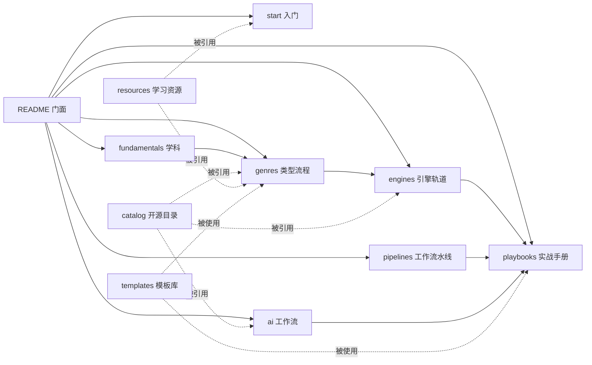

# Ludo Atlas · 游戏开发全景手册 — 仓库骨架设计文档

> 当前状态：v2.5 · 类型手册 81 类 · 阅读站 Material for MkDocs（书籍版，简体中文 / English / 日本語）
> 目标：建设一个可长期维护的开源游戏开发知识仓库，整合「分类型开发流程」×「开源项目目录」×「课程与学习资源」×「AI 开发工作流」。

---

## 目录

1. 项目定位
2. 设计原则（10 条）
3. 信息架构（双轴 + 交叉引用）
4. 完整目录树（全库骨架）
5. `docs/` 详解（八个板块）
6. `catalog/` 详解（机器可读的开源项目目录）
7. `resources/` 详解（课程与学习资源）
8. `playbooks/` 详解（端到端实战手册）
9. `templates/` 详解（统一模板库）
10. `examples/` `scripts/` `.github/` `assets/` 详解
11. 游戏类型矩阵（18 家族 × 112 类型 × 分辑）
12. 内容规范与写作规范
13. 治理与维护（贡献、评审、生命周期、许可、翻译）
14. AI 开发工作流（专章设计，含 8 个端到端案例）
15. 现状与后续
16. 仓库元数据与命名建议
17. 附录：配套手册与落点
18. 变更记录

---

## 0. 关于本文档

- 本文档定义仓库的信息架构与维护规范：定位、目录职责、模板、写作规范与协作流程。
- 目录树与模板可直接复制使用（§4-§10）；内容规范与治理见 §12-§13；AI 章节设计见 §14。
- 本文档位于 `docs/meta/design.md`，随仓库演进更新；版本记录见仓库根 `CHANGELOG.md`。

---

## 1. 项目定位

### 1.1 一句话定义

一个**中文优先、结构科学、链接可验证**的开源游戏开发知识库：把"做游戏"这件事拆成「类型流程（怎么做）」×「开源工具链（用什么做）」×「学习资源（去哪学）」×「AI 工作流（怎么快）」四条主线，整合为可检索、可贡献、可持续维护的结构化手册。

### 1.2 目标（仓库要解决的 6 个问题）

1. **新手不知道从哪开始** → `docs/start/` 提供引擎选型决策树 + 7 天第一个游戏 + 学习路径。
2. **每个游戏类型的做法完全散落** → `docs/genres/` 为每个类型建立统一结构的开发流程 Playbook（设计 / 技术 / 内容管线 / 制作 / 案例 / 起步套件）。
3. **"该用什么开源项目"没有可信清单** → `catalog/` 提供机器可读（YAML + schema）、CI 验证、带许可证与维护状态的工具目录。
4. **课程和资源鱼龙混杂** → `resources/` 按难度、费用、语言、类型筛选，标注复核日期。
5. **AI 时代的工作流没人系统整理** → `docs/ai/` 独立成章：编码代理、引擎 MCP、AI 美术/音频/叙事/QA、合规与伦理 + 8 个端到端工作流案例。
6. **从学到做之间缺少桥** → `playbooks/` 提供可复制的端到端流程（30 天 Demo、48h Game Jam、垂直切片、Steam 上架、作品集求职）。

### 1.3 非目标（明确不做，防止范围失控）

- 不搬运、不复刻他人教程全文；只做"索引 + 推荐 + 自主编写的流程与经验"。
- 不做论坛与问答（用 GitHub Discussions 承接）。
- 不做新闻站、不做市场数据服务（只链接已有权威来源）。
- 不接受无标注的商业软文；付费资源收录但强制标注价格档位与许可条款。

### 1.4 目标受众（四类画像）

| 画像 | 需求 | 主要入口 |
| --- | --- | --- |
| A. 零基础新人 | 知道游戏是怎么做出来的，做出第一个作品 | `start/` → `playbooks/zero-to-demo-30d` |
| B. 转行/求职者 | 系统补课、作品集、面试 | `fundamentals/` → `playbooks/portfolio-to-job` |
| C. 独立开发者 | 选型、少走弯路、发布与运营 | `catalog/` → `genres/` → `playbooks/steam-launch` |
| D. 教学者/团队 | 统一的课程骨架与工程规范 | `docs/` 全站 + `templates/` |

### 1.5 与现有同类仓库的差异（差异化定位）

已存在的优秀列表：`ellisonleao/magictools`（工具大全）、`dawdle-deer/awesome-learn-gamedev`（学习资源）、`FronkonGames/Awesome-Gamedev`（分类资源）、`BUas/programming-awesome-list`（课程向）。

本仓库的差异点（也是设计取舍的依据）：

1. **以"类型"组织开发流程**：现有列表几乎都按工具分类，没有人系统整理"做平台跳跃要做哪些事"。
2. **机器可读的目录**（YAML + JSON Schema + CI 校验），支持自动生成表格与站点，杜绝死链接堆积。
3. **AI 工作流独立成章**：2024 年后游戏开发工作流的最大变量，现有列表普遍缺失。
4. **模板驱动**：同类内容（类型、条目、复盘）结构完全一致，贡献者填空即写作。
5. **中文优先**，术语中英对照，面向中文社区；多语言阅读站已上线（英/日），英文版按批翻译。

> 关系定位：与上述列表**互链互补**，不重复造轮子；`catalog/` 的种子数据可从既有列表（含已 fork 的 magictools-SI）批量导入后逐条验证。

---

## 2. 设计原则（10 条，每条含落地方式）

| # | 原则 | 说明 | 落地方式 |
| --- | --- | --- | --- |
| P1 | **双轴导航** | 内容沿两条轴组织：学科轴（设计/程序/美术/音频/制作）与类型轴（112 个游戏类型，已收录 81 类） | `fundamentals/` 管学科，`genres/` 管类型；交叉处互相链接不重复 |
| P2 | **单一事实来源（SSOT）** | 每个工具、课程、资源只在 `catalog/` 或 `resources/` 定义一次 | 其他页面只引用条目 id / 链接，禁止复制描述文本 |
| P3 | **机器可读优先** | 目录数据是数据，不是散文 | `catalog/*.yml` + `schema.json`；表格与站点页面由脚本生成 |
| P4 | **模板驱动** | 同类内容必须同构，降低写作与维护成本 | `templates/` 提供类型 Playbook、条目、GDD、复盘等模板；新内容一律从模板初始化 |
| P5 | **渐进式披露** | README → 板块索引 → 章节主页 → 深潜页，逐层展开 | 每级页面首屏给"一句话摘要 + 导航"，细节下沉 |
| P6 | **可验证性** | 链接必须能打开、条目必须有复核日期 | CI：markdownlint + lychee 链接检查 + catalog schema 校验；条目标注 `added/reviewed` |
| P7 | **稳定 URL** | 目录与文件名用英文 kebab-case，标题用中文；改标题不改路径 | 分类法与路径一旦发布视为兼容性承诺，迁移必须留重定向 |
| P8 | **范围可控** | 112 个类型不是一次铺满，按分辑分级推进 | 类型矩阵标注分辑；第一辑全量、其余按需展开 |
| P9 | **面向 AI 时代** | 仓库自身要"对 LLM 友好"，并把 AI 工作流作为一等公民 | `docs/ai/` 独立章节；内容结构清晰、便于检索与引用 |
| P10 | **开放治理** | 任何人都能按流程贡献，评审有规则、失效有处理 | CONTRIBUTING + CODEOWNERS + 生命周期状态机（§13） |

---

## 3. 信息架构

### 3.1 四条主线 + 三个横切层

- 主线一 **学习线**：`start/` → `fundamentals/` → `resources/`
- 主线二 **制作线**：`genres/` → `engines/` → `pipelines/` → `playbooks/`
- 主线三 **工具线**：`catalog/`（被所有页面引用）
- 主线四 **AI 线**：`docs/ai/`（独立成章，横跨学习与制作）
- 横切层一：**模板**（`templates/`，供内容与项目复用）
- 横切层二：**示例**（`examples/`，最小可运行代码）
- 横切层三：**自动化**（`scripts/` + `.github/`，验证与生成一切）

### 3.2 交叉引用规则（写内容时的硬规则）

1. `genres/*` 引用：`catalog/`（工具）、`resources/`（课程）、`engines/`（实现差异）、`templates/`（文档模板）。
2. `engines/*` 引用：`catalog/`（该引擎生态的开源插件）、`pipelines/`（通用管线）。
3. `ai/*` 引用：`catalog/ai-tools.yml`、`pipelines/`、`templates/`。
4. 任何页面**不得**复制工具条目描述，只允许"条目名 + 相对链接 + 一句话为什么推荐"。
5. 双向链接原则：被引用方在 `related` 字段列出引用方（站点生成"反向链接"区块）。

### 3.3 导航图（mermaid，将嵌入 README）



---

## 4. 完整目录树（全库骨架）

> 说明：`#` 后为注释；`…/` 表示该目录内采用统一文件模板（见 §5.3、§5.4）。全库共 9 个顶层区域。

```text
ludo-atlas/
├── .github/                          # 工程化：CI、模板、责任到人
│   ├── workflows/
│   │   ├── lint-md.yml               # markdownlint + 格式检查（每次 PR）
│   │   ├── link-check.yml            # lychee 链接检查（PR + 每周定时）
│   │   ├── validate-catalog.yml      # catalog/*.yml 按 schema.json 校验
│   │   ├── build-site.yml            # MkDocs Material 构建并部署 GitHub Pages
│   │   ├── gen-tables.yml            # 每周由 yml 重新生成各索引页表格
│   │   └── stats.yml                 # 每周统计（条目数/覆盖度）
│   ├── ISSUE_TEMPLATE/
│   │   ├── new-resource.yml          # 推荐新资源（表单：类型/链接/理由/不重复声明）
│   │   ├── content-fix.yml           # 纠错（链接失效、过时、错误）
│   │   ├── playbook-request.yml      # 新类型 Playbook 需求
│   │   ├── translation.yml           # 翻译认领
│   │   └── config.yml                # 引导去 Discussions
│   ├── PULL_REQUEST_TEMPLATE.md      # 提交检查清单（§13.2）
│   ├── CODEOWNERS                    # 按区域指派评审人
│   └── dependabot.yml                # 依赖与 Actions 更新
│
├── docs/                             # ① 文档主站（正文内容；阅读站构建见仓库根 site/）
│   ├──（站点工程在 site/：prepare.py 汇总 + hooks 生成导航 + Material for MkDocs 构建）
│   ├── index.md                      # 首页：定位一句话 + 四条主线入口 + 统计数字
│   ├── meta/                         # 关于仓库自身
│   │   ├── design.md                 # 本设计文档（随仓库演进）
│   │   ├── taxonomy.md               # 分类法说明：家族/类型/标签词表（受控词表）
│   │   ├── writing-style.md          # 写作规范（§12）
│   │   └── link-policy.md            # 链接政策：验证、归档、失效处理
│   ├── start/                        # 0 · 入门（4 步走）
│   │   ├── README.md                 # 入门总览与推荐路径
│   │   ├── what-is-gamedev.md        # 游戏开发全景与岗位地图（程序/策划/美术/TA/音频/制作/QA/发行）
│   │   ├── engine-choice.md          # 引擎选型决策树（按目标/语言/平台/团队）
│   │   ├── first-game-7days.md       # 7 天做出第一个游戏（每天任务清单）
│   │   └── learning-path.md          # 学习路径：爱好者 / 独立开发 / 求职 三条线
│   ├── fundamentals/                 # 1 · 基础学科（6 门）
│   │   ├── game-design/              #   核心循环、系统设计、关卡设计、数值平衡、叙事、经济、UX
│   │   ├── programming/              #   语言、架构、设计模式、算法、网络、性能、版本控制与工具
│   │   ├── math-physics/             #   向量矩阵、四元数、概率、碰撞、游戏数学实践
│   │   ├── art/                      #   管线总览、2D、3D、动画、UI、技术美术、着色器
│   │   ├── audio/                    #   声音设计、音乐、中间件、混音
│   │   └── production/               #   规划、范围控制、版本控制、测试
│   ├── genres/                       # 2 · 分类型开发流程（★ 核心，18 家族 112 类型）
│   │   ├── README.md                 # 类型选择矩阵（复杂度/团队规模/市场/学习价值）
│   │   ├── _template/                # 类型 Playbook 空白模板（7 文件，见 §5.3）
│   │   ├── action/                   #   动作（12）：platformer / precision-platformer / metroidvania /
│   │   │                             #     beat-em-up / fighting / character-action / hack-and-slash / stealth /
│   │   │                             #     soulslike / run-and-gun / endless-runner / immersive-sim
│   │   ├── shooter/                  #   射击（9）：fps / tps / shmup / twin-stick / bullet-heaven /
│   │   │                             #     battle-royale / extraction-shooter / hero-shooter / looter-shooter
│   │   ├── rpg/                      #   角色扮演（7）：jrpg / arpg / crpg / tactics-srpg /
│   │   │                             #     dungeon-crawler / mmorpg / monster-taming
│   │   ├── strategy/                 #   策略（8）：rts / tower-defense / 4x / grand-strategy /
│   │   │                             #     auto-battler / moba / wargame / artillery
│   │   ├── simulation/               #   模拟（11）：management / city-builder / colony-sim / farming-life /
│   │   │                             #     survival-craft / vehicle-sim / flight-sim / god-game / life-sim /
│   │   │                             #     pet-sim / raising-sim
│   │   ├── puzzle/                   #   解谜（11）：logic / sokoban / physics / escape-room / puzzle-platformer /
│   │   │                             #     match-3 / merge / word / hidden-object / grid-logic / jigsaw
│   │   ├── narrative/                #   叙事（7）：visual-novel / otome / point-and-click / interactive-fiction /
│   │   │                             #     mud / interactive-movie / walking-sim
│   │   ├── social/                   #   社交与多人（7）：party / co-op / couch-multiplayer / mmo /
│   │   │                             #     social-deduction / asymmetric / io-games
│   │   ├── procedural/               #   程序生成与局内成长（4）：roguelike / roguelite / deckbuilder / idle-incremental
│   │   ├── rhythm-music/             #   音乐节奏（4）：rhythm / music-sandbox / karaoke / dance
│   │   ├── sports-racing/            #   竞速体育（8）：racing / kart-racing / team-sports / extreme-sports /
│   │   │                             #     golf / fishing / billiards / fitness
│   │   ├── sandbox/                  #   沙盒创造（3）：sandbox-building / creative-workshop / physics-sandbox
│   │   ├── automation/               #   自动化与逻辑（3）：factory-automation / programming-puzzle / logic-automation
│   │   ├── horror/                   #   恐怖（3）：survival-horror / psychological-horror / co-op-horror
│   │   ├── card-board/               #   卡牌与桌面（5）：tcg / board-game / mahjong / solitaire / casino
│   │   ├── education/                #   教育功能（4）：edutainment / serious-game / quiz / training-sim
│   │   ├── casual/                   #   休闲轻量（4）：hyper-casual / minigame-collection / anti-stress / arcade-classic
│   │   └── xr/                       #   扩展现实（2）：vr-game / ar-game
│   ├── engines/                      # 3 · 引擎轨道（12 条，每轨道 7 文件，见 §5.4）
│   │   ├── README.md                 # 引擎选型矩阵与对比表
│   │   ├── godot/…  unity/…  unreal/…  bevy/…  web/…  microframework/…
│   │   ├── monogame-fna/…  defold/…  gamemaker/…  renpy/…  rpgmaker/…  custom-inhouse/…
│   ├── pipelines/                    # 4 · 工作流水线（12 条通用管线）
│   │   ├── README.md                 # 管线全景：从代码提交到上线运营
│   │   ├── version-control/          #   Git 工作流、Git LFS、分支策略（游戏仓库的特殊性）
│   │   ├── environment/              #   开发环境、工具链、代理与内网、团队镜像
│   │   ├── coordination/             #   任务管理、文档协作、会议与决策记录（ADR）
│   │   ├── asset-pipeline/           #   美术资产：命名、导出、导入、图集、LOD
│   │   ├── audio-pipeline/           #   音频资产：格式、响度、预算、中间件
│   │   ├── level-content/            #   关卡与内容：数据表、编辑器、迭代节奏
│   │   ├── localization/             #   本地化：字符串提取、术语表、翻译、字体
│   │   ├── playtesting/              #   试玩：招募、脚本、记录、指标
│   │   ├── build-release/            #   构建与发布：签名、商店、版本号
│   │   ├── cicd/                     #   游戏 CI/CD：构建农场、自动打包、蒸汽管道
│   │   ├── analytics/                #   遥测与分析：事件设计、隐私、看板
│   │   └── live-ops/                 #   运营：更新节奏、热修、社区、事故响应
│   ├── ai/                           # 5 · AI 工作流（★ 专章，见 §14）
│   ├── teams/                        # 6 · 团队与规模
│   │   ├── README.md
│   │   ├── solo.md  small-team.md  studio.md
│   │   ├── hiring.md                 # 招聘与求职：岗位、面试、作品集
│   │   └── jams.md                   # Game Jam 全指南
│   ├── publishing/                   # 7 · 商业化与发行
│   │   ├── README.md
│   │   ├── marketing.md              # 营销：愿望单、Devlog、社媒、展会
│   │   ├── steam-launch.md           # Steam 上架全流程
│   │   ├── store-page.md             # 商店页与胶囊图规范
│   │   ├── pricing.md                # 定价与折扣
│   │   └── publishers-funding.md     # 发行商、投资、资助（含国内扶持）
│   └── postmortems/                  # 8 · 复盘库
│       ├── README.md                 # 复盘索引（按类型/规模/结果筛选）
│       └── _template.md              # 统一复盘模板
│
├── catalog/                          # ② 开源项目目录（机器可读，唯一事实来源）
│   ├── README.md                     # 使用说明：字段含义、如何检索、如何贡献
│   ├── schema.json                   # 条目 JSON Schema（§6.1）
│   ├── engines.yml                   # 引擎与框架
│   ├── libraries.yml                 # 库（ECS/物理/渲染/网络/音频/PCG/寻路/UI）
│   ├── editor-tools.yml              # 编辑器与工具（Tiled/LDtk/Blender/Krita/像素工具…）
│   ├── narrative-tools.yml           # 叙事工具（Ink/Twine/Yarn/Ren'Py/Dialogic）
│   ├── build-ci.yml                  # 构建与 CI 工具（GameCI/butler/gdUnit4…）
│   ├── backend-services.yml          # 后端与联机服务（Nakama/Colyseus/Agones…）
│   ├── free-assets.yml               # 免费素材源（Kenney/Poly Haven/Freesound…）
│   ├── starter-kits.yml              # 模板与脚手架工程
│   └── ai-tools.yml                  # AI 工具（§14 引用）
│
├── resources/                        # ③ 课程与学习资源
│   ├── README.md                     # 资源总索引与筛选指南
│   ├── courses/                      # 课程（按难度分文件，含大学公开课与引擎定向课）
│   │   ├── README.md  beginner.md  intermediate.md  advanced.md
│   │   ├── university.md             # 大学公开课与课程资料
│   │   └── engine-specific.md        # 引擎官方与社区课
│   ├── books.md                      # 书籍（设计/编程/美术/生产/行业纪实）
│   ├── video-channels.md             # 视频频道与系列（含 B 站/YouTube）
│   ├── blogs-newsletters.md          # 博客与周刊
│   ├── gdc-talks.md                  # GDC 经典演讲清单（主题分组）
│   ├── papers.md                     # 论文与技术报告
│   ├── communities.md                # 社区（论坛/Discord/Reddit/中文社区）
│   ├── jams-competitions.md          # 赛事与 Game Jam
│   ├── open-source-games.md          # 可学习源码的游戏（按语言/类型标注）
│   └── practice-projects.md          # 练习项目清单（复刻经典、渐难序列）
│
├── playbooks/                        # ④ 端到端实战手册（可复制流程）
│   ├── README.md
│   ├── zero-to-demo-30d/             # 30 天从零到可玩 Demo（周计划+每日清单）
│   ├── game-jam-48h/                 # 48 小时 Game Jam 攻略（含 AI 辅助版）
│   ├── vertical-slice/               # 垂直切片制作法
│   ├── steam-launch/                 # Steam 上架全流程（存档包/商店页/审核/首发）
│   ├── mobile-launch/                # 移动端发布（Android/iOS，含隐私合规）
│   ├── web-deploy/                   # Web 游戏部署（itch/自建/SEO）
│   ├── early-access/                 # 抢先体验与长期更新规划
│   ├── live-ops-6months/             # 上线后 6 个月运营手册
│   ├── portfolio-to-job/             # 作品集到求职（简历/面试/测试题）
│   └── studio-pitch/                 # 对发行商 Pitch（提案结构/预算/Demo 要求）
│
├── templates/                        # ⑤ 模板库（内容与项目双用）
│   ├── README.md                     # 模板使用说明与选择树
│   ├── gdd/                          # 游戏设计文档（mini / standard / full 三档）
│   ├── one-pager.md                  # 一页纸立项书
│   ├── tech-design.md                # 技术设计文档
│   ├── adr.md                        # 架构决策记录
│   ├── postmortem.md                 # 复盘模板
│   ├── playtest-plan.md              # 试玩计划
│   ├── milestone-plan.md             # 里程碑与排期
│   ├── art-bible.md                  # 美术圣经（风格/规格/命名）
│   ├── audio-plan.md                 # 音频规划
│   ├── genre-playbook/               # 类型 Playbook 模板（7 文件，§5.3）
│   ├── catalog-entry/entry.yml       # 目录条目模板
│   └── repo-starter/                 # 游戏仓库脚手架（.gitignore/.gitattributes/CI/README/LICENCE）
│
├── examples/                         # ⑥ 最小可运行示例（按引擎组织）
│   ├── README.md                     # 示例索引（每个示例：解决了什么问题，从哪读起）
│   ├── godot/                        #   platformer-2d/  topdown/  roguelike-tiles/ …
│   ├── unity/                        #   2d-controller/  state-machine/ …
│   ├── web/                          #   canvas-basics/  phaser-platformer/ …
│   ├── micro/                        #   raylib-starter/  love-starter/ …
│   └── shaders/                      #   可复用着色器合集（Godot/Unity/GLSL 多版本）
│
├── scripts/                          # ⑦ 自动化脚本
│   ├── validate_catalog.py           # schema 校验（CI 调用）
│   ├── gen_catalog_tables.py         # yml → 索引页表格（生成，不手改）
│   ├── new_genre.py                  # 从模板生成新类型目录
│   ├── new_playbook.py               # 从模板生成新 Playbook
│   ├── check_links.py                # 本地链接检查入口（CI 用 lychee）
│   └── stats.py                      # 统计：条目数/类型覆盖度/复核过期数
│
├── assets/                           # ⑨ 品牌与图片资源
│   ├── logo.svg  banner.png  social-preview.png   # 品牌（浅/深两版）
│   └── reading/                      # 各文档内使用的插图（webp，<300KB）
│
└── （根文件）
    README.md                  # 门面（中文）：一句话 + 四条主线导航 + 统计 + 快速开始
    README.en.md  README.ja.md # 英文 / 日文版
    LICENSE                    # 内容：CC BY-SA 4.0
    LICENSE-CODE               # 代码（examples/scripts）：MIT
    CONTRIBUTING.md            # 贡献指南（写作+数据两类流程）
    CODE_OF_CONDUCT.md         # 行为准则（Contributor Covenant）
    GOVERNANCE.md              # 治理：角色、评审、仲裁、兼职维护者制度
    ROADMAP.md                 # 路线图（状态与后续）
    CHANGELOG.md               # 变更日志（Keep a Changelog 格式）
    GLOSSARY.md                # 术语表（中英对照，站点挂页）
    CITATION.cff               # 引用信息
    .editorconfig  .gitattributes  .gitignore
    .markdownlint.json  .lycheeignore
```

---

## 5. `docs/` 详解（八个板块）

### 5.1 `start/` 与 `fundamentals/`

`start/` 五页（外加索引）：

| 文件 | 内容要点 |
| --- | --- |
| `what-is-gamedev` | 游戏从概念到发布的完整流程 + 岗位地图 |
| `role-map` | 岗位与技能地图：程序 / 策划 / 美术 / TA / 音频 / 制作 |
| `engine-choice` | 引擎选型：目标平台 × 编程基础 × 2D/3D × 团队 |
| `first-game` | 第一个游戏：30 天计划与验收标准 |
| `learning-path` | 学习路径：学什么 → 做什么 → 验收标准 |

`fundamentals/` 基础学科 7 册，每册一份 `README.md`：学科地图 + 学习顺序 + 主题分节的核心内容。

### 5.2 `fundamentals/` 各册落点

| 册 | 目录 |
| --- | --- |
| 游戏设计手册 | `game-design/` |
| 技术实现手册 | `programming/` |
| 美术与音频手册 | `art-audio/` |
| 制作管理手册 | `production/` |
| 关卡设计手册 | `level-design/` |
| 引擎源码阅读路线 | `engine-internals/` |
| 从零写渲染器路线 | `graphics/` |

### 5.3 `genres/` ★ 核心板块

**组织方式**：18 个家族下按类型建目录，每类一页 `README.md`，统一七节结构：

| 节 | 内容 |
| --- | --- |
| 1. 定位与核心循环 | 一句话定义、核心循环拆解、类型边界 |
| 2. 玩家体验目标与标杆作品 | 体验目标、标杆作品与启示 |
| 3. 设计要点 | 系统清单、数值与曲线、内容节奏、设计陷阱 |
| 4. 技术要点 | 关键技术点、架构建议、引擎实现差异、性能预算 |
| 5. 内容量与工作量参考 | 规模档位（单人 / 小队 / 商业）与里程碑参考 |
| 6. 第一个原型怎么起步 | 最小原型路线与首日清单 |
| 7. 常见坑 | 高频陷阱与对策 |

每页首部为定位块（`> **类型手册 · 第X辑**。定位：…`）与配套阅读指引；正文末尾附延伸阅读。**分辑**：第一辑～第四辑（10 / 15 / 26 / 30 类），共 81 类；长尾与混合类型按需补充（矩阵见 §11）。

### 5.4 `engines/` 引擎轨道（12 条）

每条轨道一页 `README.md`，统一七节结构：

| 节 | 内容 |
| --- | --- |
| 1. 定位与选型 | 版本现状、适用场景与取舍、匹配的类型 |
| 2. 生态与工程结构 | 目录布局、资源命名、插件生态与工具链 |
| 3. 核心工作流 | 编辑、调试、构建与日常循环 |
| 4. 关键系统惯用法 | 信号/事件、状态机、组件化、数据驱动 |
| 5. 性能与优化要点 | 绘制调用、内存、加载与平台差异 |
| 6. 学习路线 | 官方文档与教程路径（→ resources） |
| 7. 常见坑 | 高频陷阱与对策 |

**12 条轨道**：`godot`（GDScript/C#，开源首选）、`unity`、`unreal`、`bevy`（Rust/ECS）、`web`（Three.js/Babylon.js/PixiJS/Phaser）、`micro`（raylib/LÖVE/SDL/SFML）、`monogame`、`defold`、`gamemaker`、`renpy`、`rpgmaker`、`cocos`。

### 5.5 `pipelines/` 工作流水线（6 条 + 2 本深入手册）

每条管线一页 `README.md`：首屏先回答"这条管线解决什么问题、什么时候需要它"，再给流程与检查清单。**这是仓库里"经验分享"属性最强的板块。**

| 管线 | 一句话 |
| --- | --- |
| `version-control` | 游戏仓库的 Git 策略、LFS 与场景冲突治理 |
| `asset-pipeline` | 从创作到入库的五段流水线与规范 |
| `localization` | 抽取、翻译、回填、测试的完整流程 |
| `build-release` | 构建矩阵、自动化与渠道包管理 |
| `playtesting` | 假设先行、陌生人优先的测试方法 |
| `telemetry-analytics` | 先定问题再埋点的数据管线 |

深入手册：[Mod 与 UGC](../pipelines/modding/README.md)、[联机与后端](../pipelines/multiplayer-backend/README.md)。

### 5.6 `teams/`、`publishing/`、`postmortems/`

- `teams/`：`solo-dev`（单人开发策略与防弃坑）、`small-team`（3-10 人分工与协作）、`studio`（部门与流程）。
- `publishing/`：运营与增长、小游戏、主机、VR/AR、电竞、法务六册 + 索引，覆盖发行、合规与商业化。
- `postmortems/`：一文件一复盘，README 维护筛选索引（按类型 / 规模 / 成败）。投稿优先，需要授权。


---

## 6. `catalog/` 详解（开源项目目录）

### 6.1 条目 Schema（`catalog/schema.json` 的字段定义）

```yaml
- id: godot                          # 唯一 id（kebab-case，全库引用用它）
  name: Godot Engine
  homepage: https://godotengine.org
  repo: https://github.com/godotengine/godot
  category: engine                   # engine|library|editor|narrative|build|backend|assets|starter|ai
  description: 开源跨平台 2D/3D 游戏引擎，脚本语言 GDScript / C#…
  # 描述硬规则：≤80 字、一句话、说清"是什么+突出特点"，禁止广告腔
  tags: [2d, 3d, gdscript, csharp, gpl-exception]   # 受控词表见 docs/meta/taxonomy.md
  license: MIT                       # SPDX 标识符；非标准许可写详见 notes
  platforms: [windows, macos, linux, android, ios, web]
  languages: [GDScript, C#, C++]
  maturity: production               # experimental | beta | production | legacy
  pricing: free                      # free | freemium | paid | source-available
  status: active                     # active | stale | archived（维护状态）
  added: 2026-10-04
  reviewed: 2026-10-04               # 复核日期（超 12 个月自动提醒）
  notes: ""                          # 许可陷阱、商业化注意等诚实备注
```

### 6.2 收录与评审标准（科学清单，防止目录膨胀失焦）

**收录条件（全部满足）**：

1. 解决明确的游戏开发问题，且是同类中的合理选择（不是"又一个小工具"）。
2. 有可访问的官网或仓库；开源项目需有明确许可证。
3. 最近 24 个月有活跃迹象（提交/发布/社区），或为"经典退役但仍值得学习"并如实标注。
4. 无恶意历史、无来源不明的 licensing 争议。

**不收录**：无许可证的“源码可用”软件（除非特别注明风险）、纯广告项目、AI 生成的刷量仓库、已死项目（进 `legacy` 需人工批注原因）。

**分类规则**：一个项目只进一个主分类（SSOT）；交叉话题用 `tags` 表达，不复制条目。

### 6.3 使用流程（数据 → 展示）

1. 贡献者改 `catalog/*.yml`（或通过 Issue 表单提交，由维护者代填）。
2. CI：`validate_catalog.py` 校验 schema（必填字段/枚举值/日期格式）。
3. `gen_catalog_tables.py` 把 yml 生成：各分类索引页表格（插入到 `docs/catalog/*.md` 的标记区之间）与站点数据。
4. 链接检查（lychee）对 homepage/repo 做可达性检查，结果并入 CI 报告。
5. README 与首页的统计数字由构建脚本计算注入，避免手改不同步。

> 生成区用注释标记包裹：`<!-- gen:begin category=engine -->` … `<!-- gen:end -->`，人只维护 yml。

### 6.4 各 yml 文件的内容大纲（种子清单见 §17）

- `engines.yml`：引擎与"框架型"方案（Godot/Bevy/raylib/LÖVE/libGDX/MonoGame/Defold/O3DE…），字段里加 `kind: engine|framework|engine-like` 区分。
- `libraries.yml`：库按 `subcategory` 细分：`ecs` `physics` `rendering` `networking` `audio` `pcg` `pathfinding` `ui` `scripting` `serialization`。
- `editor-tools.yml`：通用编辑器与创作工具（Tiled/LDtk/Blender/Krita/像素工具/体素工具…）。
- `narrative-tools.yml`：Ink/Twine/Yarn Spinner/Ren'Py/Dialogic 等。
- `build-ci.yml`：GameCI、butler、gdUnit4、GUT、AltTester、fastlane 等。
- `backend-services.yml`：Nakama、Colyseus、Agones、Supabase/Appwrite（游戏常用部分）等。
- `free-assets.yml`：素材源（须标许可：CC0/CC-BY/混合，逐条注明）。
- `starter-kits.yml`：开源模板工程（按引擎/类型标注）。
- `ai-tools.yml`：AI 工具（§14.2 引用；字段加 `ai_scope: coding|art|audio|narrative|qa|l10n|all`、`local: true|false`、`pricing`）。

---

## 7. `resources/` 详解（课程与学习资源）

### 7.1 条目格式（表格行，统一六列）

```text
| 名称（链接） | 语言 | 费用 | 难度 | 适合人群 | 备注与复核日期 |
```

**筛选原则**：优先"完整课程/成体系"而非单篇技巧文；标注语言（中/英）与费用（免费/订阅/买断）；超 12 个月未复核的条目标记 `⏳ stale` 待清理。

### 7.2 分文件职责

| 文件 | 收录标准 |
| --- | --- |
| `courses/beginner.md` | 零基础：编程入门 + 引擎入门 + 第一个游戏 |
| `courses/intermediate.md` | 有基础：系统设计、架构、专项技术 |
| `courses/advanced.md` | 进阶：引擎原理、图形学、网络同步、性能工程 |
| `courses/university.md` | 大学公开课（CS50G、CMU、Utah 图形学等） |
| `courses/engine-specific.md` | 各引擎官方课程与文档型教程（含中文资源） |
| `books.md` | 五类：设计、编程、美术、生产管理、行业纪实（每本一句"先读哪章"） |
| `video-channels.md` | 频道路线：教程向 / 设计分析向 / 技术拆解向；中文频道单列一节 |
| `blogs-newsletters.md` | 长文博客（技术+设计）与周报 |
| `gdc-talks.md` | 按主题分组（设计/程序/美术/生产/独立）的演讲清单，附观看顺序建议 |
| `papers.md` | 图形学/程序生成/游戏 AI 论文入口 |
| `communities.md` | 社区：综合论坛、引擎社区、中文社区、Discord 服务器（附"先看置顶/FAQ"提示） |
| `jams-competitions.md` | 赛事：Ludum Dare、GGJ、GMTK Jam、7DRL、js13k…（难度/时长/适合阶段） |
| `open-source-games.md` | 可学习源码的游戏：按语言标注，附"从哪个子系统开始读"的一句话 |
| `practice-projects.md` | 练习项目阶梯：复刻经典（贪吃蛇→俄罗斯方块→平台跳跃→Roguelike→小 RPG），每个附验收标准 |

---

## 8. `playbooks/` 详解（端到端实战手册）

每个 Playbook 统一四段结构：

1. **适用与产出**：什么时候用、做完你会得到什么（可验收的产物）。
2. **总览图**：阶段划分 + 时间盒（表格）。
3. **分阶段清单**：每阶段 = 任务清单（可勾选）+ 工具（→ catalog）+ 检查点（"此处必须停下来验证 X"）。
4. **翻车点**：该流程最常见的 5 个失败原因与规避。

十个 Playbook 的关键内容骨架：

| Playbook | 核心阶段 | 特色内容 |
| --- | --- | --- |
| `zero-to-demo-30d` | 选型(2d)→原型(7d)→核心循环(10d)→内容补充(7d)→发布(4d) | 每天 2 小时版 / 全职版两套时间表 |
| `game-jam-48h` | 组队→范围裁剪→执行→提交 | 范围公式（"能玩一句话"）；AI 辅助版流程（→ §14.8） |
| `vertical-slice` | 目标定义→切片范围→打磨→评审 | 切片验收标准：外人 10 分钟能不能说出"这游戏卖点是什么" |
| `steam-launch` | 商店页先行→愿望单积累→构建→审核→首发 | 时间线表（发布前 6 个月到后 30 天，逐周任务） |
| `mobile-launch` | 适配→隐私合规→测试→提审 | iOS/Android 隐私清单、分级、买量基础 |
| `web-deploy` | 构建→部署→分享 | itch.io / GitHub Pages / 自建 CDN 三方案对比 |
| `early-access` | EA 定位→路线图→更新节奏 | EA 期望管理（什么进 EA、什么别承诺） |
| `live-ops-6months` | 更新→社区→数据→复盘 | 月度节奏模板；事故响应流程 |
| `portfolio-to-job` | 作品集→简历→面试→测试题 | 作品集三作品结构（1 完整+1 技术展示+1 快速） |
| `studio-pitch` | 提案→演示→谈判 | Pitch Deck 结构（10 页模板）；Demo 要求清单 |

---

## 9. `templates/` 详解（模板库）

### 9.1 游戏设计文档三档（`gdd/`）

| 档位 | 篇幅 | 适用 |
| --- | --- | --- |
| `mini.md` | 1-2 页 | Jam / 原型：一句话、核心循环、操作、范围 |
| `standard.md` | 8-15 页 | 独立项目：+ 系统、内容、美术方向、技术约束、排期 |
| `full.md` | 20+ 页 | 完整立项：+ 市场定位、竞品、商业模式、风险、验收 |

### 9.2 类型 Playbook 模板（`genre-playbook/`）

即 §5.3 的 7 个文件空白版 + 每文件顶部的**写作指南注释**（写什么、别写什么、字数上限）。`new_genre.py` 用它一键生成新类型目录。

### 9.3 条目模板（`catalog-entry/entry.yml`）

§6.1 schema 对应的空白条目 + 注释示例。

### 9.4 项目脚手架（`repo-starter/`）

未来新游戏仓库开箱即用的集合：

```text
repo-starter/
├── README.md                 # 游戏仓库 README 模板（名称/截图/GIF/玩法/构建方式/许可）
├── .gitignore                # 按引擎分：godot.gitignore / unity.gitignore / unreal.gitignore
├── .gitattributes            # Git LFS 规则：png/psd/wav/fbx/blend 等
├── LICENSE                   # 占位说明（游戏代码与资产许可分开）
├── docs/                     # GDD.md  TECH.md  ART_BIBLE.md  CHANGELOG.md
├── .github/workflows/ci.yml  # 构建 + 测试骨架（按引擎注释切换）
└── CONTRIBUTING.md           # 若开源
```

---

## 10. `examples/`、`scripts/`、`.github/` 详解

### 10.1 `examples/` 标准

- 每个示例 = 最小可运行 + `README.md`（解决什么问题 / 关键文件导读 / 运行命令）+ 不引入无关依赖。
- 原则："能删的都删"：示例是教学材料，不是产品工程。
- 引擎示例可参加各自 CI（可选）。

### 10.2 `scripts/` 职责与 CI 映射

| 脚本 | 被谁调用 | 作用 |
| --- | --- | --- |
| `validate_catalog.py` | `validate-catalog.yml`（PR） | yml 按 schema.json 校验，输出错误行号 |
| `gen_catalog_tables.py` | `gen-tables.yml`（周更 + 手动） | 重新生成索引页表格与 merged json |
| `new_genre.py` / `new_playbook.py` | 贡献者本地 | 从模板生成目录骨架 |
| `check_links.py` | 本地；CI 用 lychee | 链接检查（403/429 视作"浏览器可达"，其余失败需修复） |
| `stats.py` | 本地 / CI（周更） | 条目数、类型覆盖度、stale 计数、过期复核列表 |

### 10.3 `.github/` 工程化细节

- **workflows**：`lint-md`（markdownlint-cli2）、`link-check`（lychee，accept 200/206/403/429，cron 每周一）、`validate-catalog`、`build-site`（Pages 部署，注意仓库 Settings 用 Actions 源）、`gen-tables`、`stats`。
- **PR 模板检查清单**：分类正确 / 机器字段完整 / 链接可访问 / 无版权风险 / 中文排版过检 / 已跑本地校验。
- **Issue 表单**：推荐资源（防重复检查步骤）、纠错（附坏链）、Playbook 需求、翻译认领。
- **CODEOWNERS**：按 `catalog/`、`docs/genres/`、`docs/ai/` 等分区指派。

---

## 11. 游戏类型矩阵（18 家族 × 112 类型）

> 优先级（分辑）：**第一辑**=首批全量编写（10 个）；**第二辑**、**第三辑**=按批次推进的其余类型。原型难度：★=低 … ★★★★=高（"做出可玩原型"的相对难度）。
> 每个类型目录统一为单页七节结构（见 §5.3）；本矩阵用于选题与排期，不是类型目录的全部定义。

### 11.1 动作 action（12）

| 类型目录 | 定位 | 原型难度 | 代表作参考 | 优先级 |
| --- | --- | --- | --- | --- |
| platformer | 平台跳跃：移动手感与关卡节奏 | ★ | 蔚蓝 / 超级马力欧 | **第一辑** |
| precision-platformer | 硬核平台：极限操作与速通 | ★★ | 掘地求升 / 超级肉肉哥 | 第二辑 |
| metroidvania | 银河城：能力门锁 + 连通地图 | ★★★ | 空洞骑士 | **第一辑** |
| beat-em-up | 清版动作：连段与人群控制 | ★★ | 怒之铁拳 4 | 第二辑 |
| fighting | 格斗：帧数据与对抗平衡 | ★★★★ | 街霸 | 第三辑 |
| character-action | 动作冒险：连招系统与镜头调度 | ★★★★ | 鬼泣 5 | 第三辑 |
| hack-and-slash | 割草无双：一骑当千的爽快 | ★★★ | 真·三国无双 | 第三辑 |
| stealth | 潜行：信息与路线规划 | ★★★ | 耻辱 | 第三辑 |
| soulslike | 类魂：高难战斗与关卡循环 | ★★★★ | 艾尔登法环 | 第二辑 |
| run-and-gun | 横版跑轰：跑动射击的节奏 | ★★ | 合金弹头 | 第三辑 |
| endless-runner | 跑酷：一次失误重来 | ★ | 神庙逃亡 | 第三辑 |
| immersive-sim | 沉浸模拟：系统交互的自由度 | ★★★★ | 掠食 / 杀出重围 | 第三辑 |

### 11.2 射击 shooter（9）

| 类型目录 | 定位 | 原型难度 | 代表作参考 | 优先级 |
| --- | --- | --- | --- | --- |
| fps | 第一人称射击：枪感与关卡视线 | ★★★ | DOOM | 第二辑 |
| tps | 第三人称射击：掩体与镜头 | ★★★ | 生化危机 4 重制版 | 第三辑 |
| shmup | 弹幕射击（STG）：弹幕设计与判定 | ★★ | 斑鸠 | 第二辑 |
| twin-stick | 双摇杆射击：移动与瞄准分离 | ★★ | 挺进地牢 | 第二辑 |
| bullet-heaven | 幸存者类：自动攻击 + 海量敌人 | ★ | 吸血鬼幸存者 | **第一辑** |
| battle-royale | 大逃杀：百人同局与长线运营 | ★★★★ | 和平精英 | 第三辑 |
| extraction-shooter | 搜打撤：高风险物资循环 | ★★★★ | 逃离塔科夫 | 第三辑 |
| hero-shooter | 英雄竞技射击：角色技能组合 | ★★★★ | 守望先锋 | 第三辑 |
| looter-shooter | 刷宝射击：掉落与数值驱动 | ★★★★ | 无主之地 | 第三辑 |

### 11.3 角色扮演 rpg（7）

| 类型目录 | 定位 | 原型难度 | 代表作参考 | 优先级 |
| --- | --- | --- | --- | --- |
| jrpg | 日式 RPG：叙事驱动 + 回合/半即时战斗 | ★★★ | 歧路旅人 | 第二辑 |
| arpg | 动作 RPG：刷装循环 + 打击感 | ★★★ | 哈迪斯 / 暗黑破坏神 | 第二辑 |
| crpg | 欧美 RPG：规则系统 + 分支叙事 | ★★★★ | 博德之门 3 | 第三辑 |
| tactics-srpg | 战棋：网格战术与职业成长 | ★★★ | 火焰纹章 | 第三辑 |
| dungeon-crawler | 地牢爬行：格子探索与资源管理 | ★★★ | 世界树迷宫 | 第三辑 |
| mmorpg | 大型多人在线 RPG | ★★★★ | 魔兽世界 | 第三辑 |
| monster-taming | 怪物收集与养成对战 | ★★★ | 宝可梦 | 第三辑 |

### 11.4 策略 strategy（8）

| 类型目录 | 定位 | 原型难度 | 代表作参考 | 优先级 |
| --- | --- | --- | --- | --- |
| rts | 即时战略：单位经济与操作上限 | ★★★★ | 星际争霸 | 第二辑 |
| tower-defense | 塔防：波次数值与建造成长 | ★★ | 王国保卫战 | **第一辑** |
| 4x | 4X：探索扩张开发征服 | ★★★★ | 文明 6 | 第三辑 |
| grand-strategy | 大战略：宏观模拟与外交 | ★★★★ | 十字军之王 3 | 第三辑 |
| auto-battler | 自走棋：阵容组合与自动解算 | ★★ | 云顶之弈 | 第二辑 |
| moba | 多人在线竞技：英雄与地图平衡 | ★★★★ | 王者荣耀 / DOTA 2 | 第三辑 |
| wargame | 兵棋：军事推演 | ★★★★ | 钢铁雄心 | 第三辑 |
| artillery | 炮术对战：弹道与回合制 | ★★ | 百战天虫 | 第三辑 |

### 11.5 模拟 simulation（11）

| 类型目录 | 定位 | 原型难度 | 代表作参考 | 优先级 |
| --- | --- | --- | --- | --- |
| management | 模拟经营：资源循环与规模曲线 | ★★ | 双点医院 | 第二辑 |
| city-builder | 城市建造：布局与系统耦合 | ★★★ | 城市天际线 | 第二辑 |
| colony-sim | 殖民模拟：AI 代理与故事生成 | ★★★★ | 环世界 | 第二辑 |
| farming-life | 农场生活：日常循环与情感陪伴 | ★★ | 星露谷物语 / 波西亚时光 | **第一辑** |
| survival-craft | 生存建造：生存压力与制作链 | ★★ | 我的世界 / 饥荒 | **第一辑** |
| vehicle-sim | 驾驶模拟：车辆物理与路况 | ★★★ | 欧洲卡车模拟 | 第三辑 |
| flight-sim | 飞行模拟：仪表与气动 | ★★★★ | 微软飞行模拟 | 第三辑 |
| god-game | 上帝游戏：俯视操控全局 | ★★★ | 黑与白 | 第三辑 |
| life-sim | 人生模拟：日常与社交编织 | ★★★ | 模拟人生 | 第三辑 |
| pet-sim | 电子宠物：陪伴与轻养成 | ★★ | 旅行青蛙 | 第三辑 |
| raising-sim | 养成：数值培育与情感投入 | ★★ | 中国式家长 / 美少女梦工场 | 第三辑 |

### 11.6 解谜 puzzle（11）

| 类型目录 | 定位 | 原型难度 | 代表作参考 | 优先级 |
| --- | --- | --- | --- | --- |
| logic | 逻辑解谜：规则与推理之美 | ★ | 传送门 / 巴巴是你 | **第一辑** |
| sokoban | 推箱子：空间推理的经典 | ★ | 推箱子 | 第三辑 |
| physics | 物理解谜：模拟的不确定设计 | ★★ | 人类一败涂地 | 第二辑 |
| escape-room | 密室逃脱：线索网络与叙事包装 | ★★ | 锈湖系列 / 纸嫁衣 | 第三辑 |
| puzzle-platformer | 解谜平台：机制教学的关卡设计 | ★★ | FEZ / 跷跷板 | 第三辑 |
| match-3 | 三消：爽感反馈与关卡曲线 | ★ | 开心消消乐 | 第二辑 |
| merge | 合成：组合成长与解压反馈 | ★ | 合成大西瓜 | 第二辑 |
| word | 文字解谜：词汇与语言逻辑 | ★ | Wordle | 第三辑 |
| hidden-object | 找物：观察力与场景叙事 | ★★ | 隐藏的家伙 | 第三辑 |
| grid-logic | 网格逻辑：数独/数织/扫雷 | ★ | 数独 | 第三辑 |
| jigsaw | 拼图：碎片整理与图案 | ★ | 拼图游戏合集 | 第三辑 |

### 11.7 叙事 narrative（7）

| 类型目录 | 定位 | 原型难度 | 代表作参考 | 优先级 |
| --- | --- | --- | --- | --- |
| visual-novel | 视觉小说：分支叙事与演出 | ★ | 逆转裁判 | **第一辑** |
| otome | 乙女/恋爱：角色关系与好感系统 | ★ | 恋与制作人 | 第二辑 |
| point-and-click | 点击冒险：物品谜题与对话 | ★★ | 猴岛小英雄 | 第二辑 |
| interactive-fiction | 互动小说：纯文本的叙事实验 | ★ | 80 Days | 第二辑 |
| mud | 文字冒险/MUD：命令行叙事世界 | ★★ | 各在线文字世界 | 第三辑 |
| interactive-movie | 互动电影/FMV：影像分支 | ★★ | 完蛋！我被美女包围了 / 隐形守护者 | 第三辑 |
| walking-sim | 步行模拟：环境叙事 | ★★ | 看火人 | 第三辑 |

### 11.8 社交与多人 social（7）

| 类型目录 | 定位 | 原型难度 | 代表作参考 | 优先级 |
| --- | --- | --- | --- | --- |
| party | 派对：多人同乐的混乱感 | ★★ | 蛋仔派对 | 第三辑 |
| co-op | 合作闯关：协作机制设计 | ★★★ | 双人成行 | 第二辑 |
| couch-multiplayer | 本地多人：一屏共乐 | ★★ | 胡闹厨房 | 第三辑 |
| mmo | 大型多人在线：社交世界 | ★★★★ | 光·遇 | 第三辑 |
| social-deduction | 社交推理：信息不对称 | ★★ | 鹅鸭杀 | 第三辑 |
| asymmetric | 非对称对抗：不对等角色设计 | ★★★ | 第五人格 | 第三辑 |
| io-games | .io 网页对战：即点即玩 | ★★ | agar.io | 第三辑 |

### 11.9 程序生成与局内成长 procedural（4）

| 类型目录 | 定位 | 原型难度 | 代表作参考 | 优先级 |
| --- | --- | --- | --- | --- |
| roguelike | 传统 Roguelike：回合制 + 程序生成 | ★★★ | DCSS | 第二辑 |
| roguelite | 肉鸽 Lite：局内随机 + 局外成长 | ★★ | 哈迪斯 / 雨中冒险 2 | **第一辑** |
| deckbuilder | 卡牌构筑：卡池与组合爆炸 | ★★ | 杀戮尖塔 | 第二辑 |
| idle-incremental | 放置增量：数值指数与时间感 | ★ | 饼干点点乐 / 咸鱼之王 | **第一辑** |

### 11.10 音乐节奏 rhythm-music（4）

| 类型目录 | 定位 | 原型难度 | 代表作参考 | 优先级 |
| --- | --- | --- | --- | --- |
| rhythm | 节奏：判定窗口与谱面设计 | ★★ | 节奏医生 | 第三辑 |
| music-sandbox | 音乐沙盒：即兴创作的玩法化 | ★★ | Trombone Champ | 第三辑 |
| karaoke | 唱歌/K 歌玩法 | ★ | 全民 K 歌（游戏化） | 第三辑 |
| dance | 舞蹈/体感音游 | ★★ | Just Dance | 第三辑 |

### 11.11 竞速体育 sports-racing（8）

| 类型目录 | 定位 | 原型难度 | 代表作参考 | 优先级 |
| --- | --- | --- | --- | --- |
| racing | 竞速：车辆物理与赛道 | ★★★ | 极限竞速 | 第三辑 |
| kart-racing | 卡丁车竞速：道具与欢乐 | ★★ | 跑跑卡丁车 | 第三辑 |
| team-sports | 球类团队竞技 | ★★★ | FIFA 系列 | 第三辑 |
| extreme-sports | 极限运动：滑板/滑雪 | ★★★ | 极限巅峰 | 第三辑 |
| golf | 高尔夫/休闲球类 | ★★ | Golf With Your Friends | 第三辑 |
| fishing | 钓鱼：佛系节奏与收集 | ★★ | 俄罗斯钓鱼 4 | 第三辑 |
| billiards | 台球：物理的魔术 | ★★ | 台球游戏合集 | 第三辑 |
| fitness | 体感健身：运动即玩法 | ★★★ | 健身环大冒险 | 第三辑 |

### 11.12 沙盒创造 sandbox（3）

| 类型目录 | 定位 | 原型难度 | 代表作参考 | 优先级 |
| --- | --- | --- | --- | --- |
| sandbox-building | 沙盒建造：自由构造与物理 | ★★★ | 我的世界 | 第二辑 |
| creative-workshop | 创造工坊：游戏内创作与分享 | ★★★★ | 马力欧制造 | 第三辑 |
| physics-sandbox | 物理沙盒：玩具箱式交互 | ★★★ | 盖瑞模组 | 第三辑 |

### 11.13 自动化与逻辑 automation（3）

| 类型目录 | 定位 | 原型难度 | 代表作参考 | 优先级 |
| --- | --- | --- | --- | --- |
| factory-automation | 工厂自动化：产线与效率之美 | ★★★ | 异星工厂 / 戴森球计划 | 第二辑 |
| programming-puzzle | 编程解谜：用代码解谜题 | ★★ | 人力资源机器 / TIS-100 | 第三辑 |
| logic-automation | 逻辑自动化：电路与红石 | ★★★ | 我的世界（红石） | 第三辑 |

### 11.14 恐怖 horror（3）

| 类型目录 | 定位 | 原型难度 | 代表作参考 | 优先级 |
| --- | --- | --- | --- | --- |
| survival-horror | 生存恐怖：资源匮乏与压迫感 | ★★★ | 生化危机 | 第二辑 |
| psychological-horror | 心理恐怖：氛围与叙事恐惧 | ★★ | 层层恐惧 | 第三辑 |
| co-op-horror | 联机恐怖：多人尖叫体验 | ★★ | 恐鬼症 | 第三辑 |

### 11.15 卡牌与桌面 card-board（5）

| 类型目录 | 定位 | 原型难度 | 代表作参考 | 优先级 |
| --- | --- | --- | --- | --- |
| tcg | 集换式卡牌：卡池经济与对战平衡 | ★★★★ | 炉石传说 | 第三辑 |
| board-game | 桌游电子化：规则数字化 | ★★★ | 数字桌游改编 | 第三辑 |
| mahjong | 麻将：国民棋牌玩法 | ★★ | 雀魂 | 第三辑 |
| solitaire | 纸牌接龙：经典单机 | ★ | 蜘蛛纸牌 | 第三辑 |
| casino | 棋牌/赌场玩法（注意各地合规） | ★★ | —— | 第三辑 |

### 11.16 教育功能 education（4）

| 类型目录 | 定位 | 原型难度 | 代表作参考 | 优先级 |
| --- | --- | --- | --- | --- |
| edutainment | 教育娱乐：寓教于乐 | ★★ | 教育版 Minecraft | 第三辑 |
| serious-game | 严肃游戏：训练/科普/公益 | ★★★ | Foldit | 第三辑 |
| quiz | 答题竞猜：知识竞技 | ★ | 答题类综艺游戏 | 第二辑 |
| training-sim | 训练模拟：专业操作演练 | ★★★ | 行业训练模拟 | 第三辑 |

### 11.17 休闲轻量 casual（4）

| 类型目录 | 定位 | 原型难度 | 代表作参考 | 优先级 |
| --- | --- | --- | --- | --- |
| hyper-casual | 超休闲：极简玩法 + 买量 | ★ | 各类买量小游戏 | 第三辑 |
| minigame-collection | 小游戏合集：一分钟一个 | ★★ | 瓦里奥制造 | 第三辑 |
| anti-stress | 解压玩具：指尖反馈 | ★ | Antistress 类 | 第三辑 |
| arcade-classic | 街机复古：经典玩法重制 | ★ | 吃豆人 / 太空侵略者 | 第三辑 |

### 11.18 扩展现实 xr（2）

| 类型目录 | 定位 | 原型难度 | 代表作参考 | 优先级 |
| --- | --- | --- | --- | --- |
| vr-game | VR 游戏：体感与沉浸交互 | ★★★★ | 半衰期：爱莉克斯 | 第三辑 |
| ar-game | AR 游戏：现实叠加玩法 | ★★★★ | 宝可梦 GO | 第三辑 |

> 说明：开放世界、多人联机、买断/免费等属于**结构标签**而非类型，用 tags 受控词表（`docs/meta/taxonomy.md`）表达，不单设类型目录。

---

## 12. 内容规范与写作规范

### 12.1 命名与路径规范

- 目录与文件名：**英文 kebab-case**（`visual-novel/`，不出现中文文件路径）；标题用中文写在 front matter 与正文。
- 条目标题格式：`中文名（English Name）`，首次出现给英文，后文可用中文简称。
- 图片：`assets/reading/<页面slug>-<序号>.webp`，单张 ≤300KB，必填 alt。
- 外链：统一 https；禁止短链；链接文字必须是有意义描述（禁止"点这里"）。

### 12.2 Front matter（每页必填）

```yaml
---
title: 平台跳跃 · 技术方案
description: 一句话描述（用于搜索与卡片）
level: intermediate          # beginner | intermediate | advanced
tags: [genre/platformer, tech, feel]     # 来自受控词表
status: draft                # draft | review | published | stale | archived
updated: 2026-10-04
maintainers: [HuanMoovo]
related: [/genres/action/platformer/design, /catalog/engines/godot]
---
```

### 12.3 中文排版与文风

- 中英文之间加空格；中文标点用全角，代码/命令/文件名用反引号包裹。
- 术语遵循 `GLOSSARY.md`（如"碰撞体 collider""池化 pooling"），首次出现的术语给英文。
- 文风要求：**克制、具体、可验证**。禁止"众所周知""简单来说就是"式空话；经验类内容必须给具体例子或数据；不确定的结论标注"待验证"。
- AI 参与写作的内容须人工过一遍文风（去模板腔），并对事实与链接负责。

### 12.4 链接政策（`meta/link-policy.md`）

- 所有外链过 lychee；403/429 视为"浏览器可达"保留；其余失败 30 天内修复，否则删除或换稳定替代（如归档快照）。
- 条目复核周期 12 个月；到期进 `stale` 列表由 CI 汇总成 issue，人工过一遍再更新 `reviewed`。
- 严禁提交 affiliate 链接。

---

## 13. 治理与维护

### 13.1 内容生命周期（状态机）

```text
draft → review → published → (stale) → archived
                    ↑____________|（复核后回归）
```

- `stale`：超 12 个月未复核或已知部分失效；页顶悬挂提示条。
- `archived`：不再维护但保留价值；内容冻结，仅保留历史。

### 13.2 贡献流程（两类）

**内容类（写文章/Playbook）**：Fork → 从模板初始化 → 本地预览（mkdocs serve）→ PR（附自查表）→ 1 名领域评审 → squash merge。

**数据类（改 catalog/resources）**：改 yml / md 表 → 本地跑 `validate_catalog.py` → PR → CI 绿 → 评审 → merge → 下一次 `gen-tables` 自动上表格。

### 13.3 评审标准（评审人 checklist）

1. 归类正确（分类法无歧义）；2. 不与既有内容重复（搜过 id/链接）；3. 链接可访问、许可标注正确；4. 事实与出处清晰（经验类要有依据）；5. 排版过 lint；6. 对读者的问题有真实回答（不是凑字数）。

### 13.4 许可与版权

- 仓库内容：**CC BY-SA 4.0**（署名 + 相同方式共享）；代码（examples/scripts）：**MIT**；`data/` 元数据建议 **CC0** 方便复用。
- 第三方内容：只做引用与链接；引用需注明出处与许可；不接受转载未授权内容、不收录来历不明的素材。
- 商标声明：各引擎与工具商标归各自所有者；收录不代表背书。

### 13.5 翻译（i18n）策略

- 结构：Material for MkDocs + `mkdocs-static-i18n`（后缀模式）：译文与原文同目录、文件名加 `.en.md`；中文为默认语言（根路径），`/en/`、`/ja/` 为子站，顶部语言选择器切换；未译页自动回退中文。README 三语（中 / 英 / 日）。
- 优先翻译序：README → 站点首页 → 前言 → `start/` → 基础学科 → 类型手册 → 其余按批推进；目前 README、首页、前言与入门区已上线英文。
- 术语统一：`GLOSSARY.md` + `mkdocs.yml` 的 `nav_translations`；译文以 `docs/preface.en.md` 为风格基准；译文评审至少一人母语级。

---

## 14. AI 开发工作流（专章设计）

> 本章既是 `docs/ai/` 的目录与内容设计，也是"AI 开发工作流"的整理成果本身。核心立场：**AI 放大产出，但工程纪律与版权合规责任仍在人**。

### 14.1 `docs/ai/` 完整结构

```text
ai/
├── README.md                    # 全景图 + 成熟度矩阵 + "从哪开始"决策树
├── maturity-matrix.md           # 各环节 AI 成熟度表（下表 14.1）
├── coding-agents/               # 编码代理工作流
│   ├── README.md                #   什么是编码代理、适合/不适合的任务
│   ├── tool-landscape.md        #   工具对比（Claude Code/Codex/Cursor/Copilot/Gemini CLI/opencode/aider/Cline/Continue）
│   ├── repo-context-engineering.md  # 上下文工程：AGENTS.md/CLAUDE.md 写法、项目文档分层（SPEC/ARCHITECTURE/DECISIONS）
│   ├── engine-gotchas.md        #   各引擎 AI 生成代码的常见错误与规避
│   ├── testing-with-agents.md   #   让代理跑测试：headless 引擎 + 测试框架 + 日志分析
│   └── review-checklist.md      #   AI 代码审查清单（人审什么）
├── engine-mcp/                  # 引擎 MCP 集成（14.3）
│   ├── README.md  how-mcp-works.md  security.md
│   ├── godot-mcp.md  unity-mcp.md  blender-mcp.md
├── art-generation/              # AI 美术管线（14.4）
│   ├── README.md  concept-art.md  2d-sprites.md  3d-assets.md  textures.md
│   ├── ui-icons.md  consistency.md  comfyui-pipelines.md  post-processing.md
├── audio/                       # AI 音频（14.5）
│   ├── README.md  music.md  sfx.md  voice.md  adaptive.md
├── narrative-npc/               # AI 叙事与 NPC（14.6）
│   ├── README.md  offline-generation.md  runtime-llm.md
│   ├── character-consistency.md  cost-latency.md  safety.md
├── qa-testing/                  # AI 质量保障（14.7）
│   ├── README.md  test-generation.md  playtest-bots.md
│   ├── visual-regression.md  crash-triage.md
├── localization/                # AI 本地化（14.7）
│   ├── README.md  pipeline.md  glossary-qa.md
├── design-assist/               # 设计辅助
│   ├── README.md  gdd-drafting.md  balancing.md  market-research.md
├── workflows/                   # ★ 8 个端到端工作流案例（14.8）
│   ├── README.md  wf-prototype-weekend.md  wf-refactor-legacy.md
│   ├── wf-asset-factory.md  wf-narrative-pipeline.md  wf-ai-qa-loop.md
│   ├── wf-l10n-pipeline.md  wf-jam-ai.md  wf-live-ops.md
├── prompt-library/              # 提示词库（14.10）
│   ├── README.md  coding.md  design.md  art.md  audio.md
│   ├── narrative.md  l10n.md  review.md
└── compliance/                  # 合规与伦理（14.9）
    ├── README.md  steam-disclosure.md  copyright.md
    ├── team-policy.md  asset-records.md
```

### 14.2 AI 成熟度矩阵（环节 × 现状 × 代表工具 × 风险）

| 环节 | 成熟度 | 推荐用法 | 代表工具/项目 | 主要风险 |
| --- | --- | --- | --- | --- |
| 代码（样板/工具/测试） | ★★★★★ | 代理写 + 人审 + 测试验证 | Claude Code、Codex CLI、Cursor、Copilot、aider、opencode | 幻觉 API、性能反模式、不懂引擎生命周期 |
| 场景/编辑器操作 | ★★★★ | MCP 驱动编辑器（受控写权限） | godot-mcp、Unity MCP、Blender MCP | 误改场景、污染工程文件 |
| 概念美术 | ★★★★★ | 头脑风暴与参考图 | SD/Flux（ComfyUI 本地）、Midjourney | 版权来源、风格抄袭 |
| 2D 资产（需一致性） | ★★★ | 生成 + 手工精修 + 后处理 | ComfyUI 工作流、像素 AI 工具、Aseprite 精修 | 风格漂移、商用条款 |
| 3D 资产 | ★★☆ | 原型/占位可用，上线需重拓扑 | 图像转 3D（Hunyuan3D/TRELLIS/Meshy/Tripo 类） | 拓扑质量、UV、许可 |
| 纹理/材质 | ★★★☆ | 辅助生成 + 人工调 | ComfyUI、材质工具 | 一致性、贴图规范 |
| 音乐 | ★★★★ | 生成草稿/氛围乐，人工编曲把关 | Suno、Udio、Stable Audio、MusicGen（开源） | 授权条款、风格相似争议 |
| 音效 | ★★★★ | 生成 + 剪辑 | ElevenLabs SFX 类、AudioGen、jsfxr | 授权 |
| 配音 | ★★★☆ | TTS 草稿或正式（需查明商用条款） | ElevenLabs、GPT-SoVITS（开源） | 声音克隆授权（须本人书面同意） |
| 对话/NPC（运行时 LLM） | ★★☆ | 实验性；需护栏与成本控制 | ollama + 本地模型、Inworld、Convai | 成本/延迟/安全、平台护栏要求 |
| 本地化 | ★★★★ | LLM 翻译 + 术语表 + 人工 LQA | LLM + 术语表管线、Weblate（开源） | 语境缺失、术语不一致 |
| QA/测试 | ★★★ | 用例生成、视觉回归、崩溃聚类 | 编码代理 + 截图对比工具 | 误报、覆盖盲区 |
| 设计辅助 | ★★★☆ | GDD 起草、数值草案、市场调研 | 通用 LLM + 本项目模板 | 平庸化、事实错误 |

### 14.3 引擎 MCP 集成（让代理直接操作编辑器）

**原理**：MCP 服务器（stdio/HTTP）↔ WebSocket ↔ 引擎编辑器插件（执行 Editor API 命令）。代理不再"盲改文件"，而是获得**场景树读取、节点增删改、运行截图、错误日志、输入模拟**等结构化能力。

**当前生态（已核实的主要实现）**：

- **Godot**：社区 MCP 实现活跃（如 `mkdevkit/godot-mcp`、`elfensky/godot-mcp`、`hybridindie/godot-mcp` 等；能力覆盖场景编辑、运行截图、输入模拟、工具分组开关）。Godot 4.4+ / Node 18+，任何 MCP 客户端（Claude Code / Codex / Cursor 等）可接。
- **Unity**：官方在编辑器内置 MCP 服务器（AI 包内，Beta）；同时存在多个社区开源实现。Unity 6+。
- **Blender**：社区 Blender MCP 用于建模/材质辅助。
- **通用 MCP 扩展面**：图像生成（ComfyUI）、资产处理、CI 触发等都能以 MCP 暴露。

**安全模型（写进 `security.md` 的硬规则）**：

1. **权限分级**：读取/变更/危险（删除、导出、执行任意脚本）三级；默认只开读取，变更类逐项开启。
2. **备份先行**：接 MCP 前 `git commit`；代理操作只允许在工作分支。
3. **网络边界**：本地回环 + token 校验；绝不把编辑器端口暴露到局域网/公网。
4. **人审协议**：代理改场景后，人在编辑器里过一遍再提交；禁止"代理全自动整夜改工程"。

### 14.4 AI 美术管线（`art-generation/` 内容要点）

**总流程**：`目标定义（风格锚点/尺寸/用途）→ 生成（本地 ComfyUI 或服务）→ 精修（手工/后处理）→ 规范化（切图/命名/压缩）→ 导入引擎 → 记录留档（工具/许可/来源）`

- `consistency.md`（一致性技术）：风格锚点图、参考图生图、角色 LoRA、ControlNet（姿势/线稿）、批量工作流模板化，解决"一套资产风格漂移"。
- `2d-sprites.md`：精灵表/立绘的生成→像素化→手工精修→Aseprite 整理→图集打包的完整链路；给"AI 生成 + 人工精修"的分工建议（AI 出门面交给 AI，落地资产靠人修）。
- `3d-assets.md`：图像转 3D 的现状：原型/占位用 OK；产出需重拓扑、UV、减面后才进正式资产；给"占位资产水位线"标准。
- `comfyui-pipelines.md`：ComfyUI 作为**可复用管线**（JSON 工作流进 git、参数化批处理、队列化生成），而非单张抽卡。
- `post-processing.md`：批量裁剪、透明通道检查、调色统一、压缩（webp/png 规则）。
- **记录留档**：每个资产记"工具/模型/日期/是否 AI/修改程度"（→ 14.9 asset-records）。

### 14.5 AI 音频（`audio/` 内容要点）

- `music.md`：分层生成思路（主旋律/氛围/循环段）；生成后必须做**循环点处理与响度标准化**；开源侧 MusicGen/AudioCraft，闭源侧 Suno/Udio/Stable Audio；商用条款逐家核查。
- `sfx.md`：AI 生成 + 修剪 + 归一化的流水线；轻量场景用程序化音效工具（jsfxr 类）更快。
- `voice.md`：TTS 用例（原型配音/最终配音的边界）；**声音克隆必须取得声源本人书面授权**；注意行业协议与平台政策动向。
- `adaptive.md`：自适应音乐概念（分层/过渡）与实现要点；AI 生成素材如何接入引擎音频系统。

### 14.6 AI 叙事与 NPC（`narrative-npc/` 内容要点）

- **两条路线**：离线生成（LLM 批量生成对话树/文案→人工编辑→进游戏，风险低、推荐先做）与运行时生成（游戏内实时调用 LLM，实验性强）。
- `runtime-llm.md`（运行时架构）：客户端 → 你的网关（鉴权/限流/日志）→ LLM；护栏（内容过滤、话题约束、输出结构校验）；降级策略（超时回退预设台词）。
- `character-consistency.md`：角色圣经 + RAG（检索角色设定/前文）+ 生成约束；维护"已说设定库"防止自我矛盾。
- `cost-latency.md`：成本模型表（每千次对话 ≈ token 数 × 单价）、延迟预算（<300ms 几乎必须本地/小模型 + 缓存）、缓存策略（高频问答预生成）。
- `safety.md`：内容审核双向（输入/输出）；未成年人保护；日志与可追溯；**Steam 对运行时生成内容要求描述护栏**（→ 14.9）。

### 14.7 AI QA 与本地化

- `qa-testing/`：用例生成（代理读需求→写测试→人审）、代理式冒烟测试（headless 引擎 + 输入脚本 + 日志断言）、视觉回归（截图对比，AI 排除误报）、崩溃聚类（日志归组→代理初判）。
- `localization/`：`管线 = 字符串提取 → 术语表校验 → LLM 翻译（带上下文与角色设定）→ 人工 LQA → 回填 → 字体/断行验证`；禁止无术语表的裸翻译直接上线。

### 14.8 八个端到端工作流案例（`workflows/` 主体内容）

每个案例的固定结构：**适用场景 / 工具链 / 前置条件 / 分步流程 / 人工检查点（硬性）/ 成本量级 / 常见坑**。

| # | 文件 | 场景一句话 | 关键检查点 |
| --- | --- | --- | --- |
| 1 | `wf-prototype-weekend` | 一个周末用 AI 从零到可玩原型（引擎 + 编码代理 + 生图 + 音乐） | 每完成一个功能立即手动玩 5 分钟 |
| 2 | `wf-refactor-legacy` | 给存量项目加功能/重构（上下文工程 + 小步提交） | 每次提交前跑全量测试；代理不改公共 API 契约 |
| 3 | `wf-asset-factory` | 批量资产生成管线（ComfyUI 参数化 + 命名/导入自动化） | 每批抽检 10% 资产；风格锚点对比 |
| 4 | `wf-narrative-pipeline` | 世界观→剧情大纲→对话树半自动生成 | 角色一致性表人工核对 |
| 5 | `wf-ai-qa-loop` | 代理跑冒烟测试 → 抓日志 → 汇总问题单 | 代理提交的 bug 单需人复核严重级 |
| 6 | `wf-l10n-pipeline` | 提取→翻译→术语校验→回填→LQA | 术语表 + 抽样人工精读每语言 5% |
| 7 | `wf-jam-ai` | 48h Game Jam 的 AI 分工表（哪些步骤 AI、哪些禁 AI） | 提交前留 2 小时人工润色与一致性检查 |
| 8 | `wf-live-ops` | 上线后：更新日志起草、社区回复草稿、数据日报 | 对外文字必须人改人发 |

### 14.9 合规与伦理（`compliance/`，高风险区，必须写实）

**Steam AI 披露（2026 年 1 月改版后要点，写作时按最新官方文档核实）**：

- 披露分两类：**预生成内容**（随游戏发布、玩家可消费的 AI 生成内容，包括美术/音频/文本/本地化/**营销素材与商店页**）与**运行时生成内容**（游戏运行中实时生成）。
- 2026 年 1 月改版明确：**仅用于效率的内部工具（编码助手、调试等）豁免披露**；玩家能看到/听到的才算。
- 运行时生成内容：必须描述**护栏措施**；运行时生成的成人内容被明令禁止。披露是开发者对平台的承诺（不实披露=违约），版权责任全部在开发者。
- 结论（写给读者）：**用 AI 可以，留档必须**：建立资产台账；披露写"诚实、具体、简洁"。

- `copyright.md`：训练来源与输出可版权性（各国规则不一，美国版权局要求人类作者性）；游戏内 AI 资产建议"生成 + 实质人工加工"；购买/使用条款逐家核查（商用、赔偿条款）。
- `team-policy.md`：团队级政策模板（哪些环节允许 AI、哪些禁止、披露流程、代码署名与审查）。
- `asset-records.md`：资产台账模板（工具/模型版本/日期/人工修改程度/许可链接）+ 提交记录与 AI 披露文案的对应关系。

### 14.10 提示词库（`prompt-library/`）组织

- 一条提示词 = 一个文件内小节，字段：**用途 / 适用工具 / 模板（含变量占位）/ 输入示例 / 输出示例要点 / 注意事项 / 复核日期**。
- 分类对应工作流：`coding`（含"解释遗留代码""写测试""按引擎惯例改"）、`design`（机制头脑风暴、数值草案、关卡草案）、`art`（风格描述、一致性约束、负向词）、`audio`、`narrative`、`l10n`、`review`（AI 产出自查清单）。
- 品质门槛：每条提示词必须**实际用过并注明效果**，禁止从别处抄来未验证的"神奇提示词"。

---

## 15. 现状与后续

- v2.4：类型手册 81 类（第一辑～第四辑）、引擎轨道 12 条、管线与工作流、实践手册 6 本、模板 6 件、catalog 五表、示例区路线图；阅读站（Material for MkDocs 书籍版）已上线。
- v2.5：阅读站增强为多语言（简体中文 / English / 日本語），英文版启动：README、站点首页、前言与入门区已上线，其余按批翻译。
- 后续方向与认领方式见[内容路线图](roadmap.md)；版本记录见仓库根 `CHANGELOG.md`。

---

## 16. 仓库元数据与命名建议

- **仓库名（推荐）**：`ludo-atlas`。备选：`gamedev-handbook`、`awesome-gamedev-cn`、`game-dev-playbook`。
  - 取舍：`atlas` 强调"全景图谱"与本仓库"结构科学"的差异点；`awesome-*` 命名容易被误读为纯链接列表。
- **显示名**：`Ludo Atlas · 游戏开发全景手册`
- **Description（GitHub About）**：`游戏开发全景开源手册：分类型开发流程 × 开源工具链 × 课程资源 × AI 工作流 | A structured open handbook for game development.`
- **Topics**：`game-development` `gamedev` `game-design` `godot` `unity` `unreal-engine` `bevy` `indiedev` `awesome-list` `knowledge-base` `chinese` `ai-workflow` `learning-resources` `roadmap`
- **仓库设置**：默认分支 `main`；开启 Discussions（问答/选题讨论）；squash merge only；Pages 用 Actions 源部署（MkDocs Material）；社交预览图用 `assets/social-preview.png`。
- **徽章**：CI 状态、链接检查、许可、PRs welcome、最新提交。

---

## 17. 附录：配套手册与落点

设计阶段整理的种子内容已并入《资源大全》与 `catalog/`、`resources/`，不再重复维护；《资源大全》为唯一事实来源（11 章、521 条链接全量核查：398 直连可访问 · 42 反爬保护 · 2 需登录 · 15 异常已处理）。

| 手册 | 仓库落点 |
| --- | --- |
| 避坑大全 | `docs/pitfalls/` |
| 法务、专利与竞争手册 | `docs/publishing/legal/` |
| 全平台上架手册 | `playbooks/platform-launch/` |
| 游戏设计手册 | `docs/fundamentals/game-design/` |
| 技术实现手册 | `docs/fundamentals/programming/` |
| 美术与音频手册 | `docs/fundamentals/art-audio/` |
| 制作管理手册 | `docs/fundamentals/production/` |
| 运营与增长手册 | `docs/publishing/live-ops/` |
| 游戏简史 | `docs/meta/history/` |
| 人物与厂商谱 | `docs/meta/people/` |
| 开源精选与书籍推荐 | `resources/books-and-repos.md` |
| 独立开发者深度谱 | `docs/meta/people/indie/` |
| 独立开发生存手册 | `playbooks/indie-survival/` |
| AI 工作流手册 | `docs/ai/` |
| 案例研究集 | `docs/postmortems/` |
| 关卡设计手册 | `docs/fundamentals/level-design/` |
| 小游戏开发手册 | `docs/publishing/minigame/` |
| 主机开发手册 | `docs/publishing/console/` |
| VR/AR 开发手册 | `docs/publishing/xr/` |
| Mod 与 UGC 手册 | `docs/pipelines/modding/` |
| 联机与后端深入手册 | `docs/pipelines/multiplayer-backend/` |
| 电竞与竞技设计手册 | `docs/publishing/esports/` |
| 引擎源码阅读路线 | `docs/fundamentals/engine-internals/` |
| 从零写渲染器路线 | `docs/fundamentals/graphics/` |

---

## 18. 变更记录

版本与内容变更见仓库根 [CHANGELOG.md](../../CHANGELOG.md)。
