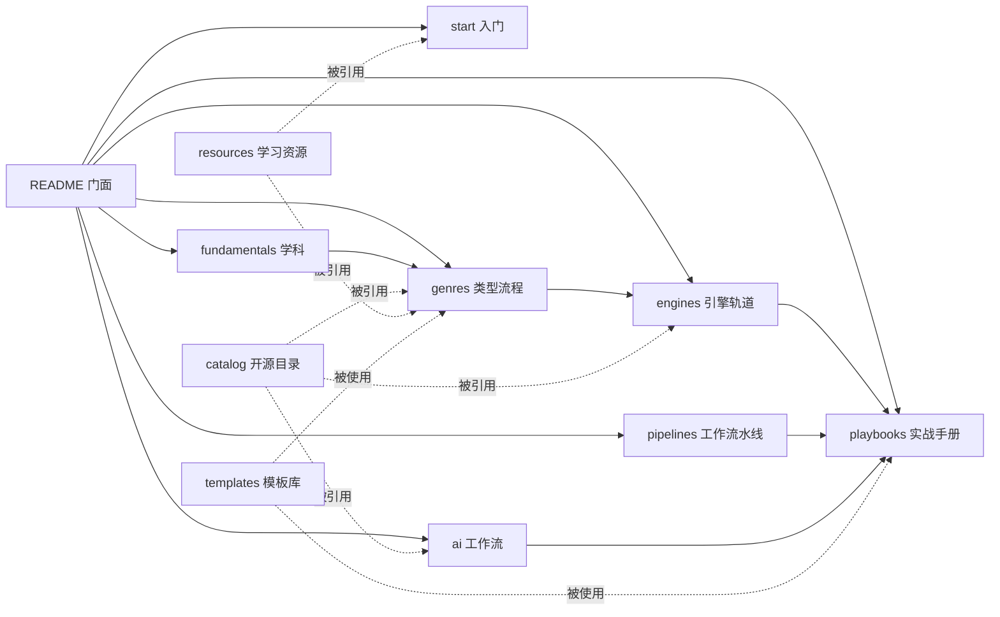

# Ludo Atlas · 游戏开发全景手册 — 仓库骨架设计文档

> 版本 v1.9 · 2026-10-04 · 状态：持续扩展（第 ㊲ 轮：类型累计 41 类；catalog 三表；示例区路线图）
> 目标：设计一个可长期维护的开源游戏开发知识仓库，整合「分类型开发流程」×「开源项目目录」×「课程与学习资源」×「AI 开发工作流」。

---

## 目录

1. 项目定位
2. 设计原则（10 条）
3. 信息架构（双轴 + 交叉引用）
4. 完整目录树（全库骨架）
5. `docs/` 详解（八个板块）
6. `catalog/` 详解（机器可读的开源项目目录）
7. `resources/` 详解（课程与学习资源）
8. `playbooks/` 详解（端到端实战手册）
9. `templates/` 详解（统一模板库）
10. `examples/` `scripts/` `data/` `.github/` `assets/` 详解
11. 游戏类型矩阵（18 家族 × 112 类型 × 优先级）
12. 内容规范与写作规范
13. 治理与维护（贡献、评审、生命周期、许可、翻译）
14. AI 开发工作流（专章设计，含 8 个端到端案例）
15. 落地路线图（Phase 0-3）
16. 仓库元数据与命名建议
17. 附录：种子内容（已并入《资源大全》）
18. 待决策问题

---

## 0. 关于本文档

- 本文档定义仓库的**骨架**：定位、结构、每个目录的职责、文件清单、模板与规范、路线图。
- 落地方式：按 §4 目录树初始化仓库；按 §5-§10 逐目录填充；§9 与 §14 的模板直接复制使用。
- 本文档建议存放在未来仓库的 `docs/meta/design.md`，作为仓库自身的"设计说明书"，随仓库演进更新。

---

## 1. 项目定位

### 1.1 一句话定义

一个**中文优先、结构科学、链接可验证**的开源游戏开发知识库：把"做游戏"这件事拆成「类型流程（怎么做）」×「开源工具链（用什么做）」×「学习资源（去哪学）」×「AI 工作流（怎么快）」四条主线，整合为可检索、可贡献、可持续维护的结构化手册。

### 1.2 目标（仓库要解决的 6 个问题）

1. **新手不知道从哪开始** → `docs/start/` 提供引擎选型决策树 + 7 天第一个游戏 + 学习路径。
2. **每个游戏类型的做法完全散落** → `docs/genres/` 为每个类型建立统一结构的开发流程 Playbook（设计 / 技术 / 内容管线 / 制作 / 案例 / 起步套件）。
3. **"该用什么开源项目"没有可信清单** → `catalog/` 提供机器可读（YAML + schema）、CI 验证、带许可证与维护状态的工具目录。
4. **课程和资源鱼龙混杂** → `resources/` 按难度、费用、语言、类型筛选，标注复核日期。
5. **AI 时代的工作流没人系统整理** → `docs/ai/` 独立成章：编码代理、引擎 MCP、AI 美术/音频/叙事/QA、合规与伦理 + 8 个端到端工作流案例。
6. **从学到做之间缺少桥** → `playbooks/` 提供可复制的端到端流程（30 天 Demo、48h Game Jam、垂直切片、Steam 上架、作品集求职）。

### 1.3 非目标（明确不做，防止范围失控）

- 不搬运、不复刻他人教程全文；只做"索引 + 推荐 + 自主编写的流程与经验"。
- 不做论坛与问答（用 GitHub Discussions 承接）。
- 不做新闻站、不做市场数据服务（只链接已有权威来源）。
- 不接受无标注的商业软文；付费资源收录但强制标注价格档位与许可条款。

### 1.4 目标受众（四类画像）

| 画像 | 需求 | 主要入口 |
| --- | --- | --- |
| A. 零基础新人 | 知道游戏是怎么做出来的，做出第一个作品 | `start/` → `playbooks/zero-to-demo-30d` |
| B. 转行/求职者 | 系统补课、作品集、面试 | `fundamentals/` → `playbooks/portfolio-to-job` |
| C. 独立开发者 | 选型、少走弯路、发布与运营 | `catalog/` → `genres/` → `playbooks/steam-launch` |
| D. 教学者/团队 | 统一的课程骨架与工程规范 | `docs/` 全站 + `templates/` |

### 1.5 与现有同类仓库的差异（差异化定位）

已存在的优秀列表：`ellisonleao/magictools`（工具大全）、`dawdle-deer/awesome-learn-gamedev`（学习资源）、`FronkonGames/Awesome-Gamedev`（分类资源）、`BUas/programming-awesome-list`（课程向）。

本仓库的差异点（也是设计取舍的依据）：

1. **以"类型"组织开发流程**：现有列表几乎都按工具分类，没有人系统整理"做平台跳跃要做哪些事"。
2. **机器可读的目录**（YAML + JSON Schema + CI 校验），支持自动生成表格与站点，杜绝死链接堆积。
3. **AI 工作流独立成章**：2024 年后游戏开发工作流的最大变量，现有列表普遍缺失。
4. **模板驱动**：同类内容（类型、条目、复盘）结构完全一致，贡献者填空即写作。
5. **中文优先**，术语中英对照，面向中文社区；结构预留英文翻译。

> 关系定位：与上述列表**互链互补**，不重复造轮子；`catalog/` 的种子数据可从既有列表（含已 fork 的 magictools-SI）批量导入后逐条验证。

---

## 2. 设计原则（10 条，每条含落地方式）

| # | 原则 | 说明 | 落地方式 |
| --- | --- | --- | --- |
| P1 | **双轴导航** | 内容沿两条轴组织：学科轴（设计/程序/美术/音频/制作）与类型轴（45 个游戏类型） | `fundamentals/` 管学科，`genres/` 管类型；交叉处互相链接不重复 |
| P2 | **单一事实来源（SSOT）** | 每个工具、课程、资源只在 `catalog/` 或 `resources/` 定义一次 | 其他页面只引用条目 id / 链接，禁止复制描述文本 |
| P3 | **机器可读优先** | 目录数据是数据，不是散文 | `catalog/*.yml` + `schema.json`；表格与站点页面由脚本生成 |
| P4 | **模板驱动** | 同类内容必须同构，降低写作与维护成本 | `templates/` 提供类型 Playbook、条目、GDD、复盘等模板；新内容一律从模板初始化 |
| P5 | **渐进式披露** | README → 板块索引 → 章节主页 → 深潜页，逐层展开 | 每级页面首屏给"一句话摘要 + 导航"，细节下沉 |
| P6 | **可验证性** | 链接必须能打开、条目必须有复核日期 | CI：markdownlint + lychee 链接检查 + catalog schema 校验；条目标注 `added/reviewed` |
| P7 | **稳定 URL** | 目录与文件名用英文 kebab-case，标题用中文；改标题不改路径 | 分类法与路径一旦发布视为兼容性承诺，迁移必须留重定向 |
| P8 | **范围可控** | 112 个类型不是一次铺满，按 P0/P1/P2 分级推进 | 类型矩阵标注优先级；P0 全量、P1 骨架、P2 建目录待填 |
| P9 | **面向 AI 时代** | 仓库自身要"对 LLM 友好"，并把 AI 工作流作为一等公民 | 根目录 `AGENTS.md` 约定 AI 协作规则；`docs/ai/` 独立章节；内容结构清晰便于检索 |
| P10 | **开放治理** | 任何人都能按流程贡献，评审有规则、失效有处理 | CONTRIBUTING + CODEOWNERS + 生命周期状态机（§13） |

---

## 3. 信息架构

### 3.1 四条主线 + 三个横切层

- 主线一 **学习线**：`start/` → `fundamentals/` → `resources/`
- 主线二 **制作线**：`genres/` → `engines/` → `pipelines/` → `playbooks/`
- 主线三 **工具线**：`catalog/`（被所有页面引用）
- 主线四 **AI 线**：`docs/ai/`（独立成章，横跨学习与制作）
- 横切层一：**模板**（`templates/`，供内容与项目复用）
- 横切层二：**示例**（`examples/`，最小可运行代码）
- 横切层三：**自动化**（`scripts/` + `.github/`，验证与生成一切）

### 3.2 交叉引用规则（写内容时的硬规则）

1. `genres/*` 引用：`catalog/`（工具）、`resources/`（课程）、`engines/`（实现差异）、`templates/`（文档模板）。
2. `engines/*` 引用：`catalog/`（该引擎生态的开源插件）、`pipelines/`（通用管线）。
3. `ai/*` 引用：`catalog/ai-tools.yml`、`pipelines/`、`templates/`。
4. 任何页面**不得**复制工具条目描述，只允许"条目名 + 相对链接 + 一句话为什么推荐"。
5. 双向链接原则：被引用方在 `related` 字段列出引用方（站点生成"反向链接"区块）。

### 3.3 导航图（mermaid，将嵌入 README）



---

## 4. 完整目录树（全库骨架）

> 说明：`#` 后为注释；`…/` 表示该目录内采用统一文件模板（见 §5.3、§5.4）。全库共 9 个顶层区域。

```text
ludo-atlas/
├── .github/                          # 工程化：CI、模板、责任到人
│   ├── workflows/
│   │   ├── lint-md.yml               # markdownlint + 格式检查（每次 PR）
│   │   ├── link-check.yml            # lychee 链接检查（PR + 每周定时）
│   │   ├── validate-catalog.yml      # catalog/*.yml 按 schema.json 校验
│   │   ├── build-site.yml            # VitePress 构建并部署 GitHub Pages
│   │   ├── gen-tables.yml            # 每周由 yml 重新生成各索引页表格
│   │   └── stats.yml                 # 每周产出 data/stats.json（条目数/覆盖度）
│   ├── ISSUE_TEMPLATE/
│   │   ├── new-resource.yml          # 推荐新资源（表单：类型/链接/理由/不重复声明）
│   │   ├── content-fix.yml           # 纠错（链接失效、过时、错误）
│   │   ├── playbook-request.yml      # 新类型 Playbook 需求
│   │   ├── translation.yml           # 翻译认领
│   │   └── config.yml                # 引导去 Discussions
│   ├── PULL_REQUEST_TEMPLATE.md      # 提交检查清单（§13.2）
│   ├── CODEOWNERS                    # 按区域指派评审人
│   └── dependabot.yml                # 依赖与 Actions 更新
│
├── docs/                             # ① 文档主站（VitePress，GitHub Pages 部署）
│   ├── .vitepress/                   # 站点配置：config.ts、侧边栏自动生成、主题、locales(zh 默认/en)
│   ├── index.md                      # 首页：定位一句话 + 四条主线入口 + 统计数字
│   ├── meta/                         # 关于仓库自身
│   │   ├── design.md                 # 本设计文档（随仓库演进）
│   │   ├── taxonomy.md               # 分类法说明：家族/类型/标签词表（受控词表）
│   │   ├── writing-style.md          # 写作规范（§12）
│   │   └── link-policy.md            # 链接政策：验证、归档、失效处理
│   ├── start/                        # 0 · 入门（4 步走）
│   │   ├── README.md                 # 入门总览与推荐路径
│   │   ├── what-is-gamedev.md        # 游戏开发全景与岗位地图（程序/策划/美术/TA/音频/制作/QA/发行）
│   │   ├── engine-choice.md          # 引擎选型决策树（按目标/语言/平台/团队）
│   │   ├── first-game-7days.md       # 7 天做出第一个游戏（每天任务清单）
│   │   └── learning-path.md          # 学习路径：爱好者 / 独立开发 / 求职 三条线
│   ├── fundamentals/                 # 1 · 基础学科（6 门）
│   │   ├── game-design/              #   核心循环、系统设计、关卡设计、数值平衡、叙事、经济、UX
│   │   ├── programming/              #   语言、架构、设计模式、算法、网络、性能、版本控制与工具
│   │   ├── math-physics/             #   向量矩阵、四元数、概率、碰撞、游戏数学实践
│   │   ├── art/                      #   管线总览、2D、3D、动画、UI、技术美术、着色器
│   │   ├── audio/                    #   声音设计、音乐、中间件、混音
│   │   └── production/               #   规划、范围控制、版本控制、测试
│   ├── genres/                       # 2 · 分类型开发流程（★ 核心，18 家族 112 类型）
│   │   ├── README.md                 # 类型选择矩阵（复杂度/团队规模/市场/学习价值）
│   │   ├── _template/                # 类型 Playbook 空白模板（7 文件，见 §5.3）
│   │   ├── action/                   #   动作（12）：platformer / precision-platformer / metroidvania /
│   │   │                             #     beat-em-up / fighting / character-action / hack-and-slash / stealth /
│   │   │                             #     soulslike / run-and-gun / endless-runner / immersive-sim
│   │   ├── shooter/                  #   射击（9）：fps / tps / shmup / twin-stick / bullet-heaven /
│   │   │                             #     battle-royale / extraction-shooter / hero-shooter / looter-shooter
│   │   ├── rpg/                      #   角色扮演（7）：jrpg / arpg / crpg / tactics-srpg /
│   │   │                             #     dungeon-crawler / mmorpg / monster-taming
│   │   ├── strategy/                 #   策略（8）：rts / tower-defense / 4x / grand-strategy /
│   │   │                             #     auto-battler / moba / wargame / artillery
│   │   ├── simulation/               #   模拟（11）：management / city-builder / colony-sim / farming-life /
│   │   │                             #     survival-craft / vehicle-sim / flight-sim / god-game / life-sim /
│   │   │                             #     pet-sim / raising-sim
│   │   ├── puzzle/                   #   解谜（11）：logic / sokoban / physics / escape-room / puzzle-platformer /
│   │   │                             #     match-3 / merge / word / hidden-object / grid-logic / jigsaw
│   │   ├── narrative/                #   叙事（7）：visual-novel / otome / point-and-click / interactive-fiction /
│   │   │                             #     mud / interactive-movie / walking-sim
│   │   ├── social/                   #   社交与多人（7）：party / co-op / couch-multiplayer / mmo /
│   │   │                             #     social-deduction / asymmetric / io-games
│   │   ├── procedural/               #   程序生成与局内成长（4）：roguelike / roguelite / deckbuilder / idle-incremental
│   │   ├── rhythm-music/             #   音乐节奏（4）：rhythm / music-sandbox / karaoke / dance
│   │   ├── sports-racing/            #   竞速体育（8）：racing / kart-racing / team-sports / extreme-sports /
│   │   │                             #     golf / fishing / billiards / fitness
│   │   ├── sandbox/                  #   沙盒创造（3）：sandbox-building / creative-workshop / physics-sandbox
│   │   ├── automation/               #   自动化与逻辑（3）：factory-automation / programming-puzzle / logic-automation
│   │   ├── horror/                   #   恐怖（3）：survival-horror / psychological-horror / co-op-horror
│   │   ├── card-board/               #   卡牌与桌面（5）：tcg / board-game / mahjong / solitaire / casino
│   │   ├── education/                #   教育功能（4）：edutainment / serious-game / quiz / training-sim
│   │   ├── casual/                   #   休闲轻量（4）：hyper-casual / minigame-collection / anti-stress / arcade-classic
│   │   └── xr/                       #   扩展现实（2）：vr-game / ar-game
│   ├── engines/                      # 3 · 引擎轨道（12 条，每轨道 7 文件，见 §5.4）
│   │   ├── README.md                 # 引擎选型矩阵与对比表
│   │   ├── godot/…  unity/…  unreal/…  bevy/…  web/…  microframework/…
│   │   ├── monogame-fna/…  defold/…  gamemaker/…  renpy/…  rpgmaker/…  custom-inhouse/…
│   ├── pipelines/                    # 4 · 工作流水线（12 条通用管线）
│   │   ├── README.md                 # 管线全景：从代码提交到上线运营
│   │   ├── version-control/          #   Git 工作流、Git LFS、分支策略（游戏仓库的特殊性）
│   │   ├── environment/              #   开发环境、工具链、代理与内网、团队镜像
│   │   ├── coordination/             #   任务管理、文档协作、会议与决策记录（ADR）
│   │   ├── asset-pipeline/           #   美术资产：命名、导出、导入、图集、LOD
│   │   ├── audio-pipeline/           #   音频资产：格式、响度、预算、中间件
│   │   ├── level-content/            #   关卡与内容：数据表、编辑器、迭代节奏
│   │   ├── localization/             #   本地化：字符串提取、术语表、翻译、字体
│   │   ├── playtesting/              #   试玩：招募、脚本、记录、指标
│   │   ├── build-release/            #   构建与发布：签名、商店、版本号
│   │   ├── cicd/                     #   游戏 CI/CD：构建农场、自动打包、蒸汽管道
│   │   ├── analytics/                #   遥测与分析：事件设计、隐私、看板
│   │   └── live-ops/                 #   运营：更新节奏、热修、社区、事故响应
│   ├── ai/                           # 5 · AI 工作流（★ 专章，见 §14）
│   ├── teams/                        # 6 · 团队与规模
│   │   ├── README.md
│   │   ├── solo.md  small-team.md  studio.md
│   │   ├── hiring.md                 # 招聘与求职：岗位、面试、作品集
│   │   └── jams.md                   # Game Jam 全指南
│   ├── publishing/                   # 7 · 商业化与发行
│   │   ├── README.md
│   │   ├── marketing.md              # 营销：愿望单、Devlog、社媒、展会
│   │   ├── steam-launch.md           # Steam 上架全流程
│   │   ├── store-page.md             # 商店页与胶囊图规范
│   │   ├── pricing.md                # 定价与折扣
│   │   └── publishers-funding.md     # 发行商、投资、资助（含国内扶持）
│   └── postmortems/                  # 8 · 复盘库
│       ├── README.md                 # 复盘索引（按类型/规模/结果筛选）
│       └── _template.md              # 统一复盘模板
│
├── catalog/                          # ② 开源项目目录（机器可读，唯一事实来源）
│   ├── README.md                     # 使用说明：字段含义、如何检索、如何贡献
│   ├── schema.json                   # 条目 JSON Schema（§6.1）
│   ├── engines.yml                   # 引擎与框架
│   ├── libraries.yml                 # 库（ECS/物理/渲染/网络/音频/PCG/寻路/UI）
│   ├── editor-tools.yml              # 编辑器与工具（Tiled/LDtk/Blender/Krita/像素工具…）
│   ├── narrative-tools.yml           # 叙事工具（Ink/Twine/Yarn/Ren'Py/Dialogic）
│   ├── build-ci.yml                  # 构建与 CI 工具（GameCI/butler/gdUnit4…）
│   ├── backend-services.yml          # 后端与联机服务（Nakama/Colyseus/Agones…）
│   ├── free-assets.yml               # 免费素材源（Kenney/Poly Haven/Freesound…）
│   ├── starter-kits.yml              # 模板与脚手架工程
│   └── ai-tools.yml                  # AI 工具（§14 引用）
│
├── resources/                        # ③ 课程与学习资源
│   ├── README.md                     # 资源总索引与筛选指南
│   ├── courses/                      # 课程（按难度分文件，含大学公开课与引擎定向课）
│   │   ├── README.md  beginner.md  intermediate.md  advanced.md
│   │   ├── university.md             # 大学公开课与课程资料
│   │   └── engine-specific.md        # 引擎官方与社区课
│   ├── books.md                      # 书籍（设计/编程/美术/生产/行业纪实）
│   ├── video-channels.md             # 视频频道与系列（含 B 站/YouTube）
│   ├── blogs-newsletters.md          # 博客与周刊
│   ├── gdc-talks.md                  # GDC 经典演讲清单（主题分组）
│   ├── papers.md                     # 论文与技术报告
│   ├── communities.md                # 社区（论坛/Discord/Reddit/中文社区）
│   ├── jams-competitions.md          # 赛事与 Game Jam
│   ├── open-source-games.md          # 可学习源码的游戏（按语言/类型标注）
│   └── practice-projects.md          # 练习项目清单（复刻经典、渐难序列）
│
├── playbooks/                        # ④ 端到端实战手册（可复制流程）
│   ├── README.md
│   ├── zero-to-demo-30d/             # 30 天从零到可玩 Demo（周计划+每日清单）
│   ├── game-jam-48h/                 # 48 小时 Game Jam 攻略（含 AI 辅助版）
│   ├── vertical-slice/               # 垂直切片制作法
│   ├── steam-launch/                 # Steam 上架全流程（存档包/商店页/审核/首发）
│   ├── mobile-launch/                # 移动端发布（Android/iOS，含隐私合规）
│   ├── web-deploy/                   # Web 游戏部署（itch/自建/SEO）
│   ├── early-access/                 # 抢先体验与长期更新规划
│   ├── live-ops-6months/             # 上线后 6 个月运营手册
│   ├── portfolio-to-job/             # 作品集到求职（简历/面试/测试题）
│   └── studio-pitch/                 # 对发行商 Pitch（提案结构/预算/Demo 要求）
│
├── templates/                        # ⑤ 模板库（内容与项目双用）
│   ├── README.md                     # 模板使用说明与选择树
│   ├── gdd/                          # 游戏设计文档（mini / standard / full 三档）
│   ├── one-pager.md                  # 一页纸立项书
│   ├── tech-design.md                # 技术设计文档
│   ├── adr.md                        # 架构决策记录
│   ├── postmortem.md                 # 复盘模板
│   ├── playtest-plan.md              # 试玩计划
│   ├── milestone-plan.md             # 里程碑与排期
│   ├── art-bible.md                  # 美术圣经（风格/规格/命名）
│   ├── audio-plan.md                 # 音频规划
│   ├── genre-playbook/               # 类型 Playbook 模板（7 文件，§5.3）
│   ├── catalog-entry/entry.yml       # 目录条目模板
│   └── repo-starter/                 # 游戏仓库脚手架（.gitignore/.gitattributes/CI/README/LICENCE）
│
├── examples/                         # ⑥ 最小可运行示例（按引擎组织）
│   ├── README.md                     # 示例索引（每个示例：解决了什么问题，从哪读起）
│   ├── godot/                        #   platformer-2d/  topdown/  roguelike-tiles/ …
│   ├── unity/                        #   2d-controller/  state-machine/ …
│   ├── web/                          #   canvas-basics/  phaser-platformer/ …
│   ├── micro/                        #   raylib-starter/  love-starter/ …
│   └── shaders/                      #   可复用着色器合集（Godot/Unity/GLSL 多版本）
│
├── scripts/                          # ⑦ 自动化脚本
│   ├── validate_catalog.py           # schema 校验（CI 调用）
│   ├── gen_catalog_tables.py         # yml → 索引页表格（生成，不手改）
│   ├── new_genre.py                  # 从模板生成新类型目录（7 文件）
│   ├── new_playbook.py               # 从模板生成新 Playbook
│   ├── check_links.py                # 本地链接检查入口（CI 用 lychee）
│   └── stats.py                      # 统计：条目数/类型覆盖度/复核过期数
│
├── data/                             # ⑧ 生成产物（机器写入，勿手改）
│   ├── catalog.merged.json           # 全部 yml 合并索引（站点与脚本共用）
│   ├── stats.json                    # 统计快照（README 徽章与首页数字）
│   └── links-report.json             # 最近一次链接检查报告
│
├── assets/                           # ⑨ 品牌与图片资源
│   ├── logo.svg  banner.png  social-preview.png   # 品牌（浅/深两版）
│   └── reading/                      # 各文档内使用的插图（webp，<300KB）
│
└── （根文件）
    README.md                  # 门面（中文）：一句话 + 四条主线导航 + 统计 + 快速开始
    README.en.md               # 英文简版
    LICENSE                    # 内容：CC BY-SA 4.0
    LICENSE-CODE               # 代码（examples/scripts）：MIT
    CONTRIBUTING.md            # 贡献指南（写作+数据两类流程）
    CODE_OF_CONDUCT.md         # 行为准则（Contributor Covenant）
    GOVERNANCE.md              # 治理：角色、评审、仲裁、兼职维护者制度
    ROADMAP.md                 # 路线图（同步 §15）
    CHANGELOG.md               # 变更日志（Keep a Changelog 格式）
    GLOSSARY.md                # 术语表（中英对照，站点挂页）
    AGENTS.md                  # 给 AI（编码代理）的仓库协作规则（P9）
    CITATION.cff               # 引用信息
    .editorconfig  .gitattributes  .gitignore
    .markdownlint.json  .lycheeignore
```

---

## 5. `docs/` 详解（八个板块）

### 5.1 `start/` 与 `fundamentals/`

| 文件 | 内容要点 | 来源规范 |
| --- | --- | --- |
| `start/README` | 三条推荐路径（爱好者 2 周 / 独立开发 6 个月 / 求职 12 个月），每步链接到具体章节 | 自写 |
| `start/what-is-gamedev` | 一张"游戏诞生流程图"（概念→原型→切片→量产→QA→发布→运营）+ 岗位地图表 | 自写 + 链接 `teams/hiring` |
| `start/engine-choice` | 决策树（图表）：目标平台×编程基础×2D/3D×团队→推荐引擎；给出 5 个常见场景的结论 | 引用 `engines/README` 对比表 |
| `start/first-game-7days` | 7 天任务清单（Day1 环境 → Day7 发布 itch），每步附"卡住了看这里"链接 | 自写 + 引用 `playbooks/game-jam-48h` |
| `start/learning-path` | 三线成长路径图，每阶段：学什么→做什么→验收标准 | 引用 `resources/courses` |

`fundamentals/` 六门学科统一结构：每目录 `README.md`（学科地图 + 学习顺序）+ 5-8 个主题页。主题页统一模板：

```markdown
---
title: <主题中文名>（<English>）
level: beginner | intermediate | advanced
tags: [fundamentals/game-design, ...]
status: draft | published
updated: YYYY-MM-DD
---
# <标题>
> 一句话摘要：这个主题解决什么问题。
## 为什么重要（30 秒）
## 核心概念（图解优先）
## 实践：最小例子
## 常见误区
## 进阶阅读（→ resources/ 链接）
```

### 5.2 `fundamentals/` 各目录文件清单

```text
game-design/    core-loop.md  systems.md  level-design.md  numbers-balance.md
                narrative.md  economy.md  ux.md  playtesting.md
programming/    languages.md  architecture.md  patterns.md  algorithms.md
                networking.md  optimization.md  save-load.md  tools.md
math-physics/   vectors-matrices.md  quaternions.md  probability.md
                collision.md  gameplay-math.md
art/            pipeline-overview.md  2d.md  3d.md  animation.md  ui.md
                technical-art.md  shaders.md
audio/          sound-design.md  music.md  middleware.md  mixing.md
production/     planning.md  scoping.md  version-control.md  testing.md
```

### 5.3 `genres/` ★ 核心板块

**组织方式**：18 个家族（action/shooter/rpg/strategy/simulation/puzzle/narrative/social/procedural/rhythm-music/sports-racing/sandbox/automation/horror/card-board/education/casual/xr）× 112 个类型目录，每个类型目录采用**统一的 7 文件模板**（`_template/` 为空白模板）：

| 文件 | 职责 | 内容大纲 |
| --- | --- | --- |
| `README.md` | 概览与导航 | 一句话定义；为什么适合（不）做这个类型；核心循环图（mermaid）；难度/团队规模/周期参考；子页面导航 |
| `design.md` | 设计要点 | 体验目标三支柱；核心循环拆解；系统清单；数值与曲线；关卡/内容节奏；**常见设计陷阱**；设计 Checklist（可勾选） |
| `tech.md` | 技术方案 | 关键技术点表格（手感/碰撞/相机/输入缓冲/状态机/生成算法/存档/网络…）；架构建议；**各引擎实现差异**（Godot/Unity/Unreal 各一节）；性能预算 |
| `content-pipeline.md` | 内容生产管线 | 关卡/美术/音频/文案的生产工具与流程；数据表设计；迭代节奏（改一次关卡要几步） |
| `production.md` | 制作与范围 | 参考范围表（单人/小队/全职分别多久）；里程碑模板；**砍功能优先序**；风险清单 |
| `case-studies.md` | 案例拆解 | 3-5 个案例，统一结构：背景 → 关键做法 → 结果 → 可复用结论；优先选**开源可读源码**的案例 |
| `starter-kit.md` | 起步套件 | 开源模板/脚手架（→ catalog/starter-kits.yml）；教程起点（→ resources）；必备素材包；"首日 10 步" |

**写作顺序建议**：先写 `README` 与 `starter-kit`（能立刻帮到人），再 `design`/`tech`，最后 `case-studies`。

**优先级**：P0 十个类型全量写；P1 二十六个类型先建目录 + 填 `README`/`starter-kit`；P2 剩余类型仅建目录占位（矩阵见 §11）。

### 5.4 `engines/` 引擎轨道（12 条）

每条轨道 7 个文件，统一结构（示例：`godot/`）：

| 文件 | 内容 |
| --- | --- |
| `README.md` | 生态总览：版本现状、适用场景、优缺点、与之匹配的类型（→ genres）、学习资源（→ resources） |
| `project-structure.md` | 工程结构最佳实践：目录布局、场景/预制体组织、资源命名、命名空间 |
| `patterns.md` | 引擎惯用法与架构模式：信号/事件、状态机、组件化、数据驱动、自动加载/单例管理 |
| `testing-debugging.md` | 单元测试框架（godot 用 gdUnit4/GUT）、调试器、日志、性能分析器用法 |
| `performance.md` | 性能预算与优化：绘制调用、内存、加载策略、平台差异 |
| `build-release.md` | 导出/打包/签名/商店集成（→ pipelines/build-release） |
| `ecosystem.md` | 生态：常用插件（→ catalog）、社区、工具链缺口 |

**12 条轨道**：`godot`（GDScript/C#，开源首选）、`unity`、`unreal`、`bevy`（Rust/ECS）、`web`（Three.js/Babylon.js/PixiJS/Phaser）、`microframework`（raylib/LÖVE/SDL/SFML，框架而非引擎）、`monogame-fna`（C#）、`defold`、`gamemaker`、`renpy`（视觉小说）、`rpgmaker`、`custom-inhouse`（自研引擎/不用引擎，含 Handmade 路线）。

### 5.5 `pipelines/` 工作流水线（12 条）

每条管线一个目录，统一 2-3 文件：`README.md`（概览+流程图）+ 专题页 + `checklist.md`。**这是仓库里"经验分享"属性最强的板块**，每条管线首屏第一句必须是"这条管线解决什么问题、什么时候需要它"。

| 管线 | 一句话 | 关键文件 |
| --- | --- | --- |
| version-control | 游戏仓库与普通软件的 Git 差异（二进制资产、LFS、锁） | `git-for-games.md` `git-lfs.md` `branch-strategy.md` |
| environment | 团队环境一致性（版本锁定、工具分发、代理/镜像） | `toolchain.md` `team-mirror.md` |
| coordination | 任务与文档协作（看板、周会、决策记录 ADR） | `task-flow.md` `adr-practice.md` |
| asset-pipeline | 美术资产从 DCC 到引擎（命名/导出/导入/图集/LOD） | `naming.md` `export-import.md` `atlas.md` |
| audio-pipeline | 音频资产（格式/响度标准/预算/中间件接线） | `formats-loudness.md` `middleware.md` |
| level-content | 关卡与数据内容（数据表、编辑器、迭代循环） | `data-tables.md` `iteration-loop.md` |
| localization | 本地化管线（字符串提取、术语表、字体、LQA） | `string-management.md` `glossary.md` `fonts.md` |
| playtesting | 试玩（招募、脚本、观察、问卷、指标） | `recruiting.md` `session-guide.md` |
| build-release | 构建与发布（版本号、签名、多平台、商店） | `versioning.md` `platforms.md` `store-release.md` |
| cicd | 游戏 CI/CD（构建农场、自动打包、Steam 管道） | `build-farm.md` `steam-pipe.md` |
| analytics | 遥测与分析（事件设计、隐私合规、看板） | `event-design.md` `privacy.md` |
| live-ops | 上线后运营（更新节奏、热修、事故响应、社区） | `cadence.md` `incident.md` |

### 5.6 `teams/`、`publishing/`、`postmortems/`

- `teams/`：`solo.md`（单人开发策略与防弃坑）、`small-team.md`（2-8 人分工与协作）、`studio.md`（部门与流程）、`hiring.md`（求职面试 + 招聘）、`jams.md`（Game Jam 全指南）。
- `publishing/`：从愿望单营销到大作发行的全链；重点页 `steam-launch.md` 与 `store-page.md`（胶囊图/截图/文案规范）。
- `postmortems/`：不用子目录堆积，一文件一复盘（`0001-<slug>.md`），README 维护筛选索引（按类型/规模/成败）。**投稿优先，需要授权**。

---

## 6. `catalog/` 详解（开源项目目录）

### 6.1 条目 Schema（`catalog/schema.json` 的字段定义）

```yaml
- id: godot                          # 唯一 id（kebab-case，全库引用用它）
  name: Godot Engine
  homepage: https://godotengine.org
  repo: https://github.com/godotengine/godot
  category: engine                   # engine|library|editor|narrative|build|backend|assets|starter|ai
  description: 开源跨平台 2D/3D 游戏引擎，脚本语言 GDScript / C#…
  # 描述硬规则：≤80 字、一句话、说清"是什么+突出特点"，禁止广告腔
  tags: [2d, 3d, gdscript, csharp, gpl-exception]   # 受控词表见 docs/meta/taxonomy.md
  license: MIT                       # SPDX 标识符；非标准许可写详见 notes
  platforms: [windows, macos, linux, android, ios, web]
  languages: [GDScript, C#, C++]
  maturity: production               # experimental | beta | production | legacy
  pricing: free                      # free | freemium | paid | source-available
  status: active                     # active | stale | archived（维护状态）
  added: 2026-10-04
  reviewed: 2026-10-04               # 复核日期（超 12 个月自动提醒）
  notes: ""                          # 许可陷阱、商业化注意等诚实备注
```

### 6.2 收录与评审标准（科学清单，防止目录膨胀失焦）

**收录条件（全部满足）**：

1. 解决明确的游戏开发问题，且是同类中的合理选择（不是"又一个小工具"）。
2. 有可访问的官网或仓库；开源项目需有明确许可证。
3. 最近 24 个月有活跃迹象（提交/发布/社区），或为"经典退役但仍值得学习"并如实标注。
4. 无恶意历史、无来源不明的 licensing 争议。

**不收录**：无许可证的“源码可用”软件（除非特别注明风险）、纯广告项目、AI 生成的刷量仓库、已死项目（进 `legacy` 需人工批注原因）。

**分类规则**：一个项目只进一个主分类（SSOT）；交叉话题用 `tags` 表达，不复制条目。

### 6.3 使用流程（数据 → 展示）

1. 贡献者改 `catalog/*.yml`（或通过 Issue 表单提交，由维护者代填）。
2. CI：`validate_catalog.py` 校验 schema（必填字段/枚举值/日期格式）。
3. `gen_catalog_tables.py` 把 yml 生成：各分类索引页表格（插入到 `docs/catalog/*.md` 的标记区之间）、站点数据、`data/catalog.merged.json`。
4. 链接检查（lychee）对 homepage/repo 做可达性检查，结果进 `data/links-report.json`。
5. README 与首页的统计数字从 `data/stats.json` 读出，避免手改不同步。

> 生成区用注释标记包裹：`<!-- gen:begin category=engine -->` … `<!-- gen:end -->`，人只维护 yml。

### 6.4 各 yml 文件的内容大纲（种子清单见 §17）

- `engines.yml`：引擎与"框架型"方案（Godot/Bevy/raylib/LÖVE/libGDX/MonoGame/Defold/O3DE…），字段里加 `kind: engine|framework|engine-like` 区分。
- `libraries.yml`：库按 `subcategory` 细分：`ecs` `physics` `rendering` `networking` `audio` `pcg` `pathfinding` `ui` `scripting` `serialization`。
- `editor-tools.yml`：通用编辑器与创作工具（Tiled/LDtk/Blender/Krita/像素工具/体素工具…）。
- `narrative-tools.yml`：Ink/Twine/Yarn Spinner/Ren'Py/Dialogic 等。
- `build-ci.yml`：GameCI、butler、gdUnit4、GUT、AltTester、fastlane 等。
- `backend-services.yml`：Nakama、Colyseus、Agones、Supabase/Appwrite（游戏常用部分）等。
- `free-assets.yml`：素材源（须标许可：CC0/CC-BY/混合，逐条注明）。
- `starter-kits.yml`：开源模板工程（按引擎/类型标注）。
- `ai-tools.yml`：AI 工具（§14.2 引用；字段加 `ai_scope: coding|art|audio|narrative|qa|l10n|all`、`local: true|false`、`pricing`）。

---

## 7. `resources/` 详解（课程与学习资源）

### 7.1 条目格式（表格行，统一六列）

```text
| 名称（链接） | 语言 | 费用 | 难度 | 适合人群 | 备注与复核日期 |
```

**筛选原则**：优先"完整课程/成体系"而非单篇技巧文；标注语言（中/英）与费用（免费/订阅/买断）；超 12 个月未复核的条目标记 `⏳ stale` 待清理。

### 7.2 分文件职责

| 文件 | 收录标准 |
| --- | --- |
| `courses/beginner.md` | 零基础：编程入门 + 引擎入门 + 第一个游戏 |
| `courses/intermediate.md` | 有基础：系统设计、架构、专项技术 |
| `courses/advanced.md` | 进阶：引擎原理、图形学、网络同步、性能工程 |
| `courses/university.md` | 大学公开课（CS50G、CMU、Utah 图形学等） |
| `courses/engine-specific.md` | 各引擎官方课程与文档型教程（含中文资源） |
| `books.md` | 五类：设计、编程、美术、生产管理、行业纪实（每本一句"先读哪章"） |
| `video-channels.md` | 频道路线：教程向 / 设计分析向 / 技术拆解向；中文频道单列一节 |
| `blogs-newsletters.md` | 长文博客（技术+设计）与周报 |
| `gdc-talks.md` | 按主题分组（设计/程序/美术/生产/独立）的演讲清单，附观看顺序建议 |
| `papers.md` | 图形学/程序生成/游戏 AI 论文入口 |
| `communities.md` | 社区：综合论坛、引擎社区、中文社区、Discord 服务器（附"先看置顶/FAQ"提示） |
| `jams-competitions.md` | 赛事：Ludum Dare、GGJ、GMTK Jam、7DRL、js13k…（难度/时长/适合阶段） |
| `open-source-games.md` | 可学习源码的游戏：按语言标注，附"从哪个子系统开始读"的一句话 |
| `practice-projects.md` | 练习项目阶梯：复刻经典（贪吃蛇→俄罗斯方块→平台跳跃→Roguelike→小 RPG），每个附验收标准 |

---

## 8. `playbooks/` 详解（端到端实战手册）

每个 Playbook 统一四段结构：

1. **适用与产出**：什么时候用、做完你会得到什么（可验收的产物）。
2. **总览图**：阶段划分 + 时间盒（表格）。
3. **分阶段清单**：每阶段 = 任务清单（可勾选）+ 工具（→ catalog）+ 检查点（"此处必须停下来验证 X"）。
4. **翻车点**：该流程最常见的 5 个失败原因与规避。

十个 Playbook 的关键内容骨架：

| Playbook | 核心阶段 | 特色内容 |
| --- | --- | --- |
| `zero-to-demo-30d` | 选型(2d)→原型(7d)→核心循环(10d)→内容补充(7d)→发布(4d) | 每天 2 小时版 / 全职版两套时间表 |
| `game-jam-48h` | 组队→范围裁剪→执行→提交 | 范围公式（"能玩一句话"）；AI 辅助版流程（→ §14.8） |
| `vertical-slice` | 目标定义→切片范围→打磨→评审 | 切片验收标准：外人 10 分钟能不能说出"这游戏卖点是什么" |
| `steam-launch` | 商店页先行→愿望单积累→构建→审核→首发 | 时间线表（发布前 6 个月到后 30 天，逐周任务） |
| `mobile-launch` | 适配→隐私合规→测试→提审 | iOS/Android 隐私清单、分级、买量基础 |
| `web-deploy` | 构建→部署→分享 | itch.io / GitHub Pages / 自建 CDN 三方案对比 |
| `early-access` | EA 定位→路线图→更新节奏 | EA 期望管理（什么进 EA、什么别承诺） |
| `live-ops-6months` | 更新→社区→数据→复盘 | 月度节奏模板；事故响应流程 |
| `portfolio-to-job` | 作品集→简历→面试→测试题 | 作品集三作品结构（1 完整+1 技术展示+1 快速） |
| `studio-pitch` | 提案→演示→谈判 | Pitch Deck 结构（10 页模板）；Demo 要求清单 |

---

## 9. `templates/` 详解（模板库）

### 9.1 游戏设计文档三档（`gdd/`）

| 档位 | 篇幅 | 适用 |
| --- | --- | --- |
| `mini.md` | 1-2 页 | Jam / 原型：一句话、核心循环、操作、范围 |
| `standard.md` | 8-15 页 | 独立项目：+ 系统、内容、美术方向、技术约束、排期 |
| `full.md` | 20+ 页 | 完整立项：+ 市场定位、竞品、商业模式、风险、验收 |

### 9.2 类型 Playbook 模板（`genre-playbook/`）

即 §5.3 的 7 个文件空白版 + 每文件顶部的**写作指南注释**（写什么、别写什么、字数上限）。`new_genre.py` 用它一键生成新类型目录。

### 9.3 条目模板（`catalog-entry/entry.yml`）

§6.1 schema 对应的空白条目 + 注释示例。

### 9.4 项目脚手架（`repo-starter/`）

未来新游戏仓库开箱即用的集合：

```text
repo-starter/
├── README.md                 # 游戏仓库 README 模板（名称/截图/GIF/玩法/构建方式/许可）
├── .gitignore                # 按引擎分：godot.gitignore / unity.gitignore / unreal.gitignore
├── .gitattributes            # Git LFS 规则：png/psd/wav/fbx/blend 等
├── LICENSE                   # 占位说明（游戏代码与资产许可分开）
├── docs/                     # GDD.md  TECH.md  ART_BIBLE.md  CHANGELOG.md
├── .github/workflows/ci.yml  # 构建 + 测试骨架（按引擎注释切换）
└── CONTRIBUTING.md           # 若开源
```

---

## 10. `examples/`、`scripts/`、`.github/` 详解

### 10.1 `examples/` 标准

- 每个示例 = 最小可运行 + `README.md`（解决什么问题 / 关键文件导读 / 运行命令）+ 不引入无关依赖。
- 原则："能删的都删"：示例是教学材料，不是产品工程。
- 引擎示例可参加各自 CI（可选，Phase 2 起）。

### 10.2 `scripts/` 职责与 CI 映射

| 脚本 | 被谁调用 | 作用 |
| --- | --- | --- |
| `validate_catalog.py` | `validate-catalog.yml`（PR） | yml 按 schema.json 校验，输出错误行号 |
| `gen_catalog_tables.py` | `gen-tables.yml`（周更 + 手动） | 重新生成索引页表格与 merged json |
| `new_genre.py` / `new_playbook.py` | 贡献者本地 | 从模板生成目录骨架 |
| `check_links.py` | 本地；CI 用 lychee | 链接检查（403/429 视作"浏览器可达"，其余失败需修复） |
| `stats.py` | `stats.yml`（周更） | 条目数、类型覆盖度、stale 计数、过期复核列表 |

### 10.3 `.github/` 工程化细节

- **workflows**：`lint-md`（markdownlint-cli2）、`link-check`（lychee，accept 200/206/403/429，cron 每周一）、`validate-catalog`、`build-site`（Pages 部署，注意仓库 Settings 用 Actions 源）、`gen-tables`、`stats`。
- **PR 模板检查清单**：分类正确 / 机器字段完整 / 链接可访问 / 无版权风险 / 中文排版过检 / 已跑本地校验。
- **Issue 表单**：推荐资源（防重复检查步骤）、纠错（附坏链）、Playbook 需求、翻译认领。
- **CODEOWNERS**：按 `catalog/`、`docs/genres/`、`docs/ai/` 等分区指派。

### 10.4 `data/` 与 `AGENTS.md`

- `data/` 全部为生成物，`.gitattributes` 标记 `linguist-generated`，贡献者不手改。
- `AGENTS.md` 内容要点：仓库结构与 SSOT 规则；改数据用 yml 不改生成区；写作规范摘要；提交信息格式（Conventional Commits）；禁止批量 AI 生成未验证的条目（**AI 辅助的提交必须逐条人验证链接与事实**）。

---

## 11. 游戏类型矩阵（18 家族 × 112 类型）

> 优先级：**P0**=首批全量编写（10 个）；**P1**=第二批（26 个，骨架+概览）；**P2**=建目录待填（76 个）。原型难度：★=低 … ★★★★=高（"做出可玩原型"的相对难度）。
> 每个类型目录统一采用 7 文件 Playbook 模板（见 §5.3）；本矩阵用于选题与排期，不是类型目录的全部定义。

### 11.1 动作 action（12）

| 类型目录 | 定位 | 原型难度 | 代表作参考 | 优先级 |
| --- | --- | --- | --- | --- |
| platformer | 平台跳跃：移动手感与关卡节奏 | ★ | 蔚蓝 / 超级马力欧 | **P0** |
| precision-platformer | 硬核平台：极限操作与速通 | ★★ | 掘地求升 / 超级肉肉哥 | P1 |
| metroidvania | 银河城：能力门锁 + 连通地图 | ★★★ | 空洞骑士 | **P0** |
| beat-em-up | 清版动作：连段与人群控制 | ★★ | 怒之铁拳 4 | P1 |
| fighting | 格斗：帧数据与对抗平衡 | ★★★★ | 街霸 | P2 |
| character-action | 动作冒险：连招系统与镜头调度 | ★★★★ | 鬼泣 5 | P2 |
| hack-and-slash | 割草无双：一骑当千的爽快 | ★★★ | 真·三国无双 | P2 |
| stealth | 潜行：信息与路线规划 | ★★★ | 耻辱 | P2 |
| soulslike | 类魂：高难战斗与关卡循环 | ★★★★ | 艾尔登法环 | P1 |
| run-and-gun | 横版跑轰：跑动射击的节奏 | ★★ | 合金弹头 | P2 |
| endless-runner | 跑酷：一次失误重来 | ★ | 神庙逃亡 | P2 |
| immersive-sim | 沉浸模拟：系统交互的自由度 | ★★★★ | 掠食 / 杀出重围 | P2 |

### 11.2 射击 shooter（9）

| 类型目录 | 定位 | 原型难度 | 代表作参考 | 优先级 |
| --- | --- | --- | --- | --- |
| fps | 第一人称射击：枪感与关卡视线 | ★★★ | DOOM | P1 |
| tps | 第三人称射击：掩体与镜头 | ★★★ | 生化危机 4 重制版 | P2 |
| shmup | 弹幕射击（STG）：弹幕设计与判定 | ★★ | 斑鸠 | P1 |
| twin-stick | 双摇杆射击：移动与瞄准分离 | ★★ | 挺进地牢 | P1 |
| bullet-heaven | 幸存者类：自动攻击 + 海量敌人 | ★ | 吸血鬼幸存者 | **P0** |
| battle-royale | 大逃杀：百人同局与长线运营 | ★★★★ | 和平精英 | P2 |
| extraction-shooter | 搜打撤：高风险物资循环 | ★★★★ | 逃离塔科夫 | P2 |
| hero-shooter | 英雄竞技射击：角色技能组合 | ★★★★ | 守望先锋 | P2 |
| looter-shooter | 刷宝射击：掉落与数值驱动 | ★★★★ | 无主之地 | P2 |

### 11.3 角色扮演 rpg（7）

| 类型目录 | 定位 | 原型难度 | 代表作参考 | 优先级 |
| --- | --- | --- | --- | --- |
| jrpg | 日式 RPG：叙事驱动 + 回合/半即时战斗 | ★★★ | 歧路旅人 | P1 |
| arpg | 动作 RPG：刷装循环 + 打击感 | ★★★ | 哈迪斯 / 暗黑破坏神 | P1 |
| crpg | 欧美 RPG：规则系统 + 分支叙事 | ★★★★ | 博德之门 3 | P2 |
| tactics-srpg | 战棋：网格战术与职业成长 | ★★★ | 火焰纹章 | P2 |
| dungeon-crawler | 地牢爬行：格子探索与资源管理 | ★★★ | 世界树迷宫 | P2 |
| mmorpg | 大型多人在线 RPG | ★★★★ | 魔兽世界 | P2 |
| monster-taming | 怪物收集与养成对战 | ★★★ | 宝可梦 | P2 |

### 11.4 策略 strategy（8）

| 类型目录 | 定位 | 原型难度 | 代表作参考 | 优先级 |
| --- | --- | --- | --- | --- |
| rts | 即时战略：单位经济与操作上限 | ★★★★ | 星际争霸 | P1 |
| tower-defense | 塔防：波次数值与建造成长 | ★★ | 王国保卫战 | **P0** |
| 4x | 4X：探索扩张开发征服 | ★★★★ | 文明 6 | P2 |
| grand-strategy | 大战略：宏观模拟与外交 | ★★★★ | 十字军之王 3 | P2 |
| auto-battler | 自走棋：阵容组合与自动解算 | ★★ | 云顶之弈 | P1 |
| moba | 多人在线竞技：英雄与地图平衡 | ★★★★ | 王者荣耀 / DOTA 2 | P2 |
| wargame | 兵棋：军事推演 | ★★★★ | 钢铁雄心 | P2 |
| artillery | 炮术对战：弹道与回合制 | ★★ | 百战天虫 | P2 |

### 11.5 模拟 simulation（11）

| 类型目录 | 定位 | 原型难度 | 代表作参考 | 优先级 |
| --- | --- | --- | --- | --- |
| management | 模拟经营：资源循环与规模曲线 | ★★ | 双点医院 | P1 |
| city-builder | 城市建造：布局与系统耦合 | ★★★ | 城市天际线 | P1 |
| colony-sim | 殖民模拟：AI 代理与故事生成 | ★★★★ | 环世界 | P1 |
| farming-life | 农场生活：日常循环与情感陪伴 | ★★ | 星露谷物语 / 波西亚时光 | **P0** |
| survival-craft | 生存建造：生存压力与制作链 | ★★ | 我的世界 / 饥荒 | **P0** |
| vehicle-sim | 驾驶模拟：车辆物理与路况 | ★★★ | 欧洲卡车模拟 | P2 |
| flight-sim | 飞行模拟：仪表与气动 | ★★★★ | 微软飞行模拟 | P2 |
| god-game | 上帝游戏：俯视操控全局 | ★★★ | 黑与白 | P2 |
| life-sim | 人生模拟：日常与社交编织 | ★★★ | 模拟人生 | P2 |
| pet-sim | 电子宠物：陪伴与轻养成 | ★★ | 旅行青蛙 | P2 |
| raising-sim | 养成：数值培育与情感投入 | ★★ | 中国式家长 / 美少女梦工场 | P2 |

### 11.6 解谜 puzzle（11）

| 类型目录 | 定位 | 原型难度 | 代表作参考 | 优先级 |
| --- | --- | --- | --- | --- |
| logic | 逻辑解谜：规则与推理之美 | ★ | 传送门 / 巴巴是你 | **P0** |
| sokoban | 推箱子：空间推理的经典 | ★ | 推箱子 | P2 |
| physics | 物理解谜：模拟的不确定设计 | ★★ | 人类一败涂地 | P1 |
| escape-room | 密室逃脱：线索网络与叙事包装 | ★★ | 锈湖系列 / 纸嫁衣 | P2 |
| puzzle-platformer | 解谜平台：机制教学的关卡设计 | ★★ | FEZ / 跷跷板 | P2 |
| match-3 | 三消：爽感反馈与关卡曲线 | ★ | 开心消消乐 | P1 |
| merge | 合成：组合成长与解压反馈 | ★ | 合成大西瓜 | P1 |
| word | 文字解谜：词汇与语言逻辑 | ★ | Wordle | P2 |
| hidden-object | 找物：观察力与场景叙事 | ★★ | 隐藏的家伙 | P2 |
| grid-logic | 网格逻辑：数独/数织/扫雷 | ★ | 数独 | P2 |
| jigsaw | 拼图：碎片整理与图案 | ★ | 拼图游戏合集 | P2 |

### 11.7 叙事 narrative（7）

| 类型目录 | 定位 | 原型难度 | 代表作参考 | 优先级 |
| --- | --- | --- | --- | --- |
| visual-novel | 视觉小说：分支叙事与演出 | ★ | 逆转裁判 | **P0** |
| otome | 乙女/恋爱：角色关系与好感系统 | ★ | 恋与制作人 | P1 |
| point-and-click | 点击冒险：物品谜题与对话 | ★★ | 猴岛小英雄 | P1 |
| interactive-fiction | 互动小说：纯文本的叙事实验 | ★ | 80 Days | P1 |
| mud | 文字冒险/MUD：命令行叙事世界 | ★★ | 各在线文字世界 | P2 |
| interactive-movie | 互动电影/FMV：影像分支 | ★★ | 完蛋！我被美女包围了 / 隐形守护者 | P2 |
| walking-sim | 步行模拟：环境叙事 | ★★ | 看火人 | P2 |

### 11.8 社交与多人 social（7）

| 类型目录 | 定位 | 原型难度 | 代表作参考 | 优先级 |
| --- | --- | --- | --- | --- |
| party | 派对：多人同乐的混乱感 | ★★ | 蛋仔派对 | P2 |
| co-op | 合作闯关：协作机制设计 | ★★★ | 双人成行 | P1 |
| couch-multiplayer | 本地多人：一屏共乐 | ★★ | 胡闹厨房 | P2 |
| mmo | 大型多人在线：社交世界 | ★★★★ | 光·遇 | P2 |
| social-deduction | 社交推理：信息不对称 | ★★ | 鹅鸭杀 | P2 |
| asymmetric | 非对称对抗：不对等角色设计 | ★★★ | 第五人格 | P2 |
| io-games | .io 网页对战：即点即玩 | ★★ | agar.io | P2 |

### 11.9 程序生成与局内成长 procedural（4）

| 类型目录 | 定位 | 原型难度 | 代表作参考 | 优先级 |
| --- | --- | --- | --- | --- |
| roguelike | 传统 Roguelike：回合制 + 程序生成 | ★★★ | DCSS | P1 |
| roguelite | 肉鸽 Lite：局内随机 + 局外成长 | ★★ | 哈迪斯 / 雨中冒险 2 | **P0** |
| deckbuilder | 卡牌构筑：卡池与组合爆炸 | ★★ | 杀戮尖塔 | P1 |
| idle-incremental | 放置增量：数值指数与时间感 | ★ | 饼干点点乐 / 咸鱼之王 | **P0** |

### 11.10 音乐节奏 rhythm-music（4）

| 类型目录 | 定位 | 原型难度 | 代表作参考 | 优先级 |
| --- | --- | --- | --- | --- |
| rhythm | 节奏：判定窗口与谱面设计 | ★★ | 节奏医生 | P2 |
| music-sandbox | 音乐沙盒：即兴创作的玩法化 | ★★ | Trombone Champ | P2 |
| karaoke | 唱歌/K 歌玩法 | ★ | 全民 K 歌（游戏化） | P2 |
| dance | 舞蹈/体感音游 | ★★ | Just Dance | P2 |

### 11.11 竞速体育 sports-racing（8）

| 类型目录 | 定位 | 原型难度 | 代表作参考 | 优先级 |
| --- | --- | --- | --- | --- |
| racing | 竞速：车辆物理与赛道 | ★★★ | 极限竞速 | P2 |
| kart-racing | 卡丁车竞速：道具与欢乐 | ★★ | 跑跑卡丁车 | P2 |
| team-sports | 球类团队竞技 | ★★★ | FIFA 系列 | P2 |
| extreme-sports | 极限运动：滑板/滑雪 | ★★★ | 极限巅峰 | P2 |
| golf | 高尔夫/休闲球类 | ★★ | Golf With Your Friends | P2 |
| fishing | 钓鱼：佛系节奏与收集 | ★★ | 俄罗斯钓鱼 4 | P2 |
| billiards | 台球：物理的魔术 | ★★ | 台球游戏合集 | P2 |
| fitness | 体感健身：运动即玩法 | ★★★ | 健身环大冒险 | P2 |

### 11.12 沙盒创造 sandbox（3）

| 类型目录 | 定位 | 原型难度 | 代表作参考 | 优先级 |
| --- | --- | --- | --- | --- |
| sandbox-building | 沙盒建造：自由构造与物理 | ★★★ | 我的世界 | P1 |
| creative-workshop | 创造工坊：游戏内创作与分享 | ★★★★ | 马力欧制造 | P2 |
| physics-sandbox | 物理沙盒：玩具箱式交互 | ★★★ | 盖瑞模组 | P2 |

### 11.13 自动化与逻辑 automation（3）

| 类型目录 | 定位 | 原型难度 | 代表作参考 | 优先级 |
| --- | --- | --- | --- | --- |
| factory-automation | 工厂自动化：产线与效率之美 | ★★★ | 异星工厂 / 戴森球计划 | P1 |
| programming-puzzle | 编程解谜：用代码解谜题 | ★★ | 人力资源机器 / TIS-100 | P2 |
| logic-automation | 逻辑自动化：电路与红石 | ★★★ | 我的世界（红石） | P2 |

### 11.14 恐怖 horror（3）

| 类型目录 | 定位 | 原型难度 | 代表作参考 | 优先级 |
| --- | --- | --- | --- | --- |
| survival-horror | 生存恐怖：资源匮乏与压迫感 | ★★★ | 生化危机 | P1 |
| psychological-horror | 心理恐怖：氛围与叙事恐惧 | ★★ | 层层恐惧 | P2 |
| co-op-horror | 联机恐怖：多人尖叫体验 | ★★ | 恐鬼症 | P2 |

### 11.15 卡牌与桌面 card-board（5）

| 类型目录 | 定位 | 原型难度 | 代表作参考 | 优先级 |
| --- | --- | --- | --- | --- |
| tcg | 集换式卡牌：卡池经济与对战平衡 | ★★★★ | 炉石传说 | P2 |
| board-game | 桌游电子化：规则数字化 | ★★★ | 数字桌游改编 | P2 |
| mahjong | 麻将：国民棋牌玩法 | ★★ | 雀魂 | P2 |
| solitaire | 纸牌接龙：经典单机 | ★ | 蜘蛛纸牌 | P2 |
| casino | 棋牌/赌场玩法（注意各地合规） | ★★ | —— | P2 |

### 11.16 教育功能 education（4）

| 类型目录 | 定位 | 原型难度 | 代表作参考 | 优先级 |
| --- | --- | --- | --- | --- |
| edutainment | 教育娱乐：寓教于乐 | ★★ | 教育版 Minecraft | P2 |
| serious-game | 严肃游戏：训练/科普/公益 | ★★★ | Foldit | P2 |
| quiz | 答题竞猜：知识竞技 | ★ | 答题类综艺游戏 | P1 |
| training-sim | 训练模拟：专业操作演练 | ★★★ | 行业训练模拟 | P2 |

### 11.17 休闲轻量 casual（4）

| 类型目录 | 定位 | 原型难度 | 代表作参考 | 优先级 |
| --- | --- | --- | --- | --- |
| hyper-casual | 超休闲：极简玩法 + 买量 | ★ | 各类买量小游戏 | P2 |
| minigame-collection | 小游戏合集：一分钟一个 | ★★ | 瓦里奥制造 | P2 |
| anti-stress | 解压玩具：指尖反馈 | ★ | Antistress 类 | P2 |
| arcade-classic | 街机复古：经典玩法重制 | ★ | 吃豆人 / 太空侵略者 | P2 |

### 11.18 扩展现实 xr（2）

| 类型目录 | 定位 | 原型难度 | 代表作参考 | 优先级 |
| --- | --- | --- | --- | --- |
| vr-game | VR 游戏：体感与沉浸交互 | ★★★★ | 半衰期：爱莉克斯 | P2 |
| ar-game | AR 游戏：现实叠加玩法 | ★★★★ | 宝可梦 GO | P2 |

> 说明：开放世界、多人联机、买断/免费等属于**结构标签**而非类型，用 tags 受控词表（`docs/meta/taxonomy.md`）表达，不单设类型目录。

---

## 12. 内容规范与写作规范

### 12.1 命名与路径规范

- 目录与文件名：**英文 kebab-case**（`visual-novel/`，不出现中文文件路径）；标题用中文写在 front matter 与正文。
- 条目标题格式：`中文名（English Name）`，首次出现给英文，后文可用中文简称。
- 图片：`assets/reading/<页面slug>-<序号>.webp`，单张 ≤300KB，必填 alt。
- 外链：统一 https；禁止短链；链接文字必须是有意义描述（禁止"点这里"）。

### 12.2 Front matter（每页必填）

```yaml
---
title: 平台跳跃 · 技术方案
description: 一句话描述（用于搜索与卡片）
level: intermediate          # beginner | intermediate | advanced
tags: [genre/platformer, tech, feel]     # 来自受控词表
status: draft                # draft | review | published | stale | archived
updated: 2026-10-04
maintainers: [HuanMoovo]
related: [/genres/action/platformer/design, /catalog/engines/godot]
---
```

### 12.3 中文排版与文风

- 中英文之间加空格；中文标点用全角，代码/命令/文件名用反引号包裹。
- 术语遵循 `GLOSSARY.md`（如"碰撞体 collider""池化 pooling"），首次出现的术语给英文。
- 文风要求：**克制、具体、可验证**。禁止"众所周知""简单来说就是"式空话；经验类内容必须给具体例子或数据；不确定的结论标注"待验证"。
- AI 参与写作的内容须人工过一遍文风（去模板腔），并对事实与链接负责。

### 12.4 链接政策（`meta/link-policy.md`）

- 所有外链过 lychee；403/429 视为"浏览器可达"保留；其余失败 30 天内修复，否则删除或换稳定替代（如归档快照）。
- 条目复核周期 12 个月；到期进 `stale` 列表由 CI 汇总成 issue，人工过一遍再更新 `reviewed`。
- 严禁提交 affiliate 链接。

---

## 13. 治理与维护

### 13.1 内容生命周期（状态机）

```text
draft → review → published → (stale) → archived
                    ↑____________|（复核后回归）
```

- `stale`：超 12 个月未复核或已知部分失效；页顶悬挂提示条。
- `archived`：不再维护但保留价值；内容冻结，仅保留历史。

### 13.2 贡献流程（两类）

**内容类（写文章/Playbook）**：Fork → 从模板初始化 → 本地预览（VitePress dev）→ PR（附自查表）→ 1 名领域评审 → squash merge。

**数据类（改 catalog/resources）**：改 yml / md 表 → 本地跑 `validate_catalog.py` → PR → CI 绿 → 评审 → merge → 下一次 `gen-tables` 自动上表格。

### 13.3 评审标准（评审人 checklist）

1. 归类正确（分类法无歧义）；2. 不与既有内容重复（搜过 id/链接）；3. 链接可访问、许可标注正确；4. 事实与出处清晰（经验类要有依据）；5. 排版过 lint；6. 对读者的问题有真实回答（不是凑字数）。

### 13.4 许可与版权

- 仓库内容：**CC BY-SA 4.0**（署名 + 相同方式共享）；代码（examples/scripts）：**MIT**；`data/` 元数据建议 **CC0** 方便复用。
- 第三方内容：只做引用与链接；引用需注明出处与许可；不接受转载未授权内容、不收录来历不明的素材。
- 商标声明：各引擎与工具商标归各自所有者；收录不代表背书。

### 13.5 翻译（i18n）策略

- 结构：VitePress `locales`；`docs/` 中文为主，英文镜像目录后置（Phase 2）。README 三语（中/英，日语可选）。
- 优先翻译序：README → 首页 → `start/` → P0 类型 README → catalog 分类说明。
- 术语统一靠 `GLOSSARY.md` + 翻译术语表；译文评审至少一人母语级。

---

## 14. AI 开发工作流（专章设计）

> 本章既是 `docs/ai/` 的目录与内容设计，也是"AI 开发工作流"的整理成果本身。核心立场：**AI 放大产出，但工程纪律与版权合规责任仍在人**。

### 14.1 `docs/ai/` 完整结构

```text
ai/
├── README.md                    # 全景图 + 成熟度矩阵 + "从哪开始"决策树
├── maturity-matrix.md           # 各环节 AI 成熟度表（下表 14.1）
├── coding-agents/               # 编码代理工作流
│   ├── README.md                #   什么是编码代理、适合/不适合的任务
│   ├── tool-landscape.md        #   工具对比（Claude Code/Codex/Cursor/Copilot/Gemini CLI/opencode/aider/Cline/Continue）
│   ├── repo-context-engineering.md  # 上下文工程：AGENTS.md/CLAUDE.md 写法、项目文档分层（SPEC/ARCHITECTURE/DECISIONS）
│   ├── engine-gotchas.md        #   各引擎 AI 生成代码的常见错误与规避
│   ├── testing-with-agents.md   #   让代理跑测试：headless 引擎 + 测试框架 + 日志分析
│   └── review-checklist.md      #   AI 代码审查清单（人审什么）
├── engine-mcp/                  # 引擎 MCP 集成（14.3）
│   ├── README.md  how-mcp-works.md  security.md
│   ├── godot-mcp.md  unity-mcp.md  blender-mcp.md
├── art-generation/              # AI 美术管线（14.4）
│   ├── README.md  concept-art.md  2d-sprites.md  3d-assets.md  textures.md
│   ├── ui-icons.md  consistency.md  comfyui-pipelines.md  post-processing.md
├── audio/                       # AI 音频（14.5）
│   ├── README.md  music.md  sfx.md  voice.md  adaptive.md
├── narrative-npc/               # AI 叙事与 NPC（14.6）
│   ├── README.md  offline-generation.md  runtime-llm.md
│   ├── character-consistency.md  cost-latency.md  safety.md
├── qa-testing/                  # AI 质量保障（14.7）
│   ├── README.md  test-generation.md  playtest-bots.md
│   ├── visual-regression.md  crash-triage.md
├── localization/                # AI 本地化（14.7）
│   ├── README.md  pipeline.md  glossary-qa.md
├── design-assist/               # 设计辅助
│   ├── README.md  gdd-drafting.md  balancing.md  market-research.md
├── workflows/                   # ★ 8 个端到端工作流案例（14.8）
│   ├── README.md  wf-prototype-weekend.md  wf-refactor-legacy.md
│   ├── wf-asset-factory.md  wf-narrative-pipeline.md  wf-ai-qa-loop.md
│   ├── wf-l10n-pipeline.md  wf-jam-ai.md  wf-live-ops.md
├── prompt-library/              # 提示词库（14.10）
│   ├── README.md  coding.md  design.md  art.md  audio.md
│   ├── narrative.md  l10n.md  review.md
└── compliance/                  # 合规与伦理（14.9）
    ├── README.md  steam-disclosure.md  copyright.md
    ├── team-policy.md  asset-records.md
```

### 14.2 AI 成熟度矩阵（环节 × 现状 × 代表工具 × 风险）

| 环节 | 成熟度 | 推荐用法 | 代表工具/项目 | 主要风险 |
| --- | --- | --- | --- | --- |
| 代码（样板/工具/测试） | ★★★★★ | 代理写 + 人审 + 测试验证 | Claude Code、Codex CLI、Cursor、Copilot、aider、opencode | 幻觉 API、性能反模式、不懂引擎生命周期 |
| 场景/编辑器操作 | ★★★★ | MCP 驱动编辑器（受控写权限） | godot-mcp、Unity MCP、Blender MCP | 误改场景、污染工程文件 |
| 概念美术 | ★★★★★ | 头脑风暴与参考图 | SD/Flux（ComfyUI 本地）、Midjourney | 版权来源、风格抄袭 |
| 2D 资产（需一致性） | ★★★ | 生成 + 手工精修 + 后处理 | ComfyUI 工作流、像素 AI 工具、Aseprite 精修 | 风格漂移、商用条款 |
| 3D 资产 | ★★☆ | 原型/占位可用，上线需重拓扑 | 图像转 3D（Hunyuan3D/TRELLIS/Meshy/Tripo 类） | 拓扑质量、UV、许可 |
| 纹理/材质 | ★★★☆ | 辅助生成 + 人工调 | ComfyUI、材质工具 | 一致性、贴图规范 |
| 音乐 | ★★★★ | 生成草稿/氛围乐，人工编曲把关 | Suno、Udio、Stable Audio、MusicGen（开源） | 授权条款、风格相似争议 |
| 音效 | ★★★★ | 生成 + 剪辑 | ElevenLabs SFX 类、AudioGen、jsfxr | 授权 |
| 配音 | ★★★☆ | TTS 草稿或正式（需查明商用条款） | ElevenLabs、GPT-SoVITS（开源） | 声音克隆授权（须本人书面同意） |
| 对话/NPC（运行时 LLM） | ★★☆ | 实验性；需护栏与成本控制 | ollama + 本地模型、Inworld、Convai | 成本/延迟/安全、平台护栏要求 |
| 本地化 | ★★★★ | LLM 翻译 + 术语表 + 人工 LQA | LLM + 术语表管线、Weblate（开源） | 语境缺失、术语不一致 |
| QA/测试 | ★★★ | 用例生成、视觉回归、崩溃聚类 | 编码代理 + 截图对比工具 | 误报、覆盖盲区 |
| 设计辅助 | ★★★☆ | GDD 起草、数值草案、市场调研 | 通用 LLM + 本项目模板 | 平庸化、事实错误 |

### 14.3 引擎 MCP 集成（让代理直接操作编辑器）

**原理**：MCP 服务器（stdio/HTTP）↔ WebSocket ↔ 引擎编辑器插件（执行 Editor API 命令）。代理不再"盲改文件"，而是获得**场景树读取、节点增删改、运行截图、错误日志、输入模拟**等结构化能力。

**当前生态（已核实的主要实现）**：

- **Godot**：社区 MCP 实现活跃（如 `mkdevkit/godot-mcp`、`elfensky/godot-mcp`、`hybridindie/godot-mcp` 等；能力覆盖场景编辑、运行截图、输入模拟、工具分组开关）。Godot 4.4+ / Node 18+，任何 MCP 客户端（Claude Code / Codex / Cursor 等）可接。
- **Unity**：官方在编辑器内置 MCP 服务器（AI 包内，Beta）；同时存在多个社区开源实现。Unity 6+。
- **Blender**：社区 Blender MCP 用于建模/材质辅助。
- **通用 MCP 扩展面**：图像生成（ComfyUI）、资产处理、CI 触发等都能以 MCP 暴露。

**安全模型（写进 `security.md` 的硬规则）**：

1. **权限分级**：读取/变更/危险（删除、导出、执行任意脚本）三级；默认只开读取，变更类逐项开启。
2. **备份先行**：接 MCP 前 `git commit`；代理操作只允许在工作分支。
3. **网络边界**：本地回环 + token 校验；绝不把编辑器端口暴露到局域网/公网。
4. **人审协议**：代理改场景后，人在编辑器里过一遍再提交；禁止"代理全自动整夜改工程"。

### 14.4 AI 美术管线（`art-generation/` 内容要点）

**总流程**：`目标定义（风格锚点/尺寸/用途）→ 生成（本地 ComfyUI 或服务）→ 精修（手工/后处理）→ 规范化（切图/命名/压缩）→ 导入引擎 → 记录留档（工具/许可/来源）`

- `consistency.md`（一致性技术）：风格锚点图、参考图生图、角色 LoRA、ControlNet（姿势/线稿）、批量工作流模板化，解决"一套资产风格漂移"。
- `2d-sprites.md`：精灵表/立绘的生成→像素化→手工精修→Aseprite 整理→图集打包的完整链路；给"AI 生成 + 人工精修"的分工建议（AI 出门面交给 AI，落地资产靠人修）。
- `3d-assets.md`：图像转 3D 的现状：原型/占位用 OK；产出需重拓扑、UV、减面后才进正式资产；给"占位资产水位线"标准。
- `comfyui-pipelines.md`：ComfyUI 作为**可复用管线**（JSON 工作流进 git、参数化批处理、队列化生成），而非单张抽卡。
- `post-processing.md`：批量裁剪、透明通道检查、调色统一、压缩（webp/png 规则）。
- **记录留档**：每个资产记"工具/模型/日期/是否 AI/修改程度"（→ 14.9 asset-records）。

### 14.5 AI 音频（`audio/` 内容要点）

- `music.md`：分层生成思路（主旋律/氛围/循环段）；生成后必须做**循环点处理与响度标准化**；开源侧 MusicGen/AudioCraft，闭源侧 Suno/Udio/Stable Audio；商用条款逐家核查。
- `sfx.md`：AI 生成 + 修剪 + 归一化的流水线；轻量场景用程序化音效工具（jsfxr 类）更快。
- `voice.md`：TTS 用例（原型配音/最终配音的边界）；**声音克隆必须取得声源本人书面授权**；注意行业协议与平台政策动向。
- `adaptive.md`：自适应音乐概念（分层/过渡）与实现要点；AI 生成素材如何接入引擎音频系统。

### 14.6 AI 叙事与 NPC（`narrative-npc/` 内容要点）

- **两条路线**：离线生成（LLM 批量生成对话树/文案→人工编辑→进游戏，风险低、推荐先做）与运行时生成（游戏内实时调用 LLM，实验性强）。
- `runtime-llm.md`（运行时架构）：客户端 → 你的网关（鉴权/限流/日志）→ LLM；护栏（内容过滤、话题约束、输出结构校验）；降级策略（超时回退预设台词）。
- `character-consistency.md`：角色圣经 + RAG（检索角色设定/前文）+ 生成约束；维护"已说设定库"防止自我矛盾。
- `cost-latency.md`：成本模型表（每千次对话 ≈ token 数 × 单价）、延迟预算（<300ms 几乎必须本地/小模型 + 缓存）、缓存策略（高频问答预生成）。
- `safety.md`：内容审核双向（输入/输出）；未成年人保护；日志与可追溯；**Steam 对运行时生成内容要求描述护栏**（→ 14.9）。

### 14.7 AI QA 与本地化

- `qa-testing/`：用例生成（代理读需求→写测试→人审）、代理式冒烟测试（headless 引擎 + 输入脚本 + 日志断言）、视觉回归（截图对比，AI 排除误报）、崩溃聚类（日志归组→代理初判）。
- `localization/`：`管线 = 字符串提取 → 术语表校验 → LLM 翻译（带上下文与角色设定）→ 人工 LQA → 回填 → 字体/断行验证`；禁止无术语表的裸翻译直接上线。

### 14.8 八个端到端工作流案例（`workflows/` 主体内容）

每个案例的固定结构：**适用场景 / 工具链 / 前置条件 / 分步流程 / 人工检查点（硬性）/ 成本量级 / 常见坑**。

| # | 文件 | 场景一句话 | 关键检查点 |
| --- | --- | --- | --- |
| 1 | `wf-prototype-weekend` | 一个周末用 AI 从零到可玩原型（引擎 + 编码代理 + 生图 + 音乐） | 每完成一个功能立即手动玩 5 分钟 |
| 2 | `wf-refactor-legacy` | 给存量项目加功能/重构（上下文工程 + 小步提交） | 每次提交前跑全量测试；代理不改公共 API 契约 |
| 3 | `wf-asset-factory` | 批量资产生成管线（ComfyUI 参数化 + 命名/导入自动化） | 每批抽检 10% 资产；风格锚点对比 |
| 4 | `wf-narrative-pipeline` | 世界观→剧情大纲→对话树半自动生成 | 角色一致性表人工核对 |
| 5 | `wf-ai-qa-loop` | 代理跑冒烟测试 → 抓日志 → 汇总问题单 | 代理提交的 bug 单需人复核严重级 |
| 6 | `wf-l10n-pipeline` | 提取→翻译→术语校验→回填→LQA | 术语表 + 抽样人工精读每语言 5% |
| 7 | `wf-jam-ai` | 48h Game Jam 的 AI 分工表（哪些步骤 AI、哪些禁 AI） | 提交前留 2 小时"去 AI 味"与一致性检查 |
| 8 | `wf-live-ops` | 上线后：更新日志起草、社区回复草稿、数据日报 | 对外文字必须人改人发 |

### 14.9 合规与伦理（`compliance/`，高风险区，必须写实）

**Steam AI 披露（2026 年 1 月改版后要点，写作时按最新官方文档核实）**：

- 披露分两类：**预生成内容**（随游戏发布、玩家可消费的 AI 生成内容，包括美术/音频/文本/本地化/**营销素材与商店页**）与**运行时生成内容**（游戏运行中实时生成）。
- 2026 年 1 月改版明确：**仅用于效率的内部工具（编码助手、调试等）豁免披露**；玩家能看到/听到的才算。
- 运行时生成内容：必须描述**护栏措施**；运行时生成的成人内容被明令禁止。披露是开发者对平台的承诺（不实披露=违约），版权责任全部在开发者。
- 结论（写给读者）：**用 AI 可以，留档必须**：建立资产台账；披露写"诚实、具体、简洁"。

- `copyright.md`：训练来源与输出可版权性（各国规则不一，美国版权局要求人类作者性）；游戏内 AI 资产建议"生成 + 实质人工加工"；购买/使用条款逐家核查（商用、赔偿条款）。
- `team-policy.md`：团队级政策模板（哪些环节允许 AI、哪些禁止、披露流程、代码署名与审查）。
- `asset-records.md`：资产台账模板（工具/模型版本/日期/人工修改程度/许可链接）+ 提交记录与 AI 披露文案的对应关系。

### 14.10 提示词库（`prompt-library/`）组织

- 一条提示词 = 一个文件内小节，字段：**用途 / 适用工具 / 模板（含变量占位）/ 输入示例 / 输出示例要点 / 注意事项 / 复核日期**。
- 分类对应工作流：`coding`（含"解释遗留代码""写测试""按引擎惯例改"）、`design`（机制头脑风暴、数值草案、关卡草案）、`art`（风格描述、一致性约束、负向词）、`audio`、`narrative`、`l10n`、`review`（AI 产出自查清单）。
- 品质门槛：每条提示词必须**实际用过并注明效果**，禁止从别处抄来未验证的"神奇提示词"。

---

## 15. 落地路线图

> 人力假设：单人维护（每周 5-10 小时）+ 社区投稿。核心策略：**先让结构完整（目录+CI+模板全就位），再让内容分级填充**。

| 阶段 | 周期 | 交付物 | 完成标准（验收） |
| --- | --- | --- | --- |
| **Phase 0 骨架** | 第 1-2 周 | 全目录树 + 根文件 + 6 个 workflow + 模板库（§9）+ 每板块 1-2 个样板内容 + 许可/README/COD | CI 全绿；`main` 可公开；新人能按 CONTRIBUTING 完成一次贡献 |
| **Phase 1 可用** | 1-2 个月 | `start/` 全量；P0 十类型的 7 文件；`catalog/` ≥120 条（含验证）；`docs/ai/` 主体；VitePress 站点上线 Pages | 站点可从 0 走到"完成第一个游戏"；catalog 表格自动生成；链接检查通过率 ≥99% |
| **Phase 2 完整** | 3-6 个月 | P1 二十六类型；12 引擎轨道；12 管线；10 个 Playbook；课程库 ≥200 条；`examples/` 首批 5 个 | 112 类型全覆盖（P2 至少 README）；README.en 上线；统计看板数字自动更新 |
| **Phase 3 社区化** | 6 个月+ | 月度精选、投稿常态化、翻译项目启动、showcase（用本仓库教程做出来的作品） | 外部贡献者 ≥5 人/季度；stale 率 <10% |

**Phase 0 任务清单（可直接执行）**：

1. `git init` + 目录骨架（脚本生成，见 §19）
2. 根文件：README（含 mermaid 导航）、LICENSE ×2、CONTRIBUTING、CODE_OF_CONDUCT、AGENTS.md
3. `.github/`：6 个 workflow + PR/Issue 模板 + CODEOWNERS
4. `templates/` 全量（先于内容：模板驱动一切）
5. 样板内容：`start/first-game-7days`、`genres/action/platformer/`（全套 7 文件之一二）、`catalog/engines.yml`（先 15 条）、`docs/ai/README`
6. 站点骨架（VitePress）可选后置，但目录结构按站点要求一步到位

---

## 16. 仓库元数据与命名建议

- **仓库名（推荐）**：`ludo-atlas`。备选：`gamedev-handbook`、`awesome-gamedev-cn`、`game-dev-playbook`。
  - 取舍：`atlas` 强调"全景图谱"与本仓库"结构科学"的差异点；`awesome-*` 命名容易被误读为纯链接列表。
- **显示名**：`Ludo Atlas · 游戏开发全景手册`
- **Description（GitHub About）**：`游戏开发全景开源手册：分类型开发流程 × 开源工具链 × 课程资源 × AI 工作流 | A structured open handbook for game development.`
- **Topics**：`game-development` `gamedev` `game-design` `godot` `unity` `unreal-engine` `bevy` `indiedev` `awesome-list` `knowledge-base` `chinese` `ai-workflow` `learning-resources` `roadmap`
- **仓库设置**：默认分支 `main`；开启 Discussions（问答/选题讨论）；squash merge only；Pages 用 Actions 源部署 VitePress；社交预览图用 `assets/social-preview.png`。
- **徽章**：CI 状态、链接检查、许可、PRs welcome、最新提交。

---

## 17. 附录：种子内容（已并入《资源大全》）

配套文件 **《Ludo Atlas · 资源大全》（`ludo-atlas-resources.md`）** 已落实并大幅扩编本附录：

- **5 轮迭代**：① 引擎与开发框架 + 工具软件官网 → ② 学习平台与社区资讯 → ③ 素材资源 → ④ 发行平台与赛事展会 → ⑤ 服务基础设施 / 合规 / 外包。
- **规模与验证**：11 章、521 条链接全量核查（含第 ⑥ 轮国际线增补）：398 直连可访问 · 42 反爬保护（浏览器可访问）· 2 需登录（开发者后台）· 15 异常已全部处理（替换 7 / 修正 1 / 删除 1 / 第三方复核保留 6），详见该文件《链接核查报告》。
- **覆盖面**：国际 + 国内（含小游戏生态、国内素材站、中文字体、国内发行渠道与外包平台）。
- **定位**：直接作为仓库 `catalog/` 与 `resources/` 的种子数据；`check_links.py` 并入 CI 作为持续验证工具。

**同目录配套手册（第 ⑥-⑱ 轮迭代，2026-10-04）**：

| 手册 | 文件 | 对应仓库落点（建议） |
| --- | --- | --- |
| 避坑大全（约 90 个高频坑，含联机/网游与 AI 工作流） | `ludo-atlas-pitfalls.md` | `docs/pitfalls/`（里程碑评审引用） |
| 法务、专利与竞争手册（版权/商标/专利/合同/出海合规/竞品分析） | `ludo-atlas-legal.md` | `docs/publishing/legal/` + `docs/publishing/market/` |
| 全平台上架手册（Steam/主机/移动/国内渠道/小游戏 + 网络游戏版号/防沉迷专项） | `ludo-atlas-launch.md` | `playbooks/platform-launch/` + `docs/publishing/compliance/` |
| 游戏设计手册（流程/核心循环/系统/数值/关卡/手感/UX/叙事/验证） | `ludo-atlas-game-design.md` | `docs/fundamentals/game-design/` |
| 技术实现手册（架构选型/核心系统/性能/多平台/网络/工程基建/引擎对照） | `ludo-atlas-tech.md` | `docs/fundamentals/programming/` + `docs/pipelines/` |
| 美术与音频手册（Art Bible/2D/3D/UI/技术美术/音频设计与实现/交付规格） | `ludo-atlas-art-audio.md` | `docs/fundamentals/art/` + `docs/fundamentals/audio/` |
| 制作管理手册（立项/估算排期/阶段模型/范围控制/协作/QA/风险/单人开发/复盘） | `ludo-atlas-production.md` | `docs/fundamentals/production/` + `playbooks/` |
| 运营与增长手册（增长漏斗/发售节奏/数据指标/社区危机/变现伦理/出海） | `ludo-atlas-liveops.md` | `docs/publishing/` + `docs/pipelines/live-ops/` |
| 游戏简史（领域史/中国游戏史/技术发展简史/代表作品） | `ludo-atlas-history.md` | `docs/meta/history/` |
| 独立开发者与厂商谱（开发者/传奇/厂商/跟人学法） | `ludo-atlas-people.md` | `docs/meta/people/` + `docs/meta/studios/` |
| 开源精选与书籍推荐（GitHub 103 仓库核查 + 60 余本书目） | `ludo-atlas-github-books.md` | `resources/books.md` + `catalog` 精选层 |
| 独立开发者深度谱（44 组深度档案 + 星露谷物语作者专题 + 共性规律） | `ludo-atlas-indie-devs.md` | `docs/meta/people/indie/` |
| 独立开发生存手册（模式/财务/路径阶梯/资金来源/决策关口/中国特辑） | `ludo-atlas-indie-survival.md` | `playbooks/indie-survival/` + `docs/teams/solo/` |
| AI 工作流手册（编码代理/引擎 MCP/美术音频管线/8 个端到端工作流/合规/提示词库） | `ludo-atlas-ai.md` | `docs/ai/`（设计文档 §14 的落地版） |
| 案例研究集（成功/失败/救赎/中国案例，四段拆解 + 模式总结） | `ludo-atlas-cases.md` | `docs/postmortems/` 导读层 |
| 关卡设计手册（度量/引导/节奏/白盒工作流/经典拆解/练习） | `ludo-atlas-level-design.md` | `docs/fundamentals/level-design/` |
| 小游戏开发手册（微信/抖音/硬件渠道：包体红线/平台能力/变现/买量/合规） | `ludo-atlas-minigame.md` | `docs/publishing/minigame/` |
| 主机开发手册（ID@Xbox / PlayStation Partners / Nintendo：移植、认证、发行） | `ludo-atlas-console.md` | `docs/publishing/console/` |
| VR/AR 开发手册（平台上架、交互设计、舒适度、性能预算、工程栈） | `ludo-atlas-xr.md` | `docs/publishing/xr/` |
| Mod 与 UGC 手册（支持层级、创意工坊/mod.io、社区运营、合规） | `ludo-atlas-modding.md` | `docs/pipelines/modding/` |
| 联机与后端深入手册（同步模型、匹配、经济安全、反作弊、成本运维） | `ludo-atlas-netcode.md` | `docs/pipelines/multiplayer-backend/` |
| 电竞与竞技设计手册（竞技性/观战系统/平衡/赛事生态/中国口径） | `ludo-atlas-esports.md` | `docs/publishing/esports/` |
| 引擎源码阅读路线（Godot/Bevy/小引擎，方法论与周计划） | `ludo-atlas-engine-reading.md` | `docs/fundamentals/engine-internals/` |
| 从零写渲染器路线（软光栅化→实时 API→光追） | `ludo-atlas-renderer-path.md` | `docs/fundamentals/graphics/` |

（原 §17.1-17.3 种子清单不再重复维护，以《资源大全》为唯一事实来源。）

## 18. 待决策问题（请确认，否则按"建议"执行）

| # | 问题 | 建议默认 |
| --- | --- | --- |
| 1 | 仓库名用 `ludo-atlas`？ | 是（见 §16） |
| 2 | 112 个类型全建目录，只全量写 P0？ | 是 |
| 3 | 站点方案 VitePress？ | 是（中文友好、Vue 生态、搜索插件成熟）；备选 MkDocs Material |
| 4 | 中英双语还是中文优先？ | 中文主 + README.en；全量英译放 Phase 2 |
| 5 | 与 magictools-SI 等既有列表的关系？ | 互链互补；种子批量导入后逐条验证 |
| 6 | 是否收录付费资源？ | 收录但强制标注；无联盟链接 |
| 7 | 是否申请加入 awesome 列表生态？ | Phase 2 后再议（需先满足 awesome 规范） |
| 8 | 托管方式？ | GitHub 公开仓库（HuanMoovo/ludo-atlas）+ Pages |
| 9 | 《资源大全》如何维护？ | 作为 catalog/resources 种子进仓；链接核查并入 CI（同口径白名单） |

---

## 19. 下一步（可立即执行）

1. **确认 §18 决策**（或直接采纳建议默认值）。
2. **一键生成骨架**：用脚本按 §4 目录树在本机初始化仓库（含全部目录、模板文件、CI、根文件），`git init` 后经隐私/链接检查推送 GitHub。
3. **Phase 0 填样板**：先落 `templates/` + `start/` + `genres/action/platformer/` + `catalog/engines.yml`，让 CI 跑起来。
4. **上线站点**：VitePress 骨架 + Pages Actions。

> 本文档为 v0.2 设计稿；结构定稿后将作为 `docs/meta/design.md` 进入仓库，并随仓库演进（变更须走 PR）。

---

## 20. 变更记录

| 版本 | 日期 | 变更 |
| --- | --- | --- |
| v0.1 | 2026-10-04 | 初始设计稿：定位、原则、信息架构、全库目录树、catalog/resources 设计、AI 工作流专章、路线图与种子清单。 |
| v0.2 | 2026-10-04 | ① 类型矩阵由 12 家族 × 45 类型扩容至 **18 家族 × 112 类型**（新增 horror / card-board / automation / education / casual / xr 等家族及大量细分类型）；② 新增配套《资源大全》（5 轮迭代、457 链接全量核查、覆盖国内资源）；③ §17 种子并入资源大全；④ §4 / §5.3 / §11 / §16 同步更新。 |
| v0.3 | 2026-10-04 | 新增第 ⑥⑦⑧ 轮配套手册三份：《避坑大全》《法务、专利与竞争手册》《全平台上架手册（含网络游戏专项）》；手册落点写入 §17；新一轮链接核查完成（新增 15 条链接，修正 2 处失效地址）。 |
| v0.4 | 2026-10-04 | 补全第 ⑨⑩⑪⑫⑬ 轮五大实践手册：《游戏设计》《技术实现》《美术与音频》《制作管理》《运营与增长》；**13 轮迭代全部完成**，共 10 份文档（结构 1 + 内容 9），链接核查累计 476 条记录。 |
| v0.5 | 2026-10-04 | 新增第 ⑭⑮⑯ 轮：《游戏简史》（含技术史与约百款代表作品）、《独立开发者与厂商谱》、《开源精选与书籍推荐》；GitHub 仓库存在性核查 103 个（101 通过、2 处修正、3 处改名更新）；书本链接 9 条核查通过。**16 轮迭代全部完成，共 13 份文档。** |
| v0.6 | 2026-10-04 | 第 ⑰⑱ 轮：独立开发者部分扩编为《独立开发者深度谱》（44 组深度档案，含 Eric Barone 专题）与《独立开发生存手册》；⑮ 增加交叉指引；官方入口 8 条链接核查通过；两处笔误修正。**18 轮迭代全部完成，共 15 份文档。** |
| v0.7 | 2026-10-04 | 第 ⑲⑳ 轮：《AI 工作流手册》（设计文档 §14 落地版）、《案例研究集》（成功/失败/救赎/中国案例四段拆解）；写作流程接入去 AI 味规范（humanizer-zh / de-ai-flavor / humanize-chinese）；存量 AI 腔扫描完成，主要问题为破折号偏多，语言打磨遍列入路线图。共 17 份文档。 |
| v0.8 | 2026-10-04 | 第 ㉑㉒ 轮：《关卡设计手册》《小游戏开发手册》（含微信/抖音包体官方口径、iOS 虚拟支付 2025 年打通等时效事实，新增 6 条链接全部核查通过）；《案例研究集》戴森球、太吾绘卷两处数字按公开资料修正。共 19 份文档。 |
| v0.9 | 2026-10-04 | 第 ㉓ 轮：《主机开发手册》（三大平台公开入口、认证与移植通用流程、发行实操；4 条入口链接核查通过）。共 20 份文档。 |
| v0.10 | 2026-10-04 | 第 ㉔㉕ 轮：《VR/AR 开发手册》（Meta/PICO/Vision Pro 口径、舒适度与性能预算）、《Mod 与 UGC 手册》（创意工坊版本控制、mod.io 跨平台、法律与社区）。共 22 份文档。 |
| v0.11 | 2026-10-04 | 第 ㉖ 轮：《联机与后端深入手册》（同步模型、服务分层、匹配、经济安全、反作弊、成本运维）。共 23 份文档。 |
| v0.12 | 2026-10-04 | 第 ㉗㉘㉙ 轮：《电竞与竞技设计手册》（竞技/观战/平衡/赛事/中国办赛口径）、《引擎源码阅读路线》（三线+周计划）、《从零写渲染器路线》（三阶段）；新增链接核查通过。共 26 份文档。 |
| v0.13 | 2026-10-04 | 仓库与站点落地：GitHub 仓库上线（HuanMoovo/ludo-atlas）、VitePress 站点经 GitHub Pages 上线、CI 三件套（Lint/链接检查/站点部署）就绪、全部 Markdown 格式规范化。 |
| v1.0 | 2026-10-04 | 收官：语言打磨遍（108 处破折号清零至 1 处表格占位符；106 处替换为冒号/逗号/句号；术语统一）；站点与 CI 稳定。**v1.0 完成判定达成：全部批次完成 + 仓库推送 + 站点上线。** |
| v1.1 | 2026-10-04 | 第 ㉚ 轮：《资源大全》国际线深度扩展——新增 63 条国际资源（发行商 / 资金与补助 / 行业媒体与数据 / 社区 / 展会 / 服务与招聘），全量核查通过（60 直接可达 · 3 反爬保护）；去重复核（36 条疑似缺失经精确比对，24 条确认为既往已收录）；全库计数同步至 521 条。 |
| v1.2 | 2026-10-04 | 项目定名 **Ludo Atlas**（原工作名 gamedev-atlas，本地目录未改）：像素史莱姆 LOGO 上线（`assets/logo.svg` + 备选 + 品牌页 + PNG）；GitHub 仓库与 Pages 站点迁移至 ludo-atlas；修复站点 base 缺失（此前子路径下样式与脚本 404）；全库品牌串与链接同步。 |
| v1.3 | 2026-10-04 | 第 ㉛ 轮：《类型手册》P0 十类落盘（平台跳跃、银河城、肉鸽、塔防、解谜、视觉小说、生存建造、农场经营、幸存者类、放置增量，统一七节结构）；入门区五页落盘（全貌/岗位/选型/第一个游戏/学习路径）；全库扩至 42 份文档。 |
| v1.4 | 2026-10-04 | 第 ㉜ 轮：引擎轨道七页（Godot/Unity/Unreal/Bevy/Web/轻量框架/Cocos）与团队与规模三页（单人/小团队/工作室）落盘；全库扩至 53 份文档。 |
| v1.5 | 2026-10-04 | 第 ㉝ 轮：《类型手册》P1 批次前 10 类落盘（动作 RPG、JRPG、双摇杆射击、FPS、弹幕射击、模拟经营、城市建造、殖民模拟、卡牌构筑、RTS）；类型索引双批次更新；全库扩至 63 份文档。 |
| v1.6 | 2026-10-04 | 第 ㉞ 轮：引擎轨道五页（Ren’Py/RPG Maker/GameMaker/Defold/MonoGame-FNA，12/12 收满）与类型手册 P1 收尾五类（物理解谜/点击式冒险/文字冒险/自走棋/沙盒建造，P0+P1 共 25 类）。注：批内 8 个子代理回执流失败但文件已完整落盘，经逐页质检确认。 |
| v1.7 | 2026-10-04 | 第 ㉟ 轮：管线六页（版本控制/美术资产/本地化/构建发布/试玩测试/遥测数据）；实践手册四页（Game Jam/30 天 Demo/垂直切片/作品集求职）；模板扩至六件（新增立项书/技术设计/测试计划/里程碑）；全库扩至 83 份文档。 |
| v1.8 | 2026-10-04 | 第 ㊱ 轮：类型手册 P2 前 10 类（竞速/格斗/清版动作/音乐节奏/派对/合作/MMO/社交推理/叙事探索/密室逃脱），累计 35 类；全库扩至 94 份文档。 |
| v1.9 | 2026-10-04 | 第 ㊲ 轮：类型手册六类（大逃杀/MOBA/潜行/恐怖/侦探推理/解谜平台，累计 41 类）；catalog 新增三表（美术 49 / 音频 55 / 素材 52）；示例区路线图。 |
